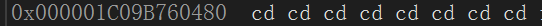
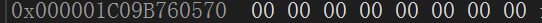
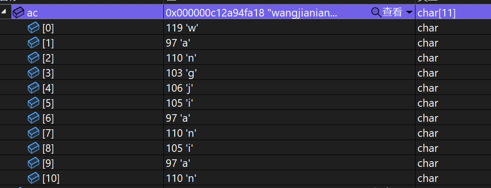
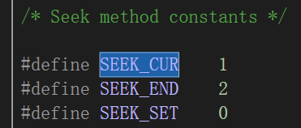

## <windows.h>

### Sleep函数

> 作用:让当前线程暂停执行一段指定的时间。

语法: `Sleep(毫秒)`

---

## <stdlib.h>

> 全称: standard library 标准库

### system()

语法: `system(command)`

**操作系统指令**
- `cls` - 清屏
- `cd` - 切换当前目录
- `mkdir` - 创建新的目录
- `shutdown /s /t <seconds>` - 关机指令
- `shutdown /a` - 取消关机指令

```c
    system("cls");// 清空控制台
```

---

### rand()


> rand作用为生成随机数，而srand用于设置随机数生成器的种子。它两通常是一对.
>
>>rand的范围是**0 - RAND_MAX**,而RAND_MAX是由`#define`定义的值为
>>**0x7fff**是一个十六进制,在C语言中，0x表示后面的数字是十六进制数。7fff对应的十进制为*32767*
>
>> rand函数全称为random，而srand函数全称应该是 seed random
```c
    #include <stdlib.h>

    #include <time.h>
    // RAND_MAX --- 0 ~ 32767
    int main () {
        //所以变量必须在函数最上方
        int i = 0;
        /*
            srand参数类型为unsigned int，而time函数返回类型为time_t
            而time_t是通过typedef定义而来它实际上就是一个long类型

        */
        srand((unsigned int)time(NULL));
        //在使用rand函数之前需要提前设置种子，不然就没有随机数，而是统一的一个值
        i = rand();

        return 0;
    }
    
```

---

### srand()

语法：`void srand(unsigned int seed)`

> srand函数用于设置随机数生成器的种子，一般使用当前时间作为种子。

---

### qsort()

原型: `void qsort(void *base, size_t number, size_t size, int (*compare)(const void *, const void *))`

- base: 指向要排序的数组的指针
- number: 数组中元素的个数
- size: 每个元素的大小（以字节为单位）
- compare: 比较函数的指针，用于确定元素的顺序

compare函数指针细节: `int compare(const void *a, const void *b)`

在比较函数compare中，返回值代表着两个元素的大小关系。
这样，qsort函数根据比较函数的返回值来确定元素的顺序，从而实现对数组的排序。

- 返回值 > 0 表示第二个元素应该排在第一个元素之前
- 返回值 = 0 表示两个元素相等，它们的相对位置不变
- 返回值 < 0 表示第一个元素应该排在第二个元素之前

> [具体使用参考qsort使用](/show_detail/detail.md#qsort的使用)

---

### malloc()

语法: `void* malloc(size_t size)`

作用: 分配所需的内存空间，并返回一个指向它的指针.

- size -- 内存块的大小，以字节为单位.

返回值: 该函数返回一个指针 ，指向已分配大小的内存。如果请求失败(请求内存空间失败)，则返回 `NULL`

基本使用

```c
#include <stdlib.h>
#include <stdio.h>
#include <string.h>
#include <errno.h>
int main()
{
	int* i = malloc(10 * sizeof(int));
	if (i == NULL)
	{
		printf("%s\n", strerror(errno));
	}
	else
	{
		int* tmp = i;
		int j = 0;
		for (j = 0; j < 10; j++)
		{
			*(tmp + j) = j;
		}
		for (j = 0; j < 10; j++)
		{
			printf("%d ", *(tmp + j));
		}
	}       
    i = NULL;   
    free(i);//释放内存空间                 
	return 0;
}
```

> [free函数的使用参考`free()`](#free)

```c
int main()
{
    int* i = malloc(INT_MAX + INT_MAX);//INT_MAX为最大的int值
	if (i == NULL)
	{
		printf("%s\n", strerror(errno));// NOT ENOUGH SPACE
	}
    return 0;
}
```

---

### free()

作用: 释放之前调用`calloc``malloc` 或`realloc`所分配的内存空间

语法: `void free(void *memblock)`

- memblock -- 指针指向一个要释放内存的内存块, 如果传递的参数是`NULL`，则不会执行任何动作。

注意点: 

```c
int main()
{
    int* i = malloc(10 * sizeof(int));
    /*虽然free释放了空间, 但是i指针的指向还是存在的
    ,所以如果不释放的话就成了野指针*/
    i = NULL;
    free(i);
    
    return 0;
}
```


---

### calloc()

作用: 返回一个指向它的指针。`malloc` 和 `calloc` 之间的不同点是，`malloc` 不会设置内存为零，而 `calloc` 会设置分配的内存为`0`.

语法: `void *calloc(size_t nitems, size_t size)`

- nitems -- 要被分配的元素个数。
- size -- 元素的大小。

```c
#include <stdlib.h>

int main()
{
	int* malloc_p = malloc(2 * sizeof(int));
	int* calloc_p = calloc(2, sizeof(int));
	return 0;
}
```





---

### realloc()

作用: 重新调整`malloc`或`calloc`所分配的指针空间的内存大小    

语法: `void *realloc(void *ptr, size_t size)`

- ptr -- 一个指针, 这个指针之前由`malloc`和`calloc`调用; 如果传递参数为空指针(NULL)，则会分配一个新的内存块，且函数返回一个指向它的指针。
- size -- 为重新分配后的大小(以字节为单位); 如果大小为 0，且 ptr 指向一个已存在的内存块，则 ptr 所指向的内存块会被释放，并返回一个空指针。

> [更多细节参考realloc的注意点](/C语言进阶.md#realloc的使用注意点)

---

### abs()

作用: 返回整数`x`的绝对值

声明: `int abs(int x)`

- x -- 要计算绝对值的整数。

返回值: 如果`x`为正, 则返回`x`; 为负则返回它的相反数`-x`; 为0返回0

> `abs()`函数只适用于整数，如果需要计算浮点数的绝对值，需要使用头文件为<math.h>的 `fabs()` 函数。

---

## <time.h>

### time()

语法:`time_t time(time_t *t);`

时间戳获取: `time(NULL);`

> [使用参考`rand()`](#rand)

---

## <stdio.h>

### scanf()

作用: 从标准输入流`stdin`读取格式化输入

声明: `int scanf(const char *format, ...)`

返回值: 如果成功，该函数返回成功匹配和赋值的个数。如果到达文件末尾或发生读错误，则返回 `EOF`

```c
#include <stdio.h>
int main()
{
	int a, b, c;
	c = scanf("%d %d", &a, &b);
	printf("%d\n", c);//2 正常输入的情况下
	return 0;
}
```

#### 使用细节

> 在输入时格式需要注意，在输入中需要对应

```c
    //在可执行程序中输入时应写--- 1#2#3
    scanf("%d#%d#%d", &i, &z, &y);
    //在可执行程序中输入时应写--- 1 2 3
    scanf("%d %d %d", &i, &z, &y);
```

---

### printf打印格式

作用: 格式化输出到标准输出流`stdout`

声明: `int fprintf(FILE *stream, const char *format, ...)`

声明: `printf("<格式化字符串>", <格式参数>);`

返回值: 如果成功，则返回**格式化字符串的大小**，否则返回一个负数。

> 打印字符格式的数据

- %d - 打印int类型的整型
- %c - 打印字符
- %s - 表示输入一个字符串
- %lf - 表示输入一个双精度浮点数
- %f - 打印浮点数 - 小数
- %ld - 表示输入一个长整数。
- %p - 以地址的形式打印 (每一块内存空间都有着自己的地址)(占位符将会被实际指针的十六进制表示所替代)
- %x - 打印16进制
- %zd - 打印size_t类型(为typedef定义的类型实际就是unsigned int)的参数的整数
- %u - 打印无符号整数(包括负数---负数打印的结果为负数的绝对值与无符号整型的取值范围取模后得到的结果)9
- %nd - 输出的整数占n位，不足n位则在前面补空格(n为整数)
- %-nd - 输出的整数占n位，不足n位则在后面补空格(n为整数)
- ...

---

### fclose()

作用: 关闭流(stream)。刷新所有的缓冲区

语法: `int fclose(FILE *stream)`

- stream -- FILE对象的指针(FILE*)，该FILE对象指定了要被关闭的流。

返回值: 如果流成功关闭，则该方法返回`0`。如果失败，则返回`EOF`(end of file)。

```c
#include <stdio.h>
int main()
{
    /* 1. 如果没有test.txt,则会新建名为test.txt的文件,然后写入 
       2. "w"模式会覆盖原先的内容
    */

    FILE* pc = fopen("test.txt", "w");
    fputs("handsome", pc);
    fclose(pc);
    return 0;
};
```

---

### fopen()

作用: 使用给定的模式`mode`打开`filename`所指向的文件

声明: `FILE *fopen(const char *filename, const char *mode)`

- filename -- 要打开的文件名或路径
- mode -- 字符串，表示文件的访问模式，可以是以下表格中的值：

模式: 

1. `"r"` -- 打开一个用于读取的文件。该文件必须存在。
2. `"w"` -- 创建一个用于写入的空文件。如果文件名称与已存在的文件相同，则会删除已有文件的内容，文件被视为一个新的空文件。如果文件不存在，则创建文件。
3. `"a"` -- 追加到一个文件。写操作向文件末尾追加数据。如果文件不存在，则创建文件。
4. `"r+"` -- 打开一个用于更新的文件，可读取也可写入。该文件必须存在。
5. `"w+"` -- 创建一个用于读写的空文件。
6. `"a+"` -- 打开一个用于读取和追加的文件。

如果处理的是二进制文件，则需使用下面的访问模式来取代上面的访问模式：

`"rb"`, `"wb"`, `"ab"`, `"rb+"`, `"r+b"`, `"wb+"`, `"w+b"`, `"ab+"`, `"a+b"`

返回值: 该函数返回一个`FILE`指针。否则返回`NULL`且设置全局变量`errno`来标识错误

> `文件指针`与`位置指针`: 文件指针指向内存中的文件信息区的开头, 其位置不会改变; 而位置
> 指针会通过文件的读写而不断改变.

```c
#define _CRT_SECURE_NO_WARNINGS 1;
#include <stdio.h>
#include <string.h>
#include <errno.h>
int main()
{
    FILE* p = fopen("D:\\c语言学习\\file_operate\\file_operate\\test.txt", "r");//打开文件
    if (p == NULL)
	{
		printf(strerror(errno));
        return 1;
	}
	char ch[255];
    fgets(ch, 255, (FILE*)p);//读数据, 文件
    printf(ch);//打印
    fclose(p);//释放缓冲区
    p = NULL;
    return 0;
}
```

---

### fputs()

作用: 把字符串写入到指定的流`stream`中, 但不包括空字符。

声明: `int fputs(const char *str, FILE *stream)`

- str -- 一个字符数组
- stream -- 这是指向`FILE`对象的指针，该`FILE`对象标识了要被**写入字符串**的流。

返回值: 该函数返回一个非负值，如果发生错误则返回`EOF`

```c
#define _CRT_SECURE_NO_WARNINGS 1;
#include <string.h>
#include <stdio.h>
#include <errno.h>
int main()
{
	FILE* fp = fopen("test.txt", "w+");//打开文件,进行读写模式
    //当指针为指针时
	if (fp == NULL)
	{
		printf("%s\n", strerror(errno));
		return 1;
	}
	fputs("woshidashuaibi", fp);//写入
	fclose(fp);//关闭stream
	fp = NULL;
	return 0;
}
```

> [关于`fopen`的模式参考这里](#fopen)

---

### fputc()

作用: 把参数 char 指定的字（一个无符号字符写入到指定的流 stream 中，**并把位置标识符往前移动**(stream读数据后位置会改变,如果需要重新读,则使用`fseek()`改变偏移值)。

声明: `int fputc(int char, FILE *stream)`

- char -- 这是要被写入的字符。该字符以其对应的`int`值进行传递。
- stream -- 这是指向 `FILE` 对象的指针，该 `FILE` 对象标识了要被写入字符的流。

返回值: 如果没有发生错误，则返回**被写入的字符**。如果发生错误，则返回 EOF，并设置错误标识符(errno)。

```c
int main()
{
	FILE* fp = fopen("test.txt", "w+");
	if (fp == NULL)
	{
		printf("%s\n", strerror(errno));
		return 1;
	}
	fputc('w', fp);
	fputc('a', fp);
	fputc('n', fp);
	fputc('g', fp);
	fclose(fp);
	fp = NULL;
	return 0;
}
```

---

### fgets()

作用: 从指定的流`stream`读取一行,并把它存储在`str`所指向的字符串内。当读取到`(n-1)`个字符时，**或者读取到换行符(空格不会停止)时，或者到达文件末尾时，它会停止，具体视情况而定。**

注意: 当读取到n-1个字符时会在第n的位置补`'\0'`
 
声明: `char* fgets(char *str, int n, FILE *stream)`

- str -- 这是指向一个字符数组的指针，该数组存储了要读取的字符串。
- n -- 这是要读取的最大字符数（包括最后的空字符`'\0'`）。通常是使用以 str 传递的数组长度。
- stream -- 这是指向 FILE 对象的指针，该 FILE 对象标识了要从中读取字符的流。

返回值: 如果成功，**该函数返回相同的 str 参数**。如果到达文件末尾或者没有读取到任何字符，str 的内容保持不变，并返回`NULL`。

如果发生错误，返回一个空指针。

```c
int main()
{
	char arr[] = "wangjianian";//长度12, 因为包括'\0'
	char tmp[30] = { 0 };
	FILE* pf = fopen("test.txt", "w");
	if (pf == NULL)
		return 1;
	fwrite(arr, 1, 11, pf);//写入时不管'\0'
	fclose(pf);
	pf = NULL;
	//重新选择模式
	pf = fopen("test.txt", "r");
	fgets(tmp,11 , pf);//读时需要把'\0'算进去
	//这时 temp = "wangjiania"
	fclose(pf);
	pf = NULL;
	return 0;
}
```

---

### fgetc()

声明: `int fgetc(FILE* stream)`

作用: 从指定的流 stream 获取下一个字符（一个无符号字符），并把位置标识符往前移动。

- stream -- 为FILE对象指向的指针, 该 FILE 对象标识了要从中读取字符的流。

返回值: 该函数以无符号 char 强制转换为 int 的形式**返回读取的字符**，如果到达文件末尾或发生读错误，则返回 `EOF`。

---

### fprintf()

作用: 格式化输出到`stream`文件指针中

声明: `int fprintf(FILE *stream, const char *format, ...)`

- stream -- 文件指针
- format -- 与`printf`一样

返回值: 如果成功，则返回写入的字符总数，否则返回一个负数。

```c
//记录日志
int main()
{
	FILE* pf = fopen("log.txt", "w");
	int arr[10] = { 0 };
	for (int i = 0; i < 10; i++)
	{
		arr[i] = i;
		fprintf(pf, "date: %s -- time: %s\n", __DATE__, __TIME__);
	}

	return 0;
}
```

---

### fscanf()

作用: 从文件流 `stream` 读取格式化输入。

声明: `int fscanf(FILE *stream, const char *format, ...)`

- stream -- 文件指针
- format -- 与`scanf`一样

返回值: 如果成功，该函数返回成功匹配和赋值的个数。如果到达文件末尾或发生读错误，则返回 `EOF`

```c
/* 打印矩阵, 并存储在test.dat文件中(以"w"的形式写入)
	13 14 15 16			3 * 4  ---> 4为循坏不变量
	9  10 11 12			2 * 4
	5  6  7  8			1 * 4
	1  2  3  4			0 * 4
	
*/
void print_matrix()
{
	int i = 0;
	FILE* pf_write = fopen("test6.dat", "w");
	if (pf_write == NULL)
	{
		perror("文件流开辟失败");
	}
	for (i = 3; i >= 0; i--)
	{
		int j = 0;
		for (j = 1; j <= 4; j++)
		{
			fprintf(pf_write, "%2d ", (i * 4) + j);
		}
		fprintf(pf_write, "\n");
	}

	fclose(pf_write);
	pf_write = NULL;
}

int main()
{
	print_matrix();
	int arr[4][4] = { 0 };
	FILE* pf_read = fopen("test6.dat", "r");
	for (int i = 0; i < 4; i++)
	{
		for (int j = 0; j < 4; j++) 
		{
			fscanf(pf_read, "%2d ", &arr[i][j]);
		}
	}
	fclose(pf_read);
	pf_read = NULL;
	return 0;
}
```

---

### fwrite()

声明: `size_t fwrite(const void *ptr, size_t size, size_t count, FILE *stream)`

作用: 把 `ptr` 所指向的数组中的数据写入到给定流 `stream` 中。

- ptr -- 这是指向要被写入的元素数组的指针。
- size -- 这是要被写入的每个元素的大小，以字节为单位(每个元素的大小)。
- count -- 这是元素的个数，每个元素的大小为 size 字节(元素的个数)。
- stream -- 这是指向 FILE 对象的指针，该 FILE 对象指定了一个输出流。

返回值: 如果成功，该函数返回一个 **`size_t` 对象，表示元素的总数**，该对象是一个整型数据类型。如果该数字与 `count` 参数不同，则会显示一个错误。

```c
typedef struct S
{
	int age;
	char name[20];
}S;

int main()
{
	S s = { 20, "wangjianian" };
	S s1 = { 0 };
	FILE* pf = fopen("test.txt", "wb");
	fwrite(&s, sizeof(S), 1, pf);
	fclose(pf);

	pf = fopen("test.txt", "rb");
	fread(&s1, sizeof(S), 1, pf);
	fclose(pf);
	return 0;
}
```

---

### fread()

作用: 从给定流 stream 读取数据到 ptr 所指向的数组中。

声明: `size_t fread(void *ptr, size_t size, size_t nmemb, FILE *stream)`

- ptr -- 这是指向带有最小尺寸 size*nmemb 字节的内存块的指针。
- size -- 这是要读取的每个元素的大小，以字节为单位。
- nmemb -- 这是元素的个数，每个元素的大小为 size 字节。
- stream -- 这是指向 FILE 对象的指针，该 FILE 对象指定了一个输入流。

返回值: 成功读取的元素总数会以 size_t 对象返回，size_t 对象是一个整型数据类型。如果总数与 nmemb 参数不同，则可能发生了一个错误或者到达了文件末尾。

> `fread`在读文件时, 没有像`fgets`那样在`n-1`的位置停止的那种

```c
int main()
{
	//写操作
	char name[] = "wangjianian";
	FILE* pf_write = fopen("test6.dat", "w");
	if (pf_write == NULL)
	{
		perror("文件流开辟失败");
		return (-1);
	};
	fwrite(name, sizeof(char), my_strlen(name), pf_write);
	fclose(pf_write);
	pf_write = NULL;
	//读操作
	char ac[11] = { 0 };
	FILE* pr_read = fopen("test6.dat", "r");
	if (pr_read == NULL)
	{
		perror("文件流开辟失败");
		return (-1);
	};
	/* fread在读的时候不会在第n个位置补'\0', fread在读方面是通用的,
	 而fgets只适用于字符串读操作 */ 
	fread(ac, sizeof(char), 11, pr_read);
	return 0;
}
```



---

### fseek()

声明: `int fseek(FILE *stream, long offset, int origin)`

- stream -- 这是指向 FILE 对象的指针，该 FILE 对象标识了流。
- offset -- 这是相对 origin 的偏移量，以字节为单位。
- origin -- 这是表示开始添加偏移 offset 的位置。它一般指定为下列常量之一：

1. `SEEK_SET` ==> 文件的开头(seek_set)
2. `SEEK_CUR` ==> 文件指针的当前位置(seek_current)
3. `SEEK_END` ==> 文件的末尾(seek_end)



```c
#include <stdio.h>
int main()
{
	FILE* pf = fopen("test.txt", "r");
	char arr[20] = { 0 };
	fseek(pf, 2, SEEK_CUR);//当前位置偏移两位
	//从前往后读
	fgets(arr, 8, pf);//需把'\0'算进去
	fclose(pf);
	pf = NULL;
	return 0;
}
```

---

### ftell()

作用: 计算当前位置偏移量与起始位置的距离, 返回值为`long int`

声明: `long int ftell(FILE *stream)`

- stream -- 这是指向 FILE 对象的指针，该 FILE 对象标识了流。

返回值: 该函数返回位置标识符的当前值。如果发生错误，则返回 `-1L`，全局变量 `errno` 被设置为一个正值。

```c
#include <stdio.h>
//test.txt ===> 123456789
int main()
{
	FILE* pf = fopen("test.txt", "r");
	fseek(pf, -2, SEEK_END);
	int len = ftell(pf);// 7
	fclose(pf);
	pf = NULL;
	return 0;
};
```

---

### rewind()

作用: 让文件指针位置回到文件的起始位置

声明: `void rewind(FILE *stream)`

- stream -- 这是指向 FILE 对象的指针，该 FILE 对象标识了流。

返回值: 无返回值
 
```c
#include <stdio.h>
//test.txt ===> 123456789
int main()
{
	FILE* pf = fopen("test.txt", "r");
	char ch = fgetc(pf);
	printf("%c\n", ch);// 1
	rewind(pf);// 回到文件的起始位置
	ch = fgetc(pf);
	printf("%c\n", ch);// 1
	fclose(pf);
	pf = NULL;
	return 0;
}
```

---

### feof()

作用: 当文件结束时(已经知道结束了), 判断文件是读取失败而结束, 还是遇到文件结尾而结束

注意: 在文件读取过程中, 不能用`feof`函数的返回值来判断文件是否结束; 而是应用于当文件结束时(已经知道结束了), 判断文件是读取失败而结束, 还是遇到文件结尾而结束

声明: `int feof(FILE *stream)`

返回值: 遇到文件结尾而结束时返回**非零值**, 否则返回`0`

```c
#include <stdio.h>
//test.txt ===> 123456789
int main()
{
	FILE* pf = fopen("test.txt", "r");
	char c;
	while ((c = fgetc(pf)) != EOF)
	{
		putchar(c);
	}

	if (feof(pf))
	{
		printf("end of file");//当文件正常读到结尾时
	}
	return 0;
}
```

---

### perror()

作用: 把一个描述性错误消息输出到标准错误`stderr`(自己抛错误)

声明: `void perror(const char *str)`

```c
#include <stdio.h>
int main()
{
	FILE* pf = fopen("test/txt", "r");//特意制造错误
	if(pf == NULL)
	{
		perror("错误");//错误: No such file or directory
		// perror("无错误时");// 无错误时: No error
		return -1;
	}
	return 0;
}
```

---

### clearerr()

作用: 清除给定流 stream 的文件结束和错误标识符

声明: `void clearerr(FILE *stream)`

- stream -- `FILE*`指针

返回值: 这不会失败，且不会设置外部变量 `errno`，但是如果它检测到它的参数不是一个有效的流，则返回`-1`，并设置 `errno` 为 `EBADF`

---

### ferror()

作用: 检查目标文件是否存在错误的"文件操作"

声明: `int ferror(FILE *stream)`

- stream -- `FILE*`指针

返回值: 如果设置了错误标识符, 则返回`非零值`, 否则返回`0`

```c
int main()
{
    FILE* fp;
    char c;
    int err;

    fp = fopen("file.txt", "w");
	// 读操作(r),而打开的流的方式为"w". 
    c = fgetc(fp);
    if (err = ferror(fp))
    {
        printf("读取文件：file.txt 时发生错误\n");
    }
    clearerr(fp);
    if (ferror(fp))
    {
        printf("读取文件：file.txt 时发生错误\n");
    }
    fclose(fp);

    return(0);
}
```

假设我们有一个文本文件`file.txt`，它是一个空文件。当运行并编译时, 因为我们试图读取一个以只写模式打开的文件. 结果是:`读取文件：file.txt 时发生错误`

---

<!-- ## rename()

作用: 给指向的文件重命名

声明: `int rename(const char *old_filename, const char *new_filename)`

- old_filename -- 旧名字
- new_filename -- 新名字

返回值: 如果成功，则返回`0`. 如果错误，则返回`-1`，并设置`errno`

--- -->

## <string.h>

### strlen()

声明: `size_t strlen(const char* str)`

- str -- 要计算长度的字符串.

返回值: 字符串的长度.

> 1. 计算字符串长度时，不包括`\0`
>
> 2. 返回值类型`size_t`实际上是`typedef unsigned int size_t`
>
> 3. 当无符号数 - 无符号数时结果也是一个无符号数, 是一个>=0的数

```c
#include <string.h>
#include <stdio.h>
int main()
{
	char ac[] = "WangJiaNian";
	int i = (int)strlen(ac);
	printf("%d\n", i);// 11
 	return 0;
}
```

---

### strcpy()

声明：`strcpy(目标字符串, 源字符串)`

`char *strcpy(char *dest, const char *src)`

return value: destination string(目标字符串)


> `strcpy`方法是一个字符串复制函数，用于将一个字符串复制到另一个字符串中。需要注意的是，`strcpy`函数不会检查目标字符串的长度，如果目标字符串的空间不足以容纳源字符串，则会导致**内存溢出**的问题。因此，在使用`strcpy`函数时需要确保目标字符串有足够的空间来容纳源字符串。`strcpy`会把源字符串的`\0`也拷贝过来。

---

```c
    /*
        const char* 意味着指针指向的元素的类型为 const char
	    所以这么做是防止在编写这个函数的时候搞混参数
    */s
    void my_strcpy(char* dest, const char* src) {
        if(dest == NULL || src == NULL) return;

        while(*src != '\0') {
            *(dest++) = *(src++);
        };
        //等于'\0'时执行的操作
        *dest = *src;
    }

    char* my_strcpy(char* dest, const char* src) {
        assert(dist != NULL);
		assert(src != NULL);
        //保留原味。因为存储的是地址，所以内部的值怎么改跟地址没什么关系
        char* result = dest;
        //将src的数据拷贝到dest包括'\0'
        while (*(dest++) = *(src++))
        {
            ;
        }
        //不直接返回dest是因为它因为通过++改变了
        return result;
    }
       
```

> [关于const char类型请参考`const修饰指针`](#const修饰指针)
>
> [关于assert使用请参考`assert.h`](#asserth头文件)
>
> 查看源文件查考`D:\Windows Kits\10\Source\10.0.22621.0\ucrt`

---

### strcmp()

声明:`int strcmp(const char *str1, const char *str2);`

- str1 -- 要进行比较的第一个字符串.
- str2 -- 要进行比较的第二个字符串.

返回值如下:

- 如果返回值 < 0，则表示 str1 < str2。
- 如果返回值 > 0，则表示 str1 > str2。
- 如果返回值 = 0，则表示 str1 = str2。

```c
#include <string.h>
#include <stdio.h>
int main()
{
	char ac1[] = "wang";
	char ac2[] = "jia";
	// 'w' > 'j' 所以返回 1
	int i = strcmp(ac1, ac2);
	printf("%d\n", i);// 1
	return 0;
}
```

> 该函数接受两个参数，分别是要比较的两个字符串str1和str2。如果两个字符串相等，函数返回值为0；如果str1小于str2，返回值为负数；如果str1大于str2，返回值为正数。
>
> 在VS编辑器下str1 大于 str2返回值为-1; str1 小于 str2返回值为1
>
> [关于`strcmp`如何排列字符串的请参考字符串的比较方式](./show_detail/detail.md#字符串的比较方式)

---

### strcat()

声明: `char* strcat(char* dest, const char* src)`

功能:合并字符串

- dest -- 目标字符数组,且**足够容纳追加后的字符串。**
- src -- 指向要追加的字符串，该字符串不会覆盖目标字符串。

> 注意点`strcat`无法自己追加自己

```c
int main()
{
	//需确保目标字符串dest有着足够的空间来容纳源字符串的长度
	char ac1[50] = "wangjianian";
	char ac2[] = "handsome";
	char* result = strcat(ac1, ac2);
	printf("%s\n", result);// wangjianianhandsome
	return 0;
}
```

---

### strstr()

声明: `char* strstr(const char* haystack, const char* needle)`

- haystack -- 要被检索的 C 字符串。
- needle -- 在 haystack 字符串内要搜索的小字符串。

返回值: `haystack`中#第一次出现`needle`字符串的位置的地址，如果未找到则返回`NULL空指针`

```c
int main()
{
	char ac1[50] = "wangjianian";
	char ac2[] = "jia";
	// 返回被找到位置的指针
	char* result = strstr(ac1, ac2);
	printf("%s\n", result);// jianian
	return 0;
}
```

---

### strncat()

声明: `char* strncat(char* dest, const char* src, size_t count)`

功能:合并字符串,且可以合并自己

- dest -- 目标字符数组, 且足够容纳追加后的字符串，包括额外的空字符。
- src -- 要追加的字符串。
- count -- 要追加的最大字符数。

```c
int main()
{
	char ac1[20] = "wang";
	char ac2[] = "jianian";
	strncat(ac1, ac2, strlen(ac2));// wangjianian
	// strncat(ac1, ac1, strlen(ac1));// wangwang 追加自己
	return 0;
}
```

> - 追加`count`个字符之后会主动补一个`'\0'`
> - 当`count` > 实际的`src`长度时, 多余的部分直接放弃不管
> 
> [strncat的注意点参考strncat的细节](./show_detail/detail.md#strncat的细节)
>
> [strncat函数实现参考头文件实现strcat()](./subject/头文件实现.md#strncat)

---

### strncpy()

声明: `char* strncpy(char* dest, const char* src, size_t count)`

- dest -- 指向用于存储复制内容的目标数组。
- src -- 要复制的字符串。
- count -- 要从源中复制的字符数。

返回值: 最终dest被复制完成后的结果

> 如果`count`的长度大于`src`, 超出的长度会给dest补`0`
>
> [strncpy的注意点参考strncpy的细节](./show_detail/detail.md#strncpy的细节)
>
> [strncpy函数实现参考头文件实现strncpy()](./subject//头文件实现.md#strncpy)

---

### strtok()

声明: `char* strtok(char* str, const char* delim)`
              
- str -- 要被分解成一组小字符串的字符串.
- delim -- 包含分隔符的C字符串。

返回值: 被分解的第一个子字符串，如果没有可检索的字符串，则返回一个空指针.

```c
int main()
{
	
	char ac2[] = "!@";
	char ac1[30] = "wang!jia@nian";
	char* ac3 = strtok(ac1, ac2);// wang
	// 再次使用strtok函数时, str为NULL代表着对上次使用的str再次进行分解
	char* ac4 = strtok(NULL, ac2);// jia
	return 0;
}
```

> `strtok`函数会改变原来的字符串, 所以在使用时最好提前备份. 
>
> 当遇到`delim`包含的分隔符时, 会把分隔符替换为`'\0'`, 并且会记住这个位置(静态)

---

### strerror()

声明: `char* strerror(int errnum)`

- errnum -- 错误号，通常是 `errno`.

返回值: 一个指向错误字符串的指针，该错误字符串描述了错误errnum(错误信息)。

```c
int main()
{
	//假设这里的test5.txt不存在
	FILE* pc_read = fopen("test5.txt", "r");
	if (pc_read == NULL)
	{
		printf("%s\n", strerror(errno));// No such file or directory
	}
	return 0;
}
```

> [`errno`的作用参考errno.h头文件的errno](#errno)

---

### memcpy()

声明: `void* memcpy(void* dest, const void* src, size_t num)`

作用: 在内存中将`src`的数据copy到`dest`中

- dest -- 用于存储复制内容的目标数组
- src -- 复制的数据源
- num -- 要被复制的字节数

在使用时最好不要令`dest`与`src`一直, 如果必须则最好使用`memmove()`

```c
int main()
{
	char ac1[20] = "liusjianian";
	char ac2[] = "wang";
	memcpy(ac1, ac2, strlen(ac2));// wangjianian
	//运用在整形数组
	int arr1[9] = { 23, 45, 97,4,5,6,7,8,9 };
	int arr2[3] = { 1,2,3 };
	memcpy(arr1, arr2, sizeof(arr2));
	// 1 2 3 4 5 6 7 8 9
	return 0;
}
```

> [`memcpy`函数使用参考这里](./show_detail/detail.md#memcpy基本使用)
>
> [`memcpy`实现方式参考这里](./subject/头文件实现.md#memcpy)

---

### memset()

声明: `void* memset(void *str, int c, size_t n)`

作用: 复制字符 c（一个无符号字符）到参数 str 所指向的字符串的前 n 个字符

- str -- 指向要填充的内存块(字符串)。
- c -- 要被设置的值。该值以`int`形式传递，但是函数在填充内存块时是使用该值的无符号字符形式。
- n -- 要被设置为该值的字符数。

```c
int main()
{
	char ac1[20] = "liusjianian";
	char c = 'A';
	memset(ac1, c, 4);// AAAAjianian
	return 0;
}
```

---

## <assert.h>

声明:`assert(condition)`

若用户指定的条件非true，则异常终止程序。可以在发行版本禁用。

```c
    #define NDEBUG 
    //若在上方定义宏名，则assert不做任何事(功能消失)
    #include <assert.h>
```

> 当定义了`NDEBUG`宏时，`assert`宏将被禁用，程序将不会执行这些检查，从而提高
> 
> 程序的执行效率。通常在发布版本中使用`NDEBUG`宏来禁用`assert`宏，以避免不必要的开销和性能损失。
> 
> - 宏 assert 的定义依赖于标准库不定义的另一个宏 NDEBUG 
> - ASSERT 只有在 Debug 版本中才有效，如果编译为 Release 版本则被忽略。


---

## <errno.h>

### errno

`errno`是通过`#define`定义的宏, **通过由系统调用设置**. 当C语言的库函数在执行
过程中, 发生了错误, 就会把对应的错误码(每一个错误码对应不同的信息),赋值给`errno`

错误码:

- 0 -- No error
- 1 -- Operation not permitted
- 2 -- No such file or directory
- ...更多的错误码参考C语言<errno.h>

---

## <ctype.h>

### isdigit()

语法: `int isdigit(int c)`

作用: 检查所传的字符是否是十进制数字

- c -- 需要检查的`字符`.

返回值: 如果 c 是一个数字，则该函数返回非零值`(true)`，否则返回 0`(false)`。

---

### islower()

语法: `int isalnum(int c)`

作用: 检查所传的字符是否为字母和数字

- c -- 需要检查的`字符`.

返回值: 如果 c 是一个数字或一个字母，则该函数返回非零值，否则返回`0`

---

### isupper()

语法: `int isupper(int c)`

作用: 检查所传的字符是否是大写字母

- c -- 需要检查的`字符`.

返回值: 如果 c 是一个大写字母，则该函数返回非零值，否则返回 0

---

### isalpha()

语法: `int isalpha(int c)`

作用:  检查所传的字符是否是字母

- c -- 需要检查的`字符`.

返回值: 如果 c 是一个字母，则该函数返回非零值，否则返回 0

---

### toupper()

语法: `int toupper(int c)`

作用: 把小写字母转换为大写字母

- c -- 要被转换为大写的字母.

返回值: 如果`c`有相对应的大写字母，则该函数返回`c`的大写字母，否则`c`保持不变。返回值是一个可被隐式转换为 char 类型的 int 值。

```c
//需注意str参数不能是常量字符串,否则会报错访问冲突问题    
char* toUpperCase(char* str)
{
	char* result = str;
	while (*str != '\0')
	{
		*str = toupper(*str);
		str++;
	}

	return result;
}
```

---

### tolower()

语法: `int tolower(int c)`

作用: 把给定的字母转换为小写字母.

- c -- 这是要被转换为小写的字母.

返回值: 如果`c`有相对应的小写字母，则该函数返回`c`的小写字母，否则`c`保持不变。返回值是一个可被隐式转换为 char 类型的 int 值。

```c
//需注意str参数不能是常量字符串,否则会报错访问冲突问题 
char* toLowerCase(char* str)
{
	char* result = str;
	while (*str != '\0')
	{
		*str = tolower(*str);
		str++;
	}

	return result;
}
```

---

## <stddef.h>

### offsetof()

语法: `size_t offsetof(structName, memberName)`

作用: 计算结构成员相对于结构体开头的字节偏移量

- structName -- 结构体类型名
- memberName -- 结构体成员名

返回值: 该宏返回类型为`size_t`的值，表示`structName`中成员(memberName)的偏移量。

```c
#include <stddef.h>

struct S1
{
	char c1;// 1
    // 7
	double d;// 8
};

int main()
{
	struct S1 s1 = { 0 };
	printf("%zd\n", offsetof(struct S1, d));// 8
	return 0;
}
```

---

#### 使用宏实现offsetof()

```c
struct STU
{
	char c1;
	int a;
	char c2;
};
/* 先将0转换为struct_name*类型 ===> (struct_name*)0
然后令其找到需要查找的成员mumber_name  ===> ((struct_name*)0)->mumber_name
*/
#define OFFSETOF(struct_name, mumber_name) (int)&(((struct_name*)0)->mumber_name)

int main()
{
	printf("%d\n", OFFSETOF(struct STU, c1));
	printf("%d\n", OFFSETOF(struct STU, a));
	printf("%d\n", OFFSETOF(struct STU, c2));
	return 0;
}
```

---

## <math.h>

### pow()

作用: 返回`x`的`y`次幂, 相当于x的y次方.

声明: `double pow(double x, double y)`

- x -- 代表基数的浮点值。
- y -- 代表指数的浮点值。

返回值: 返回`x`的`y`次幂

```c
#include <math.h>
int main(){
	double x = 2.0;
	double y = 3.0;
	double result = pow(x, y);
	printf("%lf\n", result);// 8.000000
	return 0;
}
```

---

### sqrt()

作用: 返回`x`的平方根

声明: `double sqrt(double x)`

- x -- 一个数

返回值: `x`的平方根

```c
int main(){
	double x = 4.0;
	double result = sqrt(x);
	printf("%lf\n", result);// 2.000000
	return 0;
}
```

---

### fabs()

作用: 计算浮点数`x`的绝对值

声明1: `double fabs(double x)` 

声明2: `float fabsf(float x)`

声明3: `long double fabsl(long double x)`

返回值: 如果`x`为正, 则返回`x`; 为负则返回它的相反数`-x`; 为0返回0

```c
int main(){
	double x = -4.0;
	double result = fabs(x);
	printf("%lf\n", result);// 4.000000
	return 0;
}
```

> `fabs()`函数可以用于`double`、`float` 和 `long double` 类型的参数。如果需要计算整数的绝对值，应该使用`abs()`函数。

---

### floor()

作用: 返回小于或等于`x`的最大的整数值. 例如`3.2`则返回`3.0`; `3.9`也返回`3.0`

声明: `double floor(double x)`

- x -- 浮点数

返回值: 不大于`x`的最大整数值

```c
int main(){
	double x = 3.2;
	double result = floor(x);
	printf("%lf\n", result);// 3.000000
	return 0;
}
```

---

### ceil()

作用: 返回大于或等于`x`的最小的整数值. 例如: `3.2`则返回`4.0`

声明: `double ceil(double x)`

- x -- 浮点数

返回值: 不小于 x 的最小整数值

```c
int main(){
	double x = 3.2;
	double result = ceil(x);
	printf("%lf\n", result);// 4.000000
	return 0;
}
```