# 语言的发展(课外知识)

*二进制语言* 即只有0和1
> 硬件--电- 正电--负电 那么正电就为1 负电为0

*二进制计算*

十进制逢十进一，而二进制*逢二进一*

---

- *十进制* 
    - 0-9

- *八进制*
    - 0-8

- 十六进制
  - 0-9和A-F(A为10 - f为15)

 ## 进制的计算以及转换

- 以二级------>十进制来说
    规律为: 个位数* 当前的进制的n-1位的次方
    > 001 ---- 0\*2的二次方 + 0\*2的一次方 + 0*2的0次方

- 八进制------>十进制

    > 127 ---- 1\*8的2次方 + 2\*8的1次方 + 7*8的0次方 = 64 + 16 +7 = 87
    >
    > 61 ----- 6\*8的一次方 + 1\*8的0次方 = 49 对应的十进制值位 1

```c
int i = 010;//已"0"开头为 8进制数
int j = 0x10;//已0x开头为 16进制数 
```

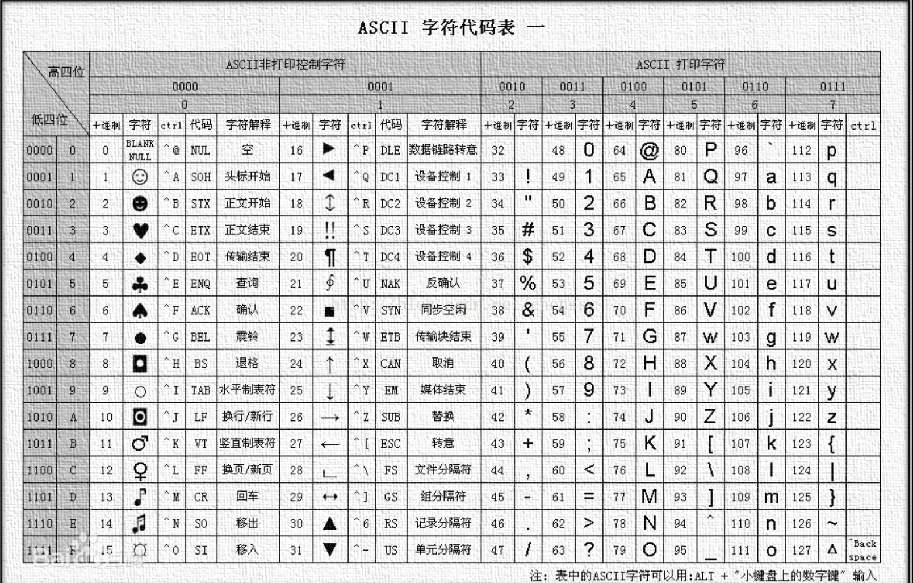

---

## 计算机的单位

> - bit - 比特位
> - byte - 字节
> - kb
> - mb
> - gb
> - tb
> - .....

- 1字节 = 8个比特位(规定好的)
- 1024字节 = 1kb(规定好的)
- 1024kb = 1mb(规定好的)
- 以此类推(规定好的)

---

# 初始c语言

```c
    //整个源文件中只能由有一个main函数
    #include <stdio.h> // 引入头文件 stdio(standard input output)标准输入输出 .h为头文件后缀
    //main为主函数。程序直接的时候找他
    int main()
    {
        //库函数(使用库函数之前需导入 #include <xxx> 就是导入方式)
        printf("hello world wang jia nian\n");
        return 0;
    }
```

## printf基本使用


**代码演示**

```c
    int age = 1;
    printf("age = %d\n", age); // age = 1

    /*字符应该是一个字母，而一个汉字则不行
        当sex = '男'时 会提示warning
        从“int”到“char”截断z
    */
    char sex = 'A';
    printf("sex = %c\n", sex);// sex = A
```

[详细使用请参考**printf打印格式**](#printf打印格式)

---

# 基本数据类型

- char - 字符类型
- short - 短整型
- int - 整数类型
- long - 长整数类型
- long long - 更长的长整数
- float - 单精度浮点数
- double - 双精度浮点数

## 占位多少字节sizeof

`sizeof(类型)` 库函数 查看类型占位多少字节 返回值为int

```c
    printf("%d\n", sizeof(char)); // 1
    printf("%d\n", sizeof(short)); // 2
    printf("%d\n", sizeof(int)); // 4
    printf("%d\n", sizeof(long)); // 4
    printf("%d\n", sizeof(long long)); // 8
    printf("%d\n", sizeof(float)); // 4
    printf("%d\n", sizeof(double)); // 8

    int age = 18;
    printf("%d\n", sizeof(age));//4
    //当值为变量(表达式)时也可以
    printf("%d\n", sizeof age)//4
```

> 注意： 当`sizeof()`的值为**类型**时，括号不可以省略
>
> [具体细节请参照`sizeof`](#sizeof)


---

## 输入函数 `scanf()`

格式

> `scanf("格式控制字符串", &变量1, &变量2, ...); //& = 取地址值`

```c
    int a;
    float b;
    scanf("%d%f", &a, &b); //&xxx为固定语法
    scanf_s("%d%f", &a, &b);

    //格式之例外
    char arr[10] = "1234";//初始化
    //因为数组的引用关系(数组名就是首元素地址)
    scanf("%s", arr);
    printf("%s\n",arr); 
```

[关于scanf的更多细节请参考`scanf()`的注意点](./show_detail/detail.md)

---

## 作用域 全局变量 局部变量

- 作用域 全局变量 局部变量和js,java等其他计算机语言基本一样

- 但c语言中全局变量可以**跨文件使用(即test1.c的一个全局变量可以在test2.c的环境下使用,对此在编程中只能有一个main函数入口)**.

## 全局变量(其中的一种)

### 全局声明外部变量extern

1. 声明变量

> `extern 类型 外部全局变量`
> 
> `extern int global; //global为外部全局变量，不用赋值` 

*演示声明全局外部变量*
```c
    //test1.c
    int global = 3;
    void test() {

    };

    //test2.c
    #include <stdio.h>

    int main()
    {
        extern int global;
        printf("%d", global);//3
    }
```

2. 声明函数

- `extern 函数返回值的类型 外部全局函数(参数类型,...)`

```c
    //外部函数来源与wang.c
    int add(int x, int y) {
	    return x + y;
    };

    int main()
    {
        extern int add(int, int);
        int num = add(10, 20);
        printf("%d\n", num);//30
        return 0;
    }
```

> 注意: `extern`关键字之所以可以引用外部变量或函数是因为当前的
> 
> 源文件与外部源文件有着**外部链接**的关系

---

## 从“double”到“float”截断

```c
    //在编辑的时候会把 3.14 认作double类型 这是会出现精度丢失
    float sex = 3.14;
    printf("%f\n", sex);//这是会弹出warning 从“double”到“float”截断

    // 如果想让3.14为单精度时在后面加一个 f
    float sex = 3.14f;
    printf("%f\n", sex);//没有警告

```

---

# sizeof()

语法: `sizeof(数据类型) -- sizeof(变量)`

> 用于获取数据类型或变量的字节大小。

1. 返回值为`size_t`类型, 在32位系统是由typedef定义的无符号整数类型(unsigned int)
2. **sizeof运算符在编译时求值，不会对运算对象进行实际计算或执行。**
3. `sizeof`参数为指针变量或类型时，在不同的平台占位字节也不同。64位=8; 32位=4
4. 参数为数组变量或类型时，sizeof运算符返回整个数组的字节大小(即操作数为数组时返回的是整个数组大小)。例如，`sizeof(int[5])`的结果是整型数组5个元素的总字节大小。
5. `sizeof`的操作数不能是函数
6. `sizeof(数组名)`计算的是整个数组的长度,这里的数组名就只有数组名,例:`sizeof(数组名+1)`这里的数组名就是首元素地址
7. `sizeof`计算数组时,计算的是数组的大小,而不在乎是不是`\0`

---

[^2]
```c
	int a = 1;
	int b = 0;
    //sizeof括号内的值是不参与运算的
	printf("%d\n", sizeof(a = 0)); // 4
	printf("%d\n", a);// 1

```

---

[^7]
```c
    char ch[] = { '1', '2', '3','4','5','6' };//无\0
    printf("%d\n", sizeof(ch));// 6
```

---

# 常量 以及 常变量const  

## const常变量

- **常变量** 格式: `const 类型 名 = 值;`

```c
    /*注： 直接写const int age;不会报错，
    但是会弹出warning (xxx : 未引用的局部变量)*/
    
    const int age;
    const int age = 10;
```

> 常变量本身不算是常量，而是不会再改变的变量

**证明**

```c
    const int a = 2;
    //错误代码
    // int arr[a] = { 0, 1 };//此时会报错
    int arr[2] = {0, 1};//没问题
```

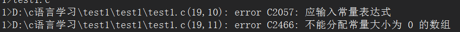

---

### const修饰指针

1. `const 类型*`
2. `类型* const`
3. `const 类型* const`

const修饰的值无法改变, 但可以改变指针的指向地址(悄悄的花钱)

```c
    //const修饰的值无法改变, 但可以改变指针的指向地址
    const int age = 20;
    int* time = &age;
    *time = 20;
    printf("%d\n", age);// 20
```

1. 限制*b解引用改变值(不让女朋友乱花男朋友钱)

`const int* b === int const *b`

```c
    const int a = 1;
    const int* b = &a;
    //报错
    // *b = 20;
    printf("%d\n", a);// 20
```

1. 限制b改变值(不让女朋友因为不给她买吃的而找其他男朋友)

```c
    int i = 100;
    const int a = 10;
    int* const b = &a;
    //报错
    // b = &i;
    printf("%d\n", a);// 20
```

3. 即不让b改变值也不让*b解引用改变值(及不给女朋友买吃的也不让她找其他女朋友)

```c
    //富家花花公子
    int i = 1000;
    //穷逼的我
    const int a = 10;
    const int* const b = &a;
```

> [关于指针请参考**🧭指针章节**](#🧭指针)

---

## `#define`定义常量和宏

1.  `#define` 定义的标识符常量

格式: `#define 常量名 值`

```c
    // 由#define定义的常量
    #define MAX 2 // 不加分号
    int arr[MAX] = { 0,1 };// 此时不会报错
    printf("%d\n", MAX);

```

2. `#define`定义宏(就是一个函数，名字高大上罢了)

`#define 宏名 替换文本`

```c
    //替换文本必须是一个表达式,函数参数不用写类型
    #define MAX(X, Y) (X > Y ? X : Y)

    printf("%d\n", MAX(2, 3));// 3
```

---

## 枚举常量enum

3. **枚举常量**

格式: `enum name {xxxxx};`

作用: 常用于状态标识, 例如:星期, 月份...

```c
    //通常里面是大写的形式，但是否需要写看自己
    enum Color
    {
        red, //printf打印值为 0
        green,//printf打印值为 1
        yellow//printf打印值为 2
    };

    int main()
    {
        //age可以改变，但是Color中的green不可以改变
        enum Color age = green;
        age = 3;
        printf("%d\n", age);//3
        int arr[green] = { 0 };// 不会报错
        return 0;
    }

```

> 当设置`green = 1;`时，会报错表达式必须时可修改的左值

---

# 字符串类型

C语言没有像java和js那样的String类型,而是通过char数组来形成字符串

```c
    //内部默认有了 '\0'
    char arr[] = "abc";
    printf("%s\n", arr);//abc
    /*
    在打印这个数组时，会一直向后寻找值，在打印这里的c字符之后会继续向后找
    如果字符数组没有找到'\0'，则使用随机数代替 直到找到 '\0'
    */
    
    char arr[] = {'a', 'b', 'c'};
    //乱码：abc烫烫烫烫烫烫烫烫烫烫烫烫烫烫烫烫贴-`茭
    printf("%s\n", arr);//这是arr输出的结果为乱码

    //这里的 \0 就相当于 js中的 done函数只有在调用done时才会结束
    char arr[] = {'a', 'b', 'c', '\0'}; // '\0' 或者 0 
    char arr[] = {'a', 'b', 'c', 0};
    printf("%s\n", arr);

    /*当字符数组规定了长度时的情况
    之所以第一项代码没有乱码是因为如果没有显式地给最后一个元素赋值为'\0'，则编译器会自动在数组的末尾添加一个'\0'。

    在第一个例子中，虽然只初始化了两个元素，但是最后一个元素被自动赋值为'\0'，所以打印charArr时只输出了前两个元素的值。

    而在第二个例子中，显式地给最后一个元素赋值为'3'，
    所以打印charArr时输出了所有三个元素的值，
    但发现最后一位不是空字符然后就用随机数代替直到找到 \0。
    */
    char charArr[3] = {'1', '2'}; //12
    char charArr[3] = {'1', '2', '3'};//123烫烫烫烫烫
```

## 数组内部的`\0`

> `0 与 '0' 与 '\0'`的区别
>
> `0` ---> 数字0
> 
> `'0'` ---> 字符0 对应的ASCLL码值为 48
> 
> `'\0'` ---> 转义字符0 -- ASCLL码值为 0

**字符串末尾的空字符 `'\0'`代表着字符数组(字符串)的结束**

## strlen()

职能: 相当于**java**和**js**的 `xxx.length`,返回值为`size_t`

```c
    //引入头文件----不引入也可以用因为有时候编译器默认包含了该头文件
    #include <string.h>

    int main() {
        char str[] = "Hello, World!";
        int len = strlen(str);
        
        printf("字符串的长度是：%d\n", len);
        
        return 0;
    }
```

*注意点*: `strlen` 函数只计算字符串的实际长度，不包括字符串末尾的空字符 `'\0'`。内部是通过计数器来实现计算长度,而不是数组本身的空间长度。

---

# 转义字符

计算机语言转义字符都差不多

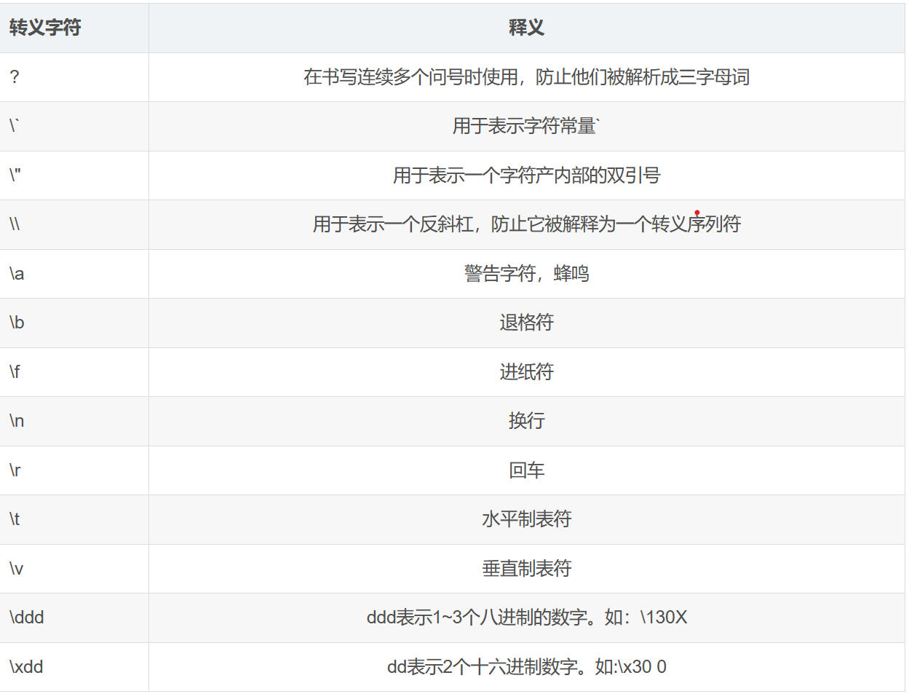

```c
    /*
    \t 代表的是键盘中的 tab键----对应的是一大段空格
    \xdd --- x32 表示的是两个十六进制位
    32 ----- 3*16^1 + 2*16^0 = 50 对应的十进制位 2
    */ 
    printf("c:\test\x32");// c:      est2
    //再次转义
    printf("c:\\test\\x32");// c:\test\x32
    /*
        \t....
        \ddd --- \127 --- 因为是八进制所以数字不能超过8 
        1*8^2 + 2*8^1 + 7*8^0 = 64 + 16 + 7 = 87 对应的十进制位 W

    */
     
    printf("c:\test\127");// c:      estW
```

> **转义字符在字符串当中占位一个字符**

---


# 自定义函数(自定义方法)

1. 语法

```c
    类型 名字(args...) {
        //类型为void可不写
        return xxx;
    }
```

2. 一个简单的使用
```c
    //与js不同但与java相同的是 函数参数需定义类型 需要注意
    int add(int num1, int num2) {
	    return num1 + num2;
    };

    int main ()
    {
        int age = 0;
        age = add(1, 2);
        printf("%d\n", age);//3
        return 0;
    }
```

---

# visual studio调试

## 基本使用

打开调试 fn + f10 打开调试并且可以让黄箭头执行

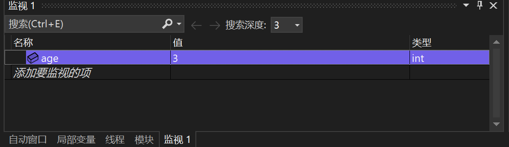

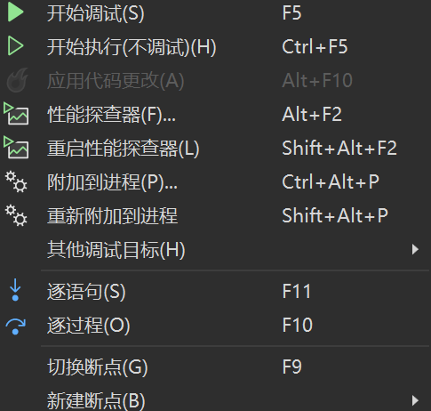

---

## 断点

> 在设置断点之后，按`fn + f5`，黄色箭头会直接跳到断点处
>
>> 注: `fn + f5`是开始调试，而不是直接`fn + f10` 

- `f5` - 启动调试，经常用来直接调到下一个断点
- `f9` - 打断点(f5和f9通常一起连用)
- `f10` - 逐过程，一个过程可以是函数调用或是一个语句
- `f11` - 逐语句，每次都执行一条语句，并且**会进入函数内部**
- `shift + f11` - 跳出 - 在自定义函数中则直接跳出当前函数;而在main中跳出则直接结束运行

---

# 数组

数组类型: `int [x]`

数组指针类型: `int(*)[x]`

- 在数组中未被填充值，默认值为 `0`
- 不完全初始化，剩下的元素默认初始化为`0`
- 数组长度限制必须是**常量表达式**

> [关于常量的详细参考常量以及`const`](#常量-以及-常变量const)

## 定义整型数组

```c
    //如果不赋值的话会弹出一个warning “arr”: 未引用的局部变量
    int arr[10]; //定义一个长度为10的整型数字数组
    /*
    /int为数组里整型的类型而不是数组本身的类型,
    在这里数组的类型为 int[10]
    */
    int arr2[10] = {1,2,3,4,5,6};

    // long arr1[2]

```

---

## 定义字符数组

> 以{}的方式填充字符数组下，需要自己手动填充`'\0'`;或者给定数组长度
> 并保留多余的空间隐式添加'\0'(主要还是因为没有初始化的元素默认填充0)

```c
    //隐式 '\0'
    char ch[10] = "abcfsda";
    //以{}的方式填充字符数组下，需要自己手动填充'\0'
    char ch1[] = {'a','b','c','d','e','f','g','\0'};
    /*
        此时为随机值，因为 \0'为字符数组的结束标志，而自己填充的
        值找遍后，会通过随机值来给数组填充，直到找到'\0'
    */
    char ch2[] = {'a','b','c','d','e','f','g'};
    /*多余的空间默认添加0所以可以找到'\0' */
    char ch2[10] = {'a','b','c','d','e','f','g'};
```

---

## 计算数组的长度length

c语言没有像java或js的xxx.length而是需要通过自己计算

```c
    //整型数组计算
    int arr[] = {1, 2, 3, 4, 5};
    //数组占位的字节 / 一个数组元素的字节
    int length = sizeof(arr) / sizeof(arr[0]);//5

    //字符串计算(通过strlen方法计算)
    char password[] = "1234";
    /*
        strlen返回值类型为size_t在64位平台下
        由typedef定义的类型位unsigned __int64
        而不是4位平台，则类型为unsigned int
    */
    printf("%d\n", (unsigned int)strlen(password));

    //通过sizeof计算会把 '\0'计算进去，所以使用这种方法的话最好提前-1
    char password[] = "1234";
    int length = sizeof(password) / sizeof(password[0]);
    printf("%d\n", length);// 5

```

---

## `arr`, `&arr[0]`, `&arr`区别

> `arr`作为参数传递时，传递的是**首元素地址**，所以`arr`和`&arr[0]`
> 是一样的。而`&arr`与其他不同因为它代表着**取出整个数组的地址**。所以
> `&arr + 1`无法获得内部的元素

```c
    int main()
    {
        int arr[10] = { 10,9,8,7,6,5,4,3,2,1 };
        //地址每次都是不同的, 这里是为了体现它们的区别
        printf("%p\n", arr + 1);// 000000CB093EFB8C
        printf("%p\n", &arr[0] + 1);// 000000CB093EFB8C
        //整个数组的地址
        printf("%p\n", &arr + 1);// 000000CB093EFBB0
        return 0;
    }
```

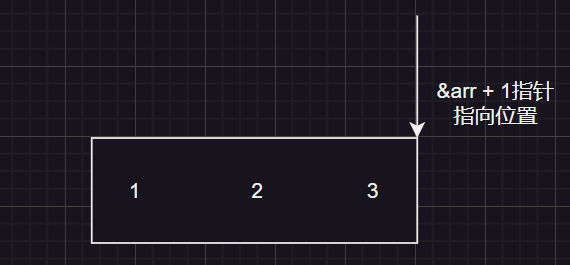

---

### 数组作为参数的另外

1. `sizeof`
```c
    int main()
        {
            int arr[10] = { 10,9,8,7,6,5,4,3,2,1 };
            //当数组名作为sizeof的参数时，打印的是整个数组
            printf("%d\n", sizeof(arr));
            return 0;
        }
```

> 当数组名作为sizeof的参数时，打印的是整个数组
>
> [更多sizeof的细节可以参考`sizeof`](#sizeof)

1. `&arr` 为整个数组的地址而不是首地址

---

## 二维数组

- 基本使用

```c
    //形式 1
    int arr[][3] = { {1,2,3}, {1,1,2} };
    /*
        形式 2
        元素会自动填充，第一行填满会填第二行，
        没有填的默认初始化为 0 
    */
    int arr[][3] = { 1,2,3,4,5,6,7,8 };
    int arr[3][3] = { 1,2,3,4,5,6,7,8 };

```

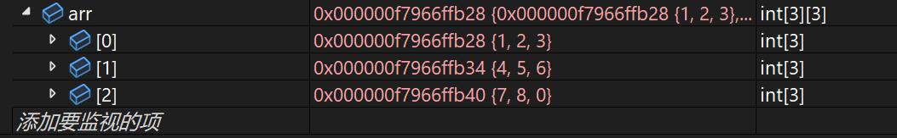

> 行的长度可以不填，但列必须有长度。例如：可以`arr[][3]`,但绝不可以
> `arr[3][]`

---

### 二维数组的内存存储

```c
    int main()
        {
            int arr[2][3] = { {1,2,3}, {1,1,2} };
            for (int i = 0; i < 2; i++)
            {
                for (int j = 0; j < 3; j++)
                {
                    printf("arr[%d][%d] = %p\n", i, j, &arr[i][j]);
                }
            }
            return 0;
        }
```

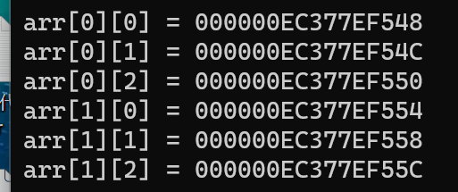

> 可以看出二维数组和一维数组一样存储都是连续的，打印格式为十六进
> 制，因为地址每次都是随机生成，所以为此打印会有不同
>> 例如:租房子，你跟房东说：我要上次租过的房子，他一定很懵逼。


---

# 操作符

大致与其他计算机语言差不多

| 算数运算符   |  移位运算符   |    赋值运算符   |   位操作符  |
|  --------   |    ------    |        ---     |  ---        |
|     `+`     |      `>>`    |         `= `   |     `&`     |
|     `-`     |      `<<`    |         `+=`   |     `^`     |
|     `+`     |              |         `-=`   |   `\|`      |
|     `*`     |              |         `*=`   |
|     `/`     |  逻辑运算符   |         `/=`   |
|     `%`     |    `&&`      |         `&=`   |
|             |   `\|\|`     |         `^=`   |
|             |              |         `\|=`  |
|             |              |         `>>=`  |
|             |              |         `<<=`  |

.png "操作符优先级")

`!(逻辑非) > 算术运算符 > 移位运算符 > 关系运算符 > 位运算符 > 逻辑与或 > 赋值运算符 > ,`


## 算数运算符

```c    
    /*c语言和Java一样除法取整不带余数
        但是在js中 5 / 2 = 2.5
    */
    int age = 5 / 2;
    printf("%d\n", age);//2

    //取余数
    int age = 5 % 2;
    printf("%d\n", age);//1

```

js当中 `5 / 2 = 2.5`

## 移位运算符

C语言的移位运算符移位的是**补码**。在计算机中，正数的原码、反码和补码都是相同的; 而负数在得到补码(负数在内存中存储的是补码, 像使用`printf`打印是输出一个数的原码)是需要一些转换。最高位(符号位)为0是正数，1为负数

[移位之后如何补位参考`右移操作符的算术右移与逻辑左移`](#右移操作符的算术右移与逻辑左移)

`<<`左移 (移 2进制为操作符)

```c
    int a = 1;
    //整型占位4个字节 = 32bit位
    //二进制表示：00000000000000000000000000000001
    //整个二进制左移(空缺的地方用0补) --> 
    // 00000000000000000000000000000010
    printf("%d\n", a << 1);// 2
    printf("%d\n", a << 2);// 4

```

> 左移相等于给一个数乘以2

`>>`右移 (移 2进制为操作符)

```c
    int a = 1;
    printf("%d\n", a >> 1);//0
```

> 注1: `>>`移位不可以移负数。例如:`int a = 5 >> -1;`就是错的
> 会报`warning C4293: “>>”: Shift 计数为负或过大，其行为未定义`
>
> 注2: **它们的操作数必须是整数**，而且整数与浮点数存储完全不一样

---

## 位操作符

(2进制)位操作

- `&` - 按位与
- `|` - 按位或
- `^` - 按位异或


`&` - 按位与(对比都为真则为真,只要有一个假就为假)
```c
    /*  二进制位比较 c语言中0为假 1为真 (个位与个位比，十位与十位比)
        
        001
        011 
        比较的结果为 001
    */
    printf("%d\n", 1 & 3);//1
```

---

`|` - 按位或(对比只要一个真就ok)
```c
    /*  进制位比较 c语言进制比较中0为假 1为真 (个位与个位比，十位与十位比)
        001
        011 
       比较的结果为  011 = 3
    */
    printf("%d\n", 1 | 3);//3
```

---

`^` - 按位异或(对应的二进制位相同为0 相异为1)
```c
    /*
        001
        011
      比较的结果为  010 = 2 
    */
    printf("%d\n", 1 ^ 3);//2
```

### 按位异或`^`骚气交换变量法(不创建临时变量)

```c
    int main
    {
        int a = 4;
        int b = 6;
        a = a ^ b;
        b = a ^ b;
        a = a ^ b;
        printf("a = %d\nb = %d\n", a, b);// 6 4
        return 0;
    }
```

---

## 单目操作符

- `!` 逻辑反操作
- `-` 负值
- `+` 正值
- `&` 取地址
- `sizeof` 操作数的类型长度（以字节为单位）
- `~` 对一个数的二进制按位取反
- `--` 前置、后置--
- `++` 前置、后置++
- `*` 间接访问操作符(解引用操作符)
- (类型) 强制类型转换

1. `!` 逻辑反操作
```c
    // c语言中0为假 非0为真  
    int age = 10;
    printf("%d\n", age);//10
    printf("%d\n", !age);//0
```

---

2. `&` 取地址
```c
    int age = 10;
    // 我当前的地址值为：32504724 但这并不代表着他会一直是这个地址
    printf("%d\n", &age);

```

---

3. `++` 前置、后置++
```c
    int a = 10;
    //后++ 先使用 再 ++
    int b = a++;
    printf("%d\n%d\n", a, b);//a = 11; b = 10;

    //先++ 再使用
    b = ++a;
    printf("%d\n%d\n", a, b);//a = 11; b = 11;
```

---

4. `~` 对一个数的二进制按位取反
```c
    int main()
{
	int a = 0;
    //这里的b为符号
	int b = ~a;
    /*
        int 0 占位32bit位对应的二进制是
        00000000000000000000000000000000
 取反为：11111111111111111111111111111111    
        还需要理解： 原码 - 反码 - 补码
        负数在内存中存储时，存储的是二进制补码

    */
    /*
        而使用的或者是打印的，是这个数的原码
        而在内存中存储的是补码，所以需要对应的做一些转换
        补码: 11111111111111111111111111111111 
        反码: 11111111111111111111111111111110 - 先-1
        原码: 10000000000000000000000000000001 - 然后符号位不变其他位按位取反
    */
	printf("%d\n", b); // -1
	return 0;
}
```

> [关于符号位请参考`符号位`](#符号位)

---

5. (类型) 强制类型转换
```c
    int age = (int)10.14;
    printf("%d\n", age);// 10
```

---

## 逻辑运算符

`&&`逻辑与(二者都为真则为真)

```c
    /*
        0为假 1为真
        5 && 6在使用%d 打印时只会返回 1 或 0
    */
    int a = 5 && 6;
    printf("%d\n",a);// 1

    a = 0 && 6;
    printf("%d\n",a);// 0
```

> 注意：在js中的逻辑运算符中，值为true时，会返回这个值本身
> 而不是1或者0

```js
    let age = 5 || 6;
    console.log(age);// 5

    let age = 5 && 6;
    console.log(age);// 6 
```

---

# 原码 - 反码 - 补码

## 符号位

> 在C语言中，整数类型的二进制表示中的最高位被称为`符号位`。符号位用来表示一个数的正负性。在C语言中，整数类型的二进制表示中的最高位被称为符号位。符号位用来表示一个数的正负性。**符号位为0表示正数，为1表示负数**(规定好的)。
>>  `最高位`：例如10000000000000000000000000000000最前面的就是最高位

---

## 转换
> 整数在内存中存储的是补码形式。补码是一种表示有符号整数的方法，它通过将正数的最高位设为0，负数的最高位设为1，然后取反加1来表示负数。

- 原码 ---> 补码

> 原码符号位不变，其他位按位取反为反码---然后反码 + 1 得到补码

- 补码 ---> 原码

> 补码-1得到反码，然后符号位不变其他位按位取反为原码

```c
    // 补码 ---> 原码
    11111111111111111111111111111111
    //补码-1得到反码
    11111111111111111111111111111110
    //符号位不变其他位按位取反为原码
    10000000000000000000000000000001
    // 最高位为负数， 而二进制对应的值为 1 最终值等于-1
```

---

## 使用

[^1]
```c
    int main()
        {
            /*
                因为为负数所以最高位为1，又因为值为1所以等于00..1
                原码：10000000000000000000000000000001
                反码：11111111111111111111111111111110 -- (反码是一个中间状态)
                补码：11111111111111111111111111111111
                在内存中存储为:ff ff ff ff - 十六进制
                十六进制的一个f = 十进制的15 = 二进制的1111
                转换为二进制：11111111111111111111111111111111
            */
            int a = -1;
            int b = a >> 1;
            /*
                而11111111111111111111111111111111右移还是
                11111111111111111111111111111111所以结果为-1
            */
            printf("%d\n", b);// -1
            return 0;
        }
```
[^1]: ./img/-1的内存.png

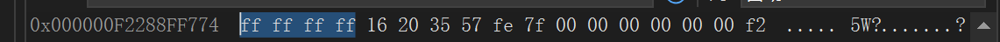

---

## 右移操作符的算术右移与逻辑左移

> 在vs编译器中采用的是**算术右移**

### 算术右移

- 右边丢弃，左边补原符号位(最高位)

### 逻辑左移

- 右边丢弃，左边补0

---

## 左移操作符的规则

- 左边丢弃，右边补0

---

# 常见关键字

`auto`、`break`、`case`、`char`、`const`、`continue`、
`default`、`do`、`double`、`else`、`enum`、`extern`、
`float`、`for`、`goto`、`if`、`int`、`long`、`register`、
`return`、`short`、`signed`、`sizeof`、`static`、
`struct`、`switch`、`typedef`、`union`、`unsigned`、`void`、
`volatile`、`while`

--

## register寄存器

- 寄存器
- 高速缓存
- 内存
- 硬盘

`register`寄存器(CPU在读取寄存器存储的数据时会很快)

```c
    /*
        不是通过声明register关键字让这个变量进入寄存器
        而是建议将变量a定义为寄存器变量
        但具体是否寄存由编译器判断
    */
    
    register int a = 0;
```

---


## `signed` 和 `unsigned`

> `signed`：表示有符号的整型。有符号整型可以表示正数和负数，其中最高位是符号位，用于表示正负性。
>
> `unsigned`：表示无符号的整型。无符号整型只能表示非负数，因此，它的取值范围从0到最大正整数。无符号整型没有符号位，所有的位都用于表示数值。


```c
    /*
        int 定义的变量是有符号的
        signed int == int 
        int是一种简写形式
    */
    signed int a = -12;
    /*
        当给无符号的整型赋值为负数时，
        使用%d还是打印赋值的-12
    */
    
    unsigned int a = -1;
    printf("%d\n", a);// -1
    /*
        %u专门打印无符号数
        因为unsigned没有符号位,所以当将-1为一个unsigned int赋值时, 最高
        位会被看成普通位

        对应的11111111111111111111111111111111 -转十-> 4294967295
    */
    printf("%u\n", a);// 4294967295
```

---

## `typedef` 类型重定义

`typedef 类型 name `

```c
    typedef int wang;
    wang b = 1;

    typedef unsigned int xxwang;
    xxwang b = 1;
```

---

## `static`静态

1. `static` 修饰局部变量时会延长它的生命周期

```c
    /*
        一般来说局部变量的生命周期是函数内部变量当前的开始和函数的结束
        但是为局部变量添加static时会延长它的生命周期而且在调试的时候
        会跳过当前赋值的操作进行下一步操作
    */

    int xxwang() {
        int a = 0;
        a++;
        return a;
    };
    
    int test() {
        static int a = 0;
        a++;
        return a;
    };

    int main {
        int i = 0;

        while(i < 5) {
            printf("%d\n", test());// 1 2 3 4 5
            printf("%d\n", xxwang());// 1 1 1 1 1
        }

        return 0;
    }
```

---

2. `static` 修饰全局变量

> `static` 修饰全局变量时，改变了变量的作用域 - 让静态的全局变量
> 只能在自己所在的源文件(.c)内部使用，出了源文件就不可以使用

3. `static` 修饰函数

> `static` 修饰函数时，改变了函数的`链接属性`
>
> 当前源文件之所以可以访问外部源文件的变量或函数是因为它们有着链接的关系
>
> 从`外部链接属性` ---> `内部链接属性`

---

## goto

语法:<kbd>LOOP:</kbd> -- <kbd>goto LOOP;</kbd>

> goto语句用于无条件地跳转到程序中的另一个标记（label），并从该标记处继续执行程序。
>
> 实际上在C语言中，应该使用循环语句（如for、while或do-while）来实现循环。
>
> goto有着自己的使用场景。例如循环多层嵌套，这是需要处理错误的话，
> 要退出循环，就要一直break break break，而goto就可以直接跳出来
> 例如**关机程序**

```c
    int main () {
        //loop 就是一个名字，但必须与goto后的值保持一致
        loop:
        pritf("我是傻逼\n");
        goto loop;
        //结果是死循环
        return 0;
    }
```

关机系统
```c
    #include <stdlib.h>
    #include <stdio.h>
    #include <string.h>
    int main () {
        char input[20] = {0};
        //60秒后关机
        system("shutdown /s /t 60");
        // system("shutdown -s -t 60");//都可以
        printf("输入:我是傻逼, 取消关机\n");
        //goto的标识符
        again:
        //数组的引用关系默认就是取地址所以不需要加&，但是加也可以
        scanf("%s", input);
        // scanf("%s", &input);
        if(strcmp(input, "我是傻逼") == 0) {
            //取消关系指令
            system("shutdown /a");
            // system("shutdown -a");//都可以
        } else {
            printf("在给你一次机会，这个机会我可以一直给\n");
            goto again;
        }
        return 0;
    }

```

> [`strcmp()`的使用参考string头文件<kbd>strcmp</kbd>](#strcmp)
>
> [`system()`的使用参考stdilb头文件<kbd>system</kbd>](#system)

---

# 🧭指针

## 计算机的32位/64位

> 电脑的32位和64位是指处理器的数据位数(二进制位)，即处理器一次能处理的数据位数。32位处理器一次能处理32位的数据，64位处理器一次能处理64位的数据
>
>>  因此32位的数据可以表示2^32个不同的值(32位的数据范围为0 -- 2^32-1。而在计数时从1开始数的，所以整体+1 得到2^32)

## 指针变量

语法: `type* name = &xxx // type*为类型`

解引用操作符: `*name = xxx`

> 指针变量用于存储内存地址

```c
    int i = 10;
    // &为取地址--- 1 && 0 为逻辑与 --- 1 & 3 按位与
    int* pi = &i;
    //这里的 * 为解引用操作符
    *pi = 111;
    printf("%d\n", i);// 111
```
> `*`所指的是它是一个指针变量，`int*`中的`int`指的是pi指向的对象i的类型(指针指向数据的类型)

---

## 指针变量大小

```c
    char i = 'w';
    char* pi = &i;
    //因为我是64位平台
    printf("%d\n", sizeof(pi));// 8  
    printf("%d\n", sizeof(char*));// 8 
    printf("%d\n", sizeof(int*));// 8 
    printf("%d\n", sizeof(long*));// 8 

    //通过debug更改环境为 32位时
    printf("%d\n", sizeof(long*));// 4 
```
> 结论: **指针大小32位平台时都为4个字节，而64位平台是8个字节**
> 
>> 32位处理器一次能处理32位(二进制位)的数据对应的就是`4个字节`，64位处理器一次能处理64位(二进制位)的数据对应的就是`8个字节`

---

## 数组指针初识

语法: `int(*)[10]` - 10为长度

```c
    	int arr[10] = { 0 };
        //容纳的是整个数组的长度，而不是数组的首地址
	    int(*pi)[10] = &arr;// 数组指针
        //int* arr[10] // 指针数组
```

---

## 🩵指针进阶

> 竟然指针都是存储地址的，而为什么还要有那么多的类型呢? 它们之间的区别呢?

### 指针类型决定能够访问多少字节

使用int指针接收int变量
```c
    int main()
    {
        //0x表示后面的数字是十六进制数 - 十进制 => 287454020
        int i = 0x11223344;
        int* pi = &i;
        *pi = 0;

        return 0;
    };
```
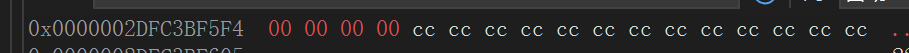


使用char指针接收int变量
```c
    int main()
    {
        //0x表示后面的数字是十六进制数 - 十进制 => 287454020
        int i = 0x11223344;
        char* pc = &i;
        *pi = 0;
        return 0;
    };
    
```

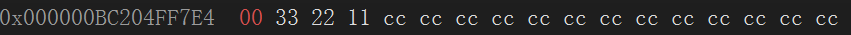

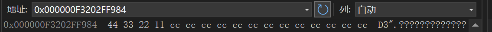

> 总结: 不同的指针变量能够访问的字节是不同的
> 
> double* - 可以访问8个字节
> 
> int* - 可以访问4个字节
> 
> char* - 可以访问1个字节
> 
> .....
>
> [关于为什么十六进制倒着存参考大端小端](./C语言进阶.md#大端小端)

---

### 各个类型指针的+1与-1得到的结果

```c
    #include <stdio.h>
    int main()
    {
        int i = 0x11223344;
        int* pi = &i; 
        /* warning C4133: “初始化”: 从"int *"到"char *"的类型不兼容
        可使用强转 ==> char* pc = (char*)&i */
        char* pc = &i;
        /* +1或者-1是为了获得上一个或下一个的元素
        地址每次都会变，这里的地址只是当前运行给出的结果    
        主要是为了验证存储地址到指针的一致性 */    
        printf("%p\n", pi);// 000000064ECFFC24
        printf("%p\n", pi + 1);// 000000064ECFFC28

        printf("%p\n", pc);// 000000064ECFFC24
        printf("%p\n", pc + 1);// 000000064ECFFC25
    }

```

> 结果: 不同类型的指针+1得到下一个元素，需要往前或向后多少个字节是不同的。
>
> 例如: char [10]. char[1]+1得到下一个元素，向后了1字节。
>
> 而int [10]. int[1]+1得到下一个元素，向后了4字节(整型数组向后4个字节得到下一个元素)。
>
> **指针类型决定了，指针走一步走多远**

---

## 野指针

1. 指针未初始化
2. 指针越界访问
3. 指针被回收

---

### 指针未初始化

```c
    //在vs编译器下不让运行
    int main()
    {
        /* 当指针没有被赋值时，那么默认就是随机值
        随机一个地址被使用会造成许多影响 */   
        int* pi;
        *pi = 10;
        return 0;
    }
```

---

### 指针越界访问

```c
    //越界可能会直接让程序崩溃
    int main()
        {
            int arr[10] = {1,2,3,4,5,6,7,8,9,10};
            int* pi = arr;
            //指针越界
            for (int i = 0; i < 11; i++)
            {
                *(pi++) = 3;
            }
            return 0;
        }
```

---

### 指针被回收

```c
    int* test()
    {
        /* 局部变量的生命周期为函数的结束，而把一个将要回收的地址交出去。
        warning C4172: 返回局部变量或临时变量的地址: a */   
        int a = 0;
        return &a;
    };

    int main()
    {
        int* pi = test();
        *pi = 10;
        return 0;
    }
```

---

## 指针相减

> **指针相减或比较**应确保两个指针指向同一块内存区域，否则结果可能是不确定的。

```c
	int arr[10] = { 0 };
    char ch[] = "12344";
    /*
        可得知地址相减不是地址与地址的间隔，而是元素与元素之间的距离
        例如: 如果是地址相减的话那么这里应是36，因为整型占4个字节
    */
	printf("%d\n", &arr[9] - &arr[0]);// 9
    //应避免这种写法因为两个指针指向不同内存区域
    // printf("%d\n", &arr[9] - &ch[1]);
```

---

## 二级指针

```c
    int main()
    {
        int i = 1;
        int* pi = &i;
        int** ppi = &pi;
        //多级指针
        int*** pppi = &ppi;
        /*
            *ppi得到&pi，在进行解 *(*ppi)得到i
        */
        **ppi = 10;
        printf("%d\n", **ppi);// 10
        return 0;
    }
```

> `i`的地址, 存储在`pi`指针变量上, 而`pi`自己也是一个变量他自己也有着一个地址
> ，而`ppi`把`pi`的地址存储起来(但归根结底多级指针还是一个指针,大小为4/8个字节)

---

## 指针数组 -- 数组指针

- 指针数组 -- 数组

```c
    int a = 10;
	int b = 20;
	int c = 30;
	int* arr[3] = { &a, &b, &c };
	printf("%d\n", *arr[2]);
```

---

- 数组指针 -- 指针

```c
    int arr[2] = {1,2};
    int(*pi) [2] = &arr;
```

> [详细指针数组于数组指针介绍参考C语言进阶之指针进阶](./C语言进阶.md#指针进阶)

---

# 结构体struct

- 语法：`struct 名字 {成员变量}`
- 使用：`struct 名字 变量名`

```c
//类似于其他语言的接口interface---在使用时才赋值
struct Book
{
    char name[20];
    short price;
};

int main {
    /*
        xxx为变量名
        注意: 括号{}内容的值需要与struct的值循序对应
    */ 
    struct Book xxx = { "小小汪" , 12 };
    printf("price = %d\n", book.price);// price = 12
    printf("name = %s\n", book.name);// name = 小小汪

    //循序不对应时,但也不会报错或者warning
    struct Book xxx = {  12, "小小汪" };
    printf("price = %d\n", book.price);// price = 0
    printf("name = %s\n", book.name);// name =
                                    //小小汪
};
```

注意点: 结构体的成员变量类型必须是完整类型, 在结构体中不能写`char name[]`
而必须是`char name[x]`x为**常量表达式**

---

修改值
```c
    #include <stdio.h>
    #include <string.h>
    struct Book
    {
        char name[20];
        short price;
    };

    int main {
        //struct Book为类型
        struct Book xxx = { "小小汪" , 12 };
        xxx.price = 10;
        //不需要解引用操作符(*)
        printf("price = %d\n", xxx.price);//price = 10
        /*
            这里的xxx.name不可以直接赋值，因为xxx.name是数组
            而存储数组的变量是一个地址它们之间是引用关系
            因此需要通过strcpy方法
            使用前需引入头文件 string.h 如果没有报错则代表着编辑器默认添加这个头文件
        */
        strcpy(xxx.name,"大帅逼汪");
        printf("price = %d\n", xxx.name);//name = 大帅逼汪
    }
```

> [strcpy的使用详细请参见`strcpy`](#strcpy)

---


## 操作符 `->`与`.`

```c
    struct Book
    {
        char name[20];
        short price;
    };

    int main {
        //xxx为变量名
        struct Book xxx = { "小小汪" , 12 };
        /*
            定义指针变量--指针的这个类型是通过指向的对象决定的
            这是指向的对象类型为 struct Book
        */
        struct Book* pb = &xxx;
        //不需要解引用操作符(*)
        printf("price = %d\n", pb -> price);
        printf("name = %s\n", pb -> name);
        /*
            使用解引用操作符(*)
            (*pb).price这里的()是必须的，直接书写 *pb.price会报错
        */
        printf("price = %d\n", (*pb).price);
        printf("name = %s\n", (*pb).name);
    }
```

---

## typedef与struct连用

```c
    /*
    这里是将struct Students定义为有typedef定义的自定义类型
    而Stu是类型名 --- 一定在加分号
    */
    typedef struct Students
    {
        char id[20];
        char name[20];
        char telephone[12];
    }Stu;

    int main()
    {
        Stu s = {"001","wjn","123567"};
        return 0;
    }
```

---

## struct嵌套使用

```c
    struct Stu
    {
        char* id;
        char name[20];
    };

    struct T
    {
        double d;
        struct Stu s;
    };
    //实现
    int main()
    {
        char idw[] = "001";
	    struct T t = { 3.14,{idw, "wjn"}};
        printf("%lf\n", t.d);
        // %s 打印
        printf("%s\n", t.s.id);
        printf("%s\n", t.s.name);
        return 0;
    }

```

> `printf("%s")`会从该地址开始打印字符，直到遇到`\0`字符为止，因此整个字符串都被打印出来了。这是printf函数的特性，它会一直打印直到遇到`\0`字符为止。

---

## struct作为函数参数传递时

```c
    struct Stu {
        char* id;
        char name[20];
    };

    struct T {
        double d;
        struct Stu s;
    };

    void print1(struct T t) {
        printf("%lf\n", t.d);
    }
    /*
        虽然print1和print2效果一致，但是在性能上指针的做法会更好，
        因为print1在实现传参时会重新为结构体开辟一块空间。
        而指针只需要开启一个4或8(看系统)的空间就够了
        所以当结构体作为函数参数传递时, 最好传递它的地址
    */
    void print2(struct T* t) {
        printf("%lf\n", t -> d);
    }
    
    int main() {
        char idw[] = "001";
        struct T t = { 3.14, {idw, "wjn"}};
        print1(t);
        print2(&t);
        return 0;
    }
    
```

---

# if while do...while switch continue

应该与任何其他计算机语言一致

## if语句基本使用
```c
    int age = 1;
    if (age > 1) {
        printf("屎真香");
    } else {
        printf("屎真丑");
    }

```

---

### 悬空else
```c
    int age = 10;
    //在不使用大括号的情况下这里的第2个if与else匹配而不是第一个
    if(age < 11) 
        if(age == 10) 
            printf("%d\n",age);
    else 
        printf("未知数值\n");
     
```

> 注意：在不使用大括号的情况下这里的第2个if与else匹配而不是第一个
> 所以为了规范的代码风格，最好加括号.

.....

## while语句使用

```c
    int age = 0;
    while (age < 10) {
        printf("屎真香\n");
        age++;
	}
```

---

## continue
作用: 跳出本次循环

---

## switch语句基本使用

> 1. switch中不能使用continue因为它是配合循环使用的
>
> 2. switch在遇到条件时，例如下方代码的`case 5`如果它不写break程序则会继续向下走

```c
    int age = 3;
    //这里会直接匹配到 case 3 如果这时没有break的话就会继续向下执行
    switch(age) {
        case 1:
            printf("星期一\n");
            break;
        case 2:
            printf("星期二\n");
            break;
        case 3:
            printf("星期三\n");
            break;
        case 4:
            printf("星期四\n");
            break;
        case 5:
            printf("星期五\n");
            break;
        default:
            printf("星期N\n");
            break;
    };
```

### switch骚气使用

```c

    int age = 1;
    switch (age) {
    case 1:
    case 2:
    case 3:
    case 4:
    case 5:
        printf("工作日\n"); 
        break;
    default:
        printf("星期N\n");
        break;
};

    //最终打印
    // 工作日
```

---


# getchar()和putchar()

> C语言中的getchar函数和putchar函数是用于输入和输出字符的函数。

## 输入缓冲区
> 输入缓冲区是一个临时存储区域，用于存储用户输入的数据，直到被读取为止。
>当我们调用`输入函数(scanf, getchar,...)`时，它会从输入缓冲区中读取数据，并将其赋值给指定的变量。如果输入缓冲区中没有足够的数据供读取，**输入函数会等待用户输入，直到有足够的数据为止。**

---

## getchar()

`函数原型：int getchar(void);`

- 作用：获得输入的一个字符从**输入缓冲区**中拿数据

基本使用
```c
    printf("请输入");
    int a = 0;
    a = getchar();
    printf("%d\n", a);
```

> 当接受`getchar()`的类型为int时,getchar获得的值会*向下转型*
> 为int类型然后在赋值。如果接受类型为char则直接赋值

---

## putchar()

`函数原型：int putchar(int c);`

- 作用：将一个字符输出到标准输出(类似于`printf("%d\n", c)`)

```c
    char a = 'w';
    a = getchar();
    putchar(a);
```

---

## scanf和getchar的碰撞与细节

```c
    char password[20] = {0};
    //获得输入字符
    int wang = 0;
    //用来清空输入缓存区
    int harvest = 0;
    printf("请输入密码\n");

    scanf("%s", &password);
    printf("密码为：%s\n", password);
    //输入缓存区清空  先读取后比较
    // while ((harvest = getchar()) != '\n');
    while ((harvest = getchar()) != '\n') {
        //空语句
        ;
    }
    printf("请确认Y/N\n");
    /*
        这里之所以没有让你输入是因为在我们按下回车的时候 \n已经加载到输入缓存区当中
        而输入函数都是从输入缓存区中拿数据所以就没有输入

        解决方法：在下一个输入函数去读数据之前，把输入缓存区清空
    */
    wang = getchar();
    putchar(wang);
```

> 这里之所以没有让你输入是因为在我们按下回车的时候 `'\n'`已经加载到**输入缓存区**当中而输入函数都是从输入缓存区中拿数据所以就没有输入。
> 
>> 解决方法：在下一个输入函数去读数据之前，把输入缓存区清空

---

## 神秘的`EOF`(End Of File)

- 在键盘中对应的快捷键为`Ctrl + z`

- `EOF`为一个#define标识符所定义的常量其值为 -1

- `#define EOF (-1)`
> 注意: `Ctrl + c`的作用是**终止正在运行的程序或进程，而不是表示EOF(End Of File)**。

---

# 辗转相除法

作用:计算最大公约数

> 以 25 与 45来举例 45 % 25 余 20，然后再25 % 20 余 5，20 % 5 余 0.5就是最大公约数

```c
    // 45 % 25 = 20 , 25 % 20 = 5; 当20 % 5 = 0时, 5就是最大公约数
    int main () {
        int m = 45;
        int n = 25;
        while(m % n) {
            int r = m % n;
            m = n;
            n = r;
        }
        printf("%d", n);
        return 0;
    }
```

---

# 高阶自定义函数

## 函数定义在main函数下面时

```c
    //声明函数
    int add(int x, int y);
    int main ()
    {
        //不声明函数就会报错 add未定义
        add(1, 2);
        return 0;
    }
    //定义函数
    int add(int x, int y)
    {
        return x + y;
    }
```
---

## 模块化定义函数并使用

> c语言允许我们使用#include导入自定义的头文件

- add.h (自定义头文件)
```c
    //头文件中只做声明
    int add(int x, int y);
```

- add.c(自定义源文件)
```c
    //源文件做实现
    int add(int x, int y)
        {
            return x + y;
        }
```

> 自定义头文件和自定义源文件命名不需要一致，但是它们应该相互对应。通常
> 情况下，头文件和源文件的命名是相同的，只是扩展名不同，头文件的扩展名为.h，源文件的扩展名为.c。

- main.c(main函数所在)
```c
    #include <stdio.h>
    //自定义函数引入是 ""
    #include "add.h"
    int main()
    {
        printf("%d\n", add(1, 2));
        return 0;
    }
```

> 注意点：源文件的实现如果有多个则会报错"**这个函数被重复定义**".
> 所以在使用头文件时要保证命名不会重复

---

## 传递参数为数组时注意点

```c
    //作用为计算字符串长度
    int my_strlen(char* str)
    {
        if(*str != '\0')
        {
            //将数组的下一个元素传递过去
            return 1 + my_strlen(++str);
        } else {
            return 0;
        }
    };

    int main()
    {
        char ch[] = "abc";
        //注：当将数组作为实参传递给形参时，实际上传递的是数组的首地址(第一个元素的地址)。
        int len = my_strlen(ch);
        return 0;
    };
```

1. 在C语言中，当将数组作为实参传递给形参时，实际上传递的是数组的首地址。
2. 数组中的元素在内存中是连续存储的，每个元素的大小相同。因此，数组中每个元素的地址都相差一个固定的偏移量，这个偏移量等于元素的大小。
3. arr+1获得下一个数组元素的地址，但这个操作是将其增加一个元素的大小，而不是地址+1

### 传递数组值的细节

```c
    #define _CRT_SECURE_NO_WARNINGS 1;
    #include <stdio.h>
    //因为数组传递的是首元素地址，所以不好计算长度
    void buttle_sort(int arr[], int sz)
    {

        int i = 0;
        //偏移值
        int offset = 0;
        for (i = 0; i < sz - 1; i++)
        {
            int j = 0;
            /*
            flag = 1 代表着数组为有序的所以这是就可以不用在排序了

            */

            int flag = 1;
            //一趟走多少次
            for (j = 0; j < sz - 1 - offset; j++) 
            {
                if (arr[j] > arr[j + 1])
                {
                    int temp = arr[j + 1];
                    arr[j + 1] = arr[j];
                    arr[j] = temp;
                    //flag = 0代表着数组还需要排序
                    flag = 0;
                }

            }
            //可以不用在排序了
            if (flag == 1)
            {
                break;
            }

            offset++;
        }
    };

    int main()
    {
        int arr[10] = { 10,9,8,7,6,5,4,3,2,1 };
        int size = sizeof(arr) / sizeof(arr[0]);
        buttle_sort(arr, size);
        for (int i = 0; i < size; i++)
        {
            // 1 2 3 4 5 6 7 8 9 10
            printf("%d ", arr[i]);
        }
        return 0;
    };
```

---

# 三元表达式与逗号表达式

## 三元表达式

`条件表达式 ? 真值表达式 : 假值表达式`

```c
	int a = 1;
	int b = 0;
    int i = a > b ? a : b;
    printf("%d\n", i);// 1
```

---

## 逗号表达式

> **逗号表达式的值为最后一个表达式的值**，但它会按顺序执行每个表达式，并且每个表达式的副作用会影响到后续表达式的执行。

```c
	int a = 1;
	int b = 0;
    /*
    第一个表达式什么都没做
    */
    int i = (a > b, a = 2, b = a + 1);
    printf("%d\n", i);// 3

```

---

# 隐式类型转换

## 整型提升


> 整型提升是指将较低精度的整数类型提升为较高精度的整数类型的过程。
> 
> 整型提升是按照**变量的数据类型的最高位**(符号位)来提升

```c
    int main()
        {
            /*
                00000000000000000000000000000011
                因为char类型只占位一字节，所以会产生截断从后往前截断
                result: 00000011
            */ 
            char a = 3;
            /*
                00000000000000000000000001111111
                result: 01111111
            */ 
            char b = 127;
            /*
                char类型的变量在运算时，会先提升到int类型，因为CPU操作数的字节长度一般是int的字节长度
                因为当前数为正数，所以最高位是0就补0
                00000000000000000000000000000011
                00000000000000000000000001111111
                相加结果为: 00000000000000000000000010000010
                然后再截断：10000010 -> 补码 - 而printf打印的是原码 - 再次转换为int类型
                因为当前的最高位是1所以补1
                11111111111111111111111110000010 - 补码
                11111111111111111111111110000001 - 反码
                10000000000000000000000001111110 - 原码 = -126
            */

            char i = a + b;
            printf("%d\n", i); // -126
            return 0;
        }
```

---

```c
    char a = 3;
    printf("%d\n", sizeof a);// 1
    //因为 -a参与了运算
	printf("%d\n", sizeof(-a));// 4
	printf("%d\n", sizeof(!a));// 1
```

---

## 整型提升规则

1. 如果参与运算的两个操作数类型不同，则将较低精度的操作数提升为较高精度的操作数类型，然后进行运算。
2. 如果操作数为`char`类型，则会被提升为`int`类型。
3. 如果操作数为`short`类型，则会被提升为`int`类型。
4. 如果操作数为`float`类型，则会被提升为`double`类型。
5. 如果操作数为`unsigned`类型，则会被提升为`有符号`类型。

---

### 整型提升,unsigned类型与截断的注意点

```c
    /*
        负数截断的是补码,需先进行转换
        result:11111111
    */
    char a = -1;
    // char 与 signed char是一样的
	signed char b = -1;
    /*
        result:11111111
        但是存储在unsigned char类型这个无符号类型，最高位就变成了普通位
    */
	unsigned char c = -1;
    /*
        因为整型提升是按照变量的数据类型的最高位(符号位)来提升
        所以a = 11111111111111111111111111111111
        c的最高位已经变成了普通位又因为是无符号类型所以补0
        c = 00000000000000000000000011111111
    */
	printf("a = %d\nb = %d\nc = %d\n", a, b, c);// -1 -1 255
```

```c
    /*  转换
        10000000000000000000000010000000 - 原码
        11111111111111111111111101111111 - 反码
        11111111111111111111111110000000 - 补码
        截断：10000000
    */
    char a = -128;
    /*  整数提升
        11111111111111111111111110000000
    */
	printf("%u\n", a);//  4,294,967,168
    /*
    因为有符号char的取值范围是 -128 ~ 127.所以可以把 128理解成127 + 1
    而127 + 1就相当于-128(可参考下列图形)
    */
    char b = 128;
    printf("%d\n", b);//  4,294,967,168
```

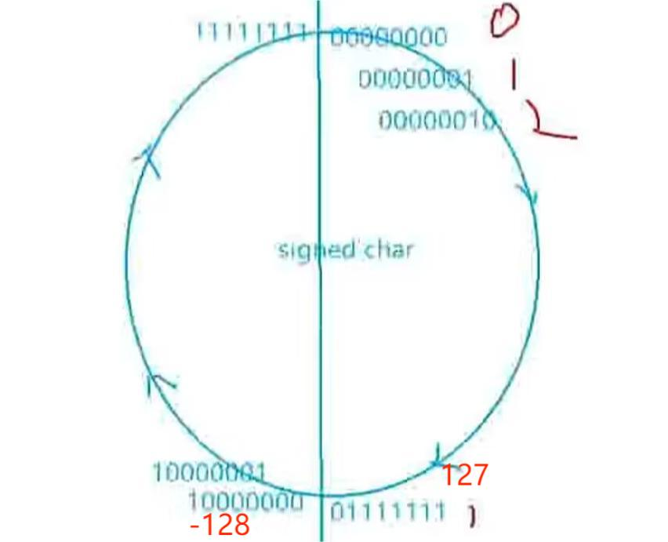

> 注意点：整型提升是按照变量的数据类型的最高位(符号位)来提升，而不是依赖于需要打印的格式。

---

# 栈区的存储方式

> 栈的存储非常类似与弹夹。先存储的后出去，后存储的先出去。

## 压栈和入栈

> 在C语言中，"压栈"和"入栈"通常用于描述将数据放入栈中的操作。栈是一种后进先出（LIFO）的数据结构，只有栈顶的元素可以被访问、插入或删除。

---

## 栈区地址存放规则

- 栈区的默认使用规则:
  - 先使用高地址处的空间
  - 再使用低地址处的空间

### 11

```c
    int main()
{
    /*
        在vs2022中debug版本和release版本都做了地址优化

    */
	int i = 0;
	int b = 12;
	return 0;
}
```

> 但是在存储中发现**i的地址**比**b的地址**要低，可是在栈的地址规则中
> 先使用高地址处的空间再使用低地址处的空间。这在理论上是冲突的
>> 这是因为编辑器对地址做了优化

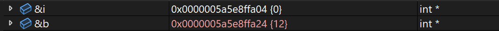