# int类型在内存中的存储

```c
	int a = 20;
    /*
        因为负数在内存中存储的是补码，所以转换一下
        10000000000000000000000000001010 - 原码
        11111111111111111111111111110101 - 反
        1111 1111 1111 1111 1111 1111 1111 0110 - 补
        因为内存是已十六进制显示，转换结果为
        ff ff ff f6

    */
	int b = -10;
```

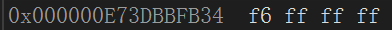

> [内存存储的十六进制为什么倒着存请参考**大端小端**](#大端小端)

---

## 为什么内存存储补码呢

> 在计算机系统中,数值一律用补码来表示和存储。原因在于,使用补码,可以将符号位和数值域统一处理，同时，加法和减法也可以统一处理 ( CPU只有加法器)此外,补码与原码相互转换,其运算过程是相同的.不需要额外的硬件电路。

```c
    /*
        如果是原码相加的话数值就有问题。
        补码相加
        00000000000000000000000000000001
        11111111111111111111111111111111 - -1的补码
        10000000000000000000000000000000 - 超出的位丢掉
        result: 00000000000000000000000000000000
    */
    1 + (-1)
```

---

# float类型在内存中的存储(只需了解)

`计算标准: (-1)^S * M * 2^E`

- S符号位用来表示正负号，0表示正数，1表示负数
- M尾数位表示使用了科学计数法之后的值(值在1<= M <2之间),所以在存储时只把小数存进去，读取时在补上去
- E指数位用来表示浮点数的指数部分，采用偏移码表示

```c
    /*
    例: 9.0 -- 十进制
    转换为二进制 => 1001.0 -- 小数点后的数按2的负数次方计算，因为0的多少次方都是0所以直接放在后面
    计算标准: (-1)^S * M * 2^E(symbol)
    S表示数值的正负 1为负 0为正
    M表示使用了科学计数法之后的值
    E表示移位多少例如现在就是 1001.0 ==> 1.001 * 10^3 这里的3就代表着E
    (-1)^0 * 1.001 * 2^3
    S = 0
    M = 1.001
    E = 3

    但是因为E并不总是为正数的，所以为了解决这个问题实际指数加上一个偏移值（127）来存储(32位)。
    */
    float i = 9.0;
    /*
		转换为二进制 => 101.1  
		-1^0 * 1.011 * 2^2 ==> (-1)^S * M * 2^E
		S = 0; M = 1.011 E = 2
		但实际放在内存的E要保证是正数所以 + 127(32位)
		而M只把小数部分存进去，解析的时候会补上去
		最终 ==> 0 011 129 -- S占位1bit E占位8bit M占位23bit ,M往后补0
		0 10000001 011 00000000000000000000
		符号位 129转换为二进制 M的值不够补0
		因为内存是已十六进制显示
		0100 0000 1011 0000 0000 0000 0000 0000
		40 b0 00 00 --小端--> 00 00 b0 40
	*/
    float b = 5.5;

```

> [关于float类型存储详细请参考`float类型在内存中的存储详细`](./show_detail/detail.md#float类型在内存中的存储详细)

---

# 大端小端

> 大端(存储)模式：表示数据的高位字节存储在低地址，低位字节存储在高地址，即数据的起始地址是最高有效字节。
> 
> 小端(存储)模式：则相反，数据的高位字节存储在高地址，低位字节存储在低地址，即数据的起始地址是最低有效字节。

```c
    /*
        利用程序判断大端小端
        1为小端，0为大端
    */
    int is_system()
    {
        int a = 1;
        /*
            指针类型决定了访问多少个字节
            而判断1这个整数的存储是大端还是小端，就需要拿到头一个字节的值
            所以放在了char*指针中
        */
        char* pc = (char*)&a;
        if(*pc == 1)
        {
            return 1;
        }
        else {
            return 0;
        }
    };

    int is_system() {
        int a = 1;
        return *(char*)&a;
    }
```

---

# 当函数无参数但使用时也传递参数时

```c
    #include <stdio.h>
    // void test()
    void test(void)//void表无类型
    {
        printf("hehehe\n");
    };
    int main()
    {
        /*
            当函数无参而传递参数时不会有什么，但是不想让他人传递参数可以+一个void
        */
        test(100);//warning C4087: “test”: 用“void”参数列表声明
        return 0;
    }
```

---

# 指针进阶

## 指针形式的终极奥义

arr[i] = *(arr + i) = *(pi + 1) = pi[i] 

arr[x][y] = \*(*(arr + x) + y)

```c
    int main()
    {
        int arr[3] = {1,2,3};
        //首元素地址
        int* pi = arr;
        int i = 0;
        for(i = 0; i < 3; i++)
        {
            //arr[i] = *(arr + i) = *(pi + 1) = pi[i] 
            // printf("%d ", *(arr + i));
            printf("%d ", pi[i]);
        }
    }
    
```

---

## 指针形式的绕口令

> 查看一个变量是什么类型时,可以先把它的变量名去掉再来看,剩下的就是类型

```c
    int arr[5]; // ===> 存储5个元素的整型数组
    int* arr[5];// ===> 存储5个(int*)指针的指针数组
    int(*arr)[5];// ===> 数组指针，指向的值类型int [5]

    /*
        ===> 一个存储数组指针的数组。
        拆分开为 ===> 1. arr[5]  2. int* [3]
        arr[5]是一个数组，存储的指针的类型为int* [3]
    */
    int (*arr[5])[3];

    int* (arr[5]) [3];
```

---

## 数组参数--指针参数

### 一维数组首元素地址作为参数

写法:`int* pi -- int arr[]`

```c
    #include <stdio.h>

    // void test(int arr[]) { //首元素地址
    void test(int* pi) { //首元素地址
        printf("hehe");
    };

    int main() {
        int arr[] = {1,2,3};
        test(arr);
        test(&arr[0]);
        return 0;
    };
```

---

### 一维指针数组首元素地址作为参数

写法:`char* arr[] -- char** arr`

```c
    // void test(char* arr[]) {
    void test(char** arr) {
        printf("hehe");
    }

    int main() {
        //把常量字符串的a的地址传递过去，其实还是传递首元素地址
        char* pc = "abcd";
        char* arr[] = { pc };
        /*
            这里的类型是char*是一个指针,而数组作为参数,传的是首元素地址
            在这里也就是指针的地址,所以用二级指针作为形参
        */
        test(arr);
        return 0;
    };
```

---

### 二维数组首元素地址作为参数

写法:`arr[][column] -- int (*arr)[column]`

```c
    // void test(arr[2][4]) {
    void test(int (*arr)[4]) {    
        printf("hehe");
    }

    int main() {
        /*
            二维数组的第一行也就是一个数组,
            所以传递首元素地址为一个数组
        */
        int arr[2][4] = { 0 };
        test(arr);
        return 1;
    }
```

> [关于二维数组的知识参考**二维数组**](./C语言学习.md#二维数组)

---

## 函数指针

```c
    int Add(int x, int y) {
        return x + y;
    };

    void Print(char* pc) {
        printf("%s\n", pc);
    };

    int main() {
        /*
            函数也是有地址的
        */
        int (*fun)(int, int) = Add;
        // int (*fun)(int x, int xiaozhupeiqi) = &Add;// 变量名可写可不写,也可以乱写
        printf("%d\n", (*fun)(1, 2));// 3
        printf("%p\n", Add);// Add 和 &Add功能一样
        printf("%p\n", &Add);
        void (*char_fun)(char*) = Print;
        /*
            在调用时char_fun前面的*没有用,可以不加,也可以一直加
            可以理解为函数Print就是一个地址,然后调用,而char_fun
            存储它的地址,所以可以直接(char_fun)("abcdefg");
        */
        (char_fun)("abcdefg");// abcdefg
        // (*char_fun)("abcdefg");// abcdefg
        // (**char_fun)("abcdefg");// abcdefg
        // (***char_fun)("abcdefg");// abcdefg
        return 0;
    }
```

---

### 函数指针的例题(面试题)

```c
    /*
        首先把0强制转换为函数指针类型 ===> (void(*)())0
        然后解引用 ===> *((void(*)())0)
        函数调用 ===> *((void(*)())0)()
        当然这个函数运行异常(面试题容易考)
    */
    *((void(*)())0)();
    /*
        1.*signal(int, void(*)(int)) ===> 这时还没有写返回值类型,这个函数指针
        有两个参数1.int 2.void(*)(int)函数指针
        它的返回值为void (int)也就是返回一个函数指针
        2.signal是一个函数声明
        signal函数的参数有2个,第一个是int,第二个是函数指针,该函数指针参数为int,返回值为void. signal函数返回值也是一个函数指针,该指针参数为int,返回值为void
    */
    void test(void (*signal(int, void(*)(int))) (int)) {};
    /*
        简化
    */
    typedef void(*)(int) func_int;
    func_int (signal(int, func_int));
```

---

## 函数指针的数组

语法格式:`type (*name[num])(...args)`

> 函数指针的数组的使用是一种**策略模式**
>
> [关于策略模式的详细请参考**策略模式详细**](./show_detail/detail.md#策略模式)

```c
int Add(int x, int y)
{
	return x + y;
}
int Subtract(int x, int y)
{
	return x - y;
}
int Multiplication(int x, int y)
{
	return x * y;
}
int Division(int x, int y)
{
	return x / y;
}

int main()
{
    int(*add)(int, int) = Add;
	int(*subtract)(int, int) = Subtract;
	int(*multiplication)(int, int) = Multiplication;
	int(*division)(int, int) = Division;
    //存放形式
	int(*arr[4])(int, int) = {add, subtract, multiplication, division};
    int i = 0;
    for(i = 0; i < 4; i++) {
        //因为函数名就是地址,可以直接调用
        arr[i](2,3)
    }
    return 0;
}
```

---

## 指向函数指针数组的指针

```c
    //函数指针数组
    int (*arr[5])(int, int) = { 0, Add ,Subtract,Div ,Mul };
    /*
        函数指针数组的指针
        int (* [5])(int, int) 为函数指针数组的类型
    */
    int(*(*pp_arr)[5])(int, int) = &arr;
    //如果能够正常使用,证明没有写错
    printf("%d\n", (*pp_arr)[1](1, 2));// 3
```

---

## 回调函数

> 回调函数不是自身调用.而是通过函数指针在特定条件下调用的函数.

```c
    void print() {
        printf("hehe");
    }
    void test(void (*pfunc)()) {
        pfunc();
    }

    int main() {
        test(print);
        return 0;
    }
```

> [更加贴近实际的应用请参考鹏哥C语言指针详细(5)](https://www.bilibili.com/video/BV1q54y1q79w/?p=36)

---

## void*类型

void*是一种指针类型，可以指向任何类型的数据(没警告)。

使用场景: 用来实现动态内存分配和**类型转换**等功能。

> 一般来说char\*指针存放int\*的地址,会出现`warning C4133: “初始化”: 从“int *”到“char *”的类型不兼容`. 那么想要这样的警告消失做法有:
>
>> 1. 强制类型转换`char* pc = (char*)&i;`
>> 2. 使用`void*`类型, 它可以存储所有指针地址,但有着一些注意点

---

### void*使用注意点

1. 无法使用解引用`*va = 1`, 因为根本不知道void*能够访问多少字节
2. 无法使用偏移元素`va++`, 因为根本不知道void*能够访问多少字节

```c
	int i = 0;
    void* va = &i;
	// *va = 0;//报错
	// va++;//报错
```

> [关于**类型转换**的使用场景可以参考stdlib.h头文件中的`qsort()`](./C语言学习.md#qsort)

---

## 指针例题

### 考察strlen用法

```c
    char ch[] = { '1', '2', '3','4','5','6' };//没有'\0'
    /*
        ch是首元素地址,然后解引用,但是*ch是一个char类型的,所以会把char类型
        转换为ASCLL值. '1' = 49.这里会把49当成地址来使用,而在49后面找'\0'
        就直接算是非法访问的野指针了

        0xC0000005: 读取位置 0x0000000000000031 时发生访问冲突。
        0x0000000000000031为十六进制 ==转化十进制==> 3*16^1 + 1*16^0 = 49 
    */
    printf("%d\n", strlen(*ch));//err
```

> [strlen的用法请参考`strlen`](./C语言学习.md#strlen-1)
> 
> [更多指针例题请参考**指针例题**](./show_detail/指针例题.md#例题)

# 结构体进阶

## 结构体声明注意点

```c
struct Stu
{
	char name[20];
	int age;
}s;

int main()
{
    //s = { "wangjianian", 20 }; error报错
	s = (struct Stu){ "wangjianian", 20 };// 结构体的初始化不能在定义时直接赋值
	printf("%s %d\n", s.name, s.age);
	return 0;
}
```

---

## 匿名结构体(了解)

没有名字的结构体

```c
//第一种
struct
{
	char name[20];
	int age;
}student;
```

```c
struct
{
	char name[20];
	int age;
}student = { "wangjianian", 20 };//只能用一次

int main()
{
	printf("%s %d\n", student.name, student.age);// wangjianian 20
	return 0;
}
```

> 第一种虽然可以这样声明, 但是却无法在`main`函数中正常初始化(使用).
> 因为这时`student`的结构体类型是`匿名结构体`无法进行强制类型转换
>
> 如果需要使用, 则需要使用第二种

---

### 匿名结构体使用注意点

```c
struct 
{
	char name[20];
	int age;
}s1;

struct
{
	char name[20];
	int age;
}* s2;//匿名结构体指针

int main()
{
    //warning C4133: “=”: 从“*”到“*”的类型不兼容
	s2 = &s1;//虽然俩个结构体长得一样, 但根本就不是一回事
	return 0;
}
```

---

## 结构体的自引用

- 错误的自引用

```c
struct Node
{
	char name[20];
    //当使用sizeof计算时, 根本就无法计算. 而且在编码时也会报错
	// struct Node n;
};
```

- 正确的自引用

```c
struct Node
{
	char val;
    //链表的思路
	struct Node* next;
};

int main()
{
    struct Node n = {0};
    printf("%d\n", (int)sizeof(n));//32 因为我是64平台,指针占8个字节
    return 0;
}
```

---

## 结构体内存对齐

```c
struct S1
{
	char c1;
	int age;
	char c2;
    /*在内存找到一个位置,第一个成员放在偏移值为0的地址处(占位1字节);
      其他成员要对齐到整数倍,因为age的对齐数为4,即需要在偏移值为4的位置
      上(如果起始位置对齐的话)填充值(占位8字节); c2的对齐数为1,直接填充(9字节).
      最后"结构体总大小为最大对齐数的整数倍地址处",占位(12字节,空的丢掉) */

};

struct S2
{
	char c1;
    double d;
};

int main()
{
	struct S1 s1 = { 0 };
	struct S2 s2 = { 0 };
	printf("%zd\n", sizeof(s1));// 12
	printf("%zd\n", sizeof(s2));// 16
	return 0;
}
```

### 对齐规则

1. 第一个成员在于结构体变量偏移值为0(arr+0)的地址处.
2. 其他成员变量要对齐到某个数字(对齐数)的整数倍地址处.
3. 结构体总大小为最大对齐数(不算vs默认对齐数,只计算成员的对齐数,每个成员都有对齐数)的整数倍
4. 如果嵌套了结构体的情况, 嵌套的结构体对齐到自己内部的最大对齐数<kbd>(自身结构体内部的最大对齐数)</kbd>的整数倍处, 结构体的整体大小就是所有最大对齐数(含嵌套结构体的对齐数)的整数倍
5. 结构体成员为数组时,对齐数需以元素大小来判断(`char ch[5]`虽然占位5个字节,但是对齐数却是它的元素`char类型`来决定, 所以对齐数为`1`)

`对齐数` = 编译器默认的一个对齐数(8)于该成员大小(字节单位)的较小值(比较谁更小)


> - 整数倍 ==> 例如 3 是 12的整数倍(即12可以整除3)
> - vs编译器中默认对齐数为`8`


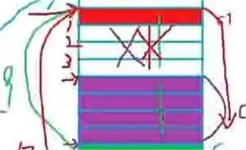

.jpg "结构体的内存对齐")

---

###  嵌套结构体对齐规则

```c
struct S3
{
	double d;
	char s1;
	int age;
};
//嵌套结构体
struct S4
{
	char c1;
    //嵌套的结构体对齐到自己内部的最大对齐数(这时S3的最大对齐数为 8)
	struct S3 s3;
	double d;
    /* 首成员c1(对齐数为1)放在偏移值为0(arr+0)的地址(占位1字节);  S3的最大对齐数为 8
       (开始浪费字节 占位8字节), 填充struct S3 s3(s3占位16字节)字节数(占位24字节);
       double d对齐数为8, 因为8是24的整数倍,所以不用浪费内存直接填充(占位32字节) */
};

int main()
{
    struct S3 s3 = { 0 };
    struct S4 s4 = { 0 };
    printf("%d\n", sizeof(s3));16
    printf("%d\n", sizeof(s4));// 32
	return 0;
}
```

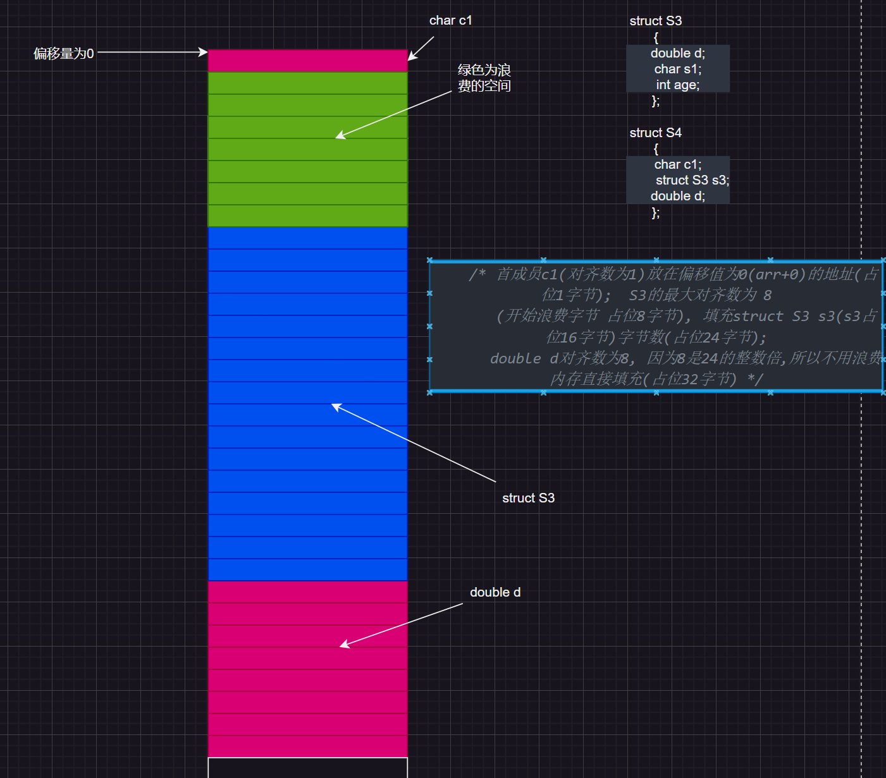

---

### 为什么存在内存对齐

内存对齐是为了提高内存访问的效率和性能。当计算机访问内存时，
对齐的数据可以更快地被读取和写入，而不需要额外的处理成本。

1. 平台兼容性：一些硬件平台对于非对齐的内存访问可能引发异常或错误。某些硬件平台只能在特定的地址处取特定类型的数据.
2. 性能优化：内存对齐可以提高内存的访问效率。处理对齐的数据不需要进行额外的操作或对齐修正，可以直接从存储器中获取或写入数据，加快了数据的访问速度。为了访问未对齐的内存,处理器需要作两次内存访问,而对齐的内存访问仅需要一次访问.

> 总体来说: 结构体的内存对齐是拿空间来换取时间的做法

---

## 修改默认内存对齐数

语法: `#pragma pack(int X)`

```c
#pragma pack(4)

struct S1
{
	char c1;// 1
    //3
	double d;// 8
};

int main()
{
	struct S1 s1 = { 0 };
	printf("%d\n", sizeof(s1));// 12
	return 0;
}
```

> 1. 如果`#pragma pack(1)`则相当于没有内存对齐
> 2. 格式一定要正确, 像<kbd>#pragma 1</kbd>什么的写法是错误的
> 3. 内存对齐数通常是**2的次方数**(因为如果设置5的话,除了第一个成员,其他数每次对齐都会浪费空间)
> 
> [参考结构体成员的字节偏移量参考`offsetof()`](/C头文件函数.md#offsetof)

---

# 位段

位段的位指的是**二进制位**

位段于结构体相似,但也有着一些不同

1. 位段成员必须是整数类型`int`, `unsigned int`, `signed int`和`char`
2. 位段的成员名后边有一个冒号(:)和数字
3. 使用位段可以节省内存空间，因为它们允许我们将多个值或状态信息存储在同一个整数中。

---

## 位段的内存分配

1. 位段的空间上是按照以4个字节(int)或者1个字节(char)的方式来开辟的
2. 位段涉及很多不确定因素,位段是不跨平台的,注重可移植性应该避免使用位段

### int类型的分配方式

```c
struct S
{
	int a : 2;
	int b : 5;
	int c : 10;
	int d : 30;
    //int d : 33 error 因为int类型位32bit位
};

int main()
{
	printf("%d\n", sizeof(struct S));// 8
	return 0;
}
```

> 注意: 位域类型对位数(**:后面的数字**)不能超过自身类型的二进制数量

.png "位段的内存分配")

---

### char类型的分配方式

```c
struct C
{
	char a : 3;
	char b : 4;
	char c : 5;
	char d : 4;
};

int main()
{
	struct C c = { 0 };
	c.a = 10;
	c.b = 20;
	c.c = 3;
	c.d = 4;
	return 0;
}
```

.png "位段的内存分配(char类型)")

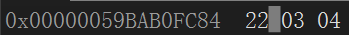

> 当位域类型对位数不能容纳被赋值的数时, 会产生截断. 例如: 上述例子的`c.b = 20`而是的
> 二进制为`10100`而对应的对位数只有4个bit位, 所以会产生截断(从后往前)==>`0100`; 如果
> 对位数过多完全可以容纳,则补`0`
>
> **位段与大小端没有关系**

---

### 不带参数的位段

```c
struct STU
{
	int a : 12;
	int b : 12;
    //位段后不带:的, 代表它占位一整个int也就是32字节
	int c;
	int d : 2;
};

struct STU1
{
	char a : 4;
	char b : 2;
	char c;
	char d : 1;
};
 
int main()
{
	printf("%d\n",sizeof(struct STU));// 8
    printf("%d\n",sizeof(struct STU1));// 3
	return 0;
}
```

---

## 位段的跨平台问题

1. int位段被当成有符号还是无符号数是不确定的(C语言标准没有给出回答,所以每一个编译器都不一样)
2. 位段中的最大位的数目不确定(16位机器最大16, 32位机器最大32, 写成27在16位机器会出问题.16位机器中int为2字节)
3. 位段中的成员在内存中从左向右分配, 还是从右向左分配标准尚未定义
4. 当一块空间包含两个位段, 第二个位段成员比较大时且无法容纳与第一个位段剩余的位时, 是利用还是舍弃,这时不确定的

> 跟结构体相比, 位段可以达到同样的效果还可以很好的节省空间, 但是有跨平台问题问题.


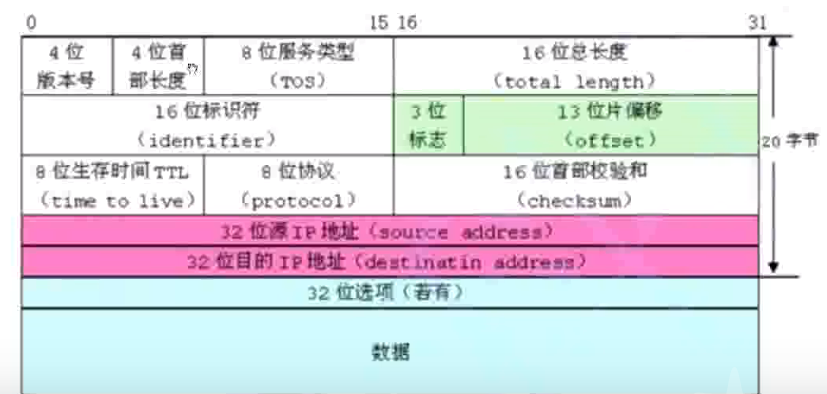

---

# 枚举(enum)

```c
enum Sex
{
	FALE,//默认值为0
	FEMALE,//然后依次递增(在没有修改的情况下) 1
	SECRET// 2
};

enum Color
{
    RED = 2,//这就相当于为常量赋值一个初始值
    GREEN = 5,
    BLUE = 9
};

enum Boy
{
    HANDSOME = 7,
    UGLY,//因为这个值没有被主动赋值,所以根据上一个值然后自增
    CUTE = 1,
};

int main()
{
	enum Sex s = FALE;
	printf("%d %d %d\n", FALE, FEMALE, SECRET);// 0 1 2
    printf("%d %d %d\n", RED, GREEN, BLUE);// 2 5 9
    printf("%d %d %d\n", HANDSOME, UGLY, CUTE);// 7 8 1
    return 0;
};
```

> 枚举成员被视为常量。在C语言中，枚举成员是一个具有固定值的常量。当定义枚举类型时，每个枚举成员都被赋予一个特定的值，并且它在整个程序运行过程中保持不变。默认情况下，枚举成员的值从0开始自增。**但是，我们也可以为每个枚举成员显式指定一个值**。如果没有显式指定值，则会按照自增规则依次进行赋值。
>
> 枚举类型成员在底层实际上被视为整数类型(自己是无法更改类型的).

---

# 共用体(union)

在C语言中，联合（union）是一种特殊的数据类型，允许在相同的内存位置存储不同类型的数据。联合内的成员共享同一块内存，但每次只能用一个成员来保存数据。

```c
union Data {
	int i;
	float f;
	char str[20];
};

int main()
{
    union Data d;
	d.f = 1.1f;
	d.i = 1;
    //共用一块空间
	printf("%p\n", &d);
	printf("%p\n", &d.f);
	printf("%p\n", &d.i);
    return 0;
};
```

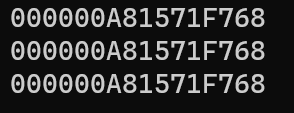

## 使用共用体判断大小端

```c
int check_system()
{
	union type
	{
		char c;
		int i;
	}T;
	T.i = 1;
	printf("%d\n", T.c);
	return T.c;
}
```

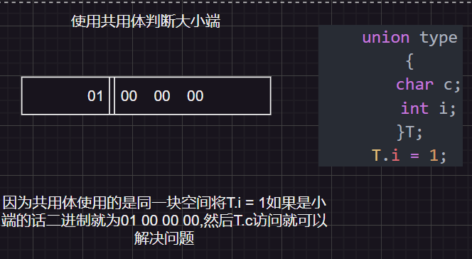

---

## 共用体大小的计算

- **共用体的大小至少是最大成员的大小**
- **当最大成员大小不是最大对齐数的整数倍的时候, 就要对齐到最大对齐数的整数倍**

```c
union Un
{
	int i;//对齐数为 4
	char ch[5];//大小 5. 数组的对齐数通过它的元素来判断, 即对齐数(char)为 1
    //因为char ch[5]就相当于5个char变量
};

int main()
{
    union Un u;
    /* 对齐到对齐到最大对齐数的整数倍, 最大对齐数为4又因为char ch[5]占位5字节
    所以占位8字节,而多余的(8 - 5)个字节浪费掉 */
	printf("%d\n", sizeof(u));//8
	return 0;
};
```

> [关于对齐数参考结构体对齐规则](#对齐规则)

---

# 动态内存分配

## 内存使用分配图

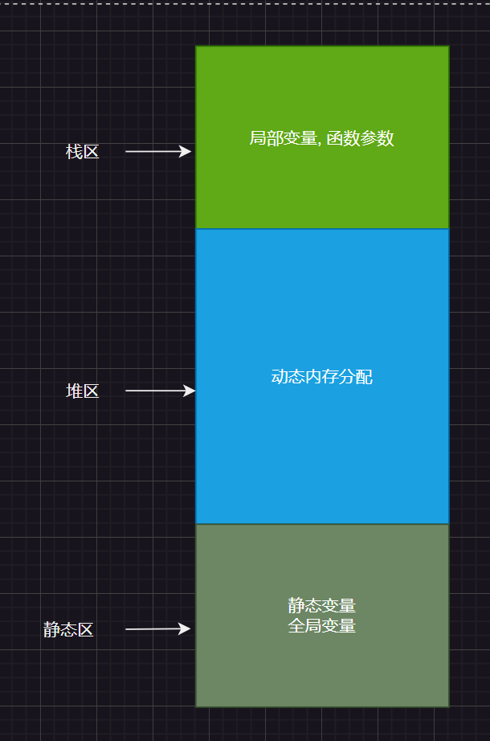

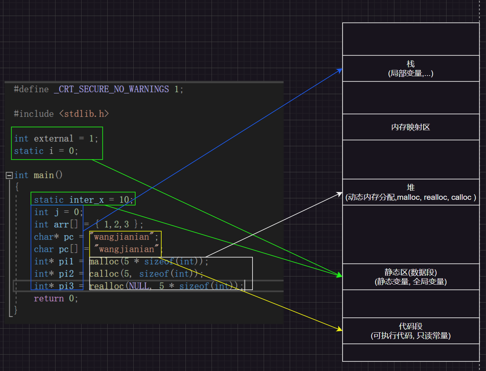

---

## `malloc`, `free`, `calloc`, `realloc`

malloc和calloc的区别在于需要传递的参数不同

> [具体参考malloc()](/C头文件函数.md#malloc)

---

## realloc的使用注意点

1. 如果malloc分配的指针`p`空间之后有着足够的内存空间可以追加, 则直接追加,然后返回`p`
2. 如果`p`空间之后没有足够的内存空间可以追加.则`realloc`函数**就会重新找一个新的内存空间**, 开辟一块满足需求的空间, 并把原来的数据拷贝过去, 并释放旧的内存空间,追后返回重新开辟的内存空间地址


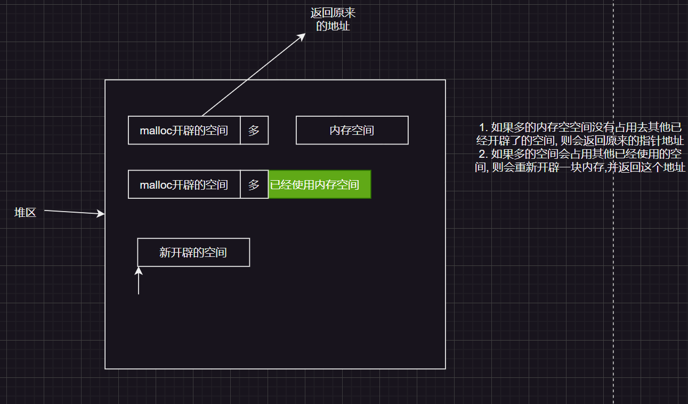

---

## 堆区栈区静态区返回值

### 当栈区的局部变量返回

```c
//错误代码
    int* test()
    {
        int i = 1;
        return &i;
    }
    int main()
    {
        int* result = test();
        *result = 10;// 非法访问
        return 0;
    }
```

> 此时代码会造成非法访问的问题, 因为局部变量的生命周期是当函数执型完之后就释放这块空间(`static`修饰符则会延长变量的声明周期)

---

### 当静态区的局部变量返回

```c
    int* test()
    {
        static int i = 1;
        return &i;
    }
    int main()
    {
        int* result = test();
        *result = 10;// 没有问题, 因为static修饰符延长了生命周期
        return 0;
    }
```

### 当返回堆区的局部变量时

堆区的变量就是`malloc`, `calloc`和`realloc`开辟的

```c
    int* test()
    {
        int* pi = malloc(4 * sizeof(int));
        return pi;
    }

    int main()
    {
        int* i = test();
        *i = 10;
        free(i);
        i = NULL;
        return 0;
    }
```

> 因为堆区开辟的空间不会因为函数的结束而结束, 只有手动释放内存调用`free`函数 

---

## 柔性数组

通常，C语言中定义数组时，需要指定数组的大小。但柔性数组允许在结构体中定义一个数组，而不指定其大小，使得该数组成为可变长度的。

- 使用柔性数组实现

```c
typedef struct Student
{
	int n;
	int arr[];//柔性数组
}Stu;

int main()
{
	//printf("%d\n", sizeof(Stu));
	Stu* s = malloc(sizeof(Stu) + 5 * sizeof(int));
	int i = 0;
	s->n = 1;
	for (i = 0; i < 5; i++)
	{
		s->arr[i] = i;
	}
	Stu* ptr = realloc(s, sizeof(Stu) + 10 * sizeof(int));
	if (ptr != NULL)
	{
		s = ptr;
		ptr = NULL;
	}
	for (i = 5; i < 10; i++)
	{
		s->arr[i] = i;
	}
	for (i = 0; i < 10; i++)
	{
		printf("%d ", s->arr[i]);
	}
	printf("\n");
	free(s);
	s = NULL;
	return 0;
}
```

- 使用指针的方式实现

```c
struct Stu2
{
	int n;
	int* arr;
};

int main()
{
	//开辟空间
	struct Stu2* s = malloc(sizeof(struct Stu2));
	s->arr = malloc(5 * sizeof(int));
	s->n = 2;
	int i = 0;
	for (i = 0; i < 5; i++)
	{
		s->arr[i] = i;
	}
	int* ptr = realloc(s->arr, 10 * sizeof(int));
	if (ptr != NULL)
	{
		s->arr = ptr;
		ptr = NULL;
	}
	for (i = 5; i < 10; i++)
	{
		s->arr[i] = i;
	}
	for (i = 0; i < 10; i++)
	{
		printf("%d ", s->arr[i]);
	}
    //如果先释放s, 就无法找到s->arr这块内存区域
	free(s->arr);
	s->arr = NULL;
	free(s);
	s = NULL;
	return 0;
}
```

> 1. 指针实现对比柔性数组的`free`要更多(free越多,越不好管理),而且还需要注意**释放的先后问题**; 而柔性数组存储时连续的
> 2. malloc开辟空间, 会导致有的内存区域不大也不小(**内存碎片**); 而连续存储相对来说内存碎片会更少
>
> [参考局部性原理](#局部性原理 "局部性原理")

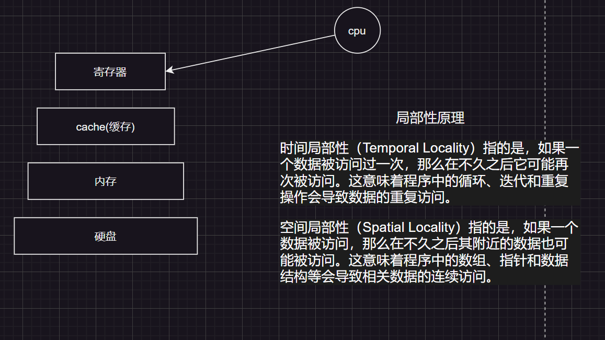

---

### 柔性数组的特点

1. 结构体的柔性数组的成员前面至少有一个其他成员
2. sizeof返回的结构体大小不包括柔性数组的内存
3. 包含柔性数组成员的结构使用malloc函数进行动态内存分配, 并且分配的内存大小应该大于结构体大小, 以适应柔性数组的预期大小

---

# 局部性原理

局部性原理（Locality Principle）是计算机科学中的一个重要概念
，描述了在程序中访问数据的模式。局部性原理指出，当一个程序访问某个数据项时，
很可能在近期再次访问相邻的数据项，或者在不久的将来访问相邻的数据项。
这种数据访问的模式可以分为两类：时间局部性和空间局部性。

时间局部性（Temporal Locality）指的是，如果一个数据被访问过一次，那么在不久之后它可能再次被访问。这意味着程序中的循环、迭代和重复操作会导致数据的重复访问。

空间局部性（Spatial Locality）指的是，**如果一个数据被访问，那么在不久之后其附近的数据也可能被访问**。这意味着程序中的数组、指针和数据结构等会导致相关数据的连续访问。

---

# 文件操作

在编程设计中,一般谈的文件有两种: 程序文件, 数据文件

1. 程序文件(例如`.c`后缀名)
2. 数据文件(文件内容不一定是数据,而是程序运行时的读写数据,例如`.json`)

## 文件类型

数据文件被称为**文本文件**和**二进制文件**. 数据在内存中已二进制的形式存储, 如果不加转换的输出到外存就是二进制文件

## 基本使用

`FILE *fopen( const char *filename, const char *mode )`

```c
#include <stdio.h>
#include <string.h>
#include <errno.h>

int main()
{
	FILE* fp = fopen("test.txt", "w");//打开文件
    if (fp == NULL)
	{
		printf(strerror(errno));
		return 0;
	}
	fputs("hello world!", fp);// 写入文件
	fclose(fp);
	return 0;
}
```

## 输入输出缓冲区关键字`stdin`和`stdout`

```c
#include <stdio.h>
int main()
{
    char buf[255] = { 0 };
	fgets(buf, 255, stdin);//在输入缓冲区(键盘)拿数据并赋值给buf
	fputs(buf, stdout);// 写入buf的内容在输出缓冲区中(屏幕)
    // scanf("%s", buf);//相当于
    // printf("%s\n", buf);
    return 0;
}
```
                                           
---

# 预处理

章节涉及:
1. 程序的翻译环境
2. 程序的执行环境
3. 编译和链接
4. 预处理指令`#define`
5. 宏和函数的对比

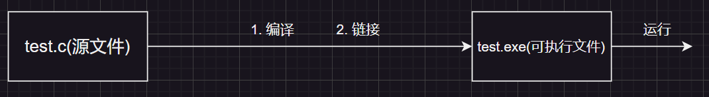

## 程序的翻译环境和执行环境

`将xxx.c`翻译成`xxx.exe`的过程

在这个**翻译环境**中源代码(.c)会被转换为可执行的机器指令(二进制01); 而**执行环境**用于实际执行代码 

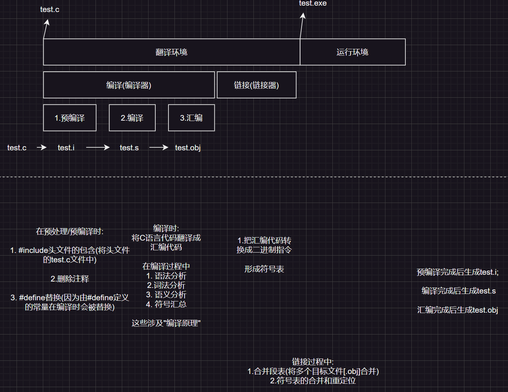

### 符号汇总和形成符号表

#### 符号汇总

```c
// test2.c
int add(int x, int y)
{
	return x + y;
}
```

> `test2.c`文件中`add`函数在编译过程中会形成一个符号地址

```c
// test1.c
#include <stdio.h>
/*这些话只是一个声明, 在运行时之所以可以使用是因为
经历了链接过程符号表的合并*/
extern int add(int x, int y);

int main()
{
	int a = 20;
	int b = 30;
    
	int c = add(a, b);
	printf("%d\n", c);
	return 0;
}
```

> `test1.c`文件中`main`函数就是一个符号

#### 形成符号表

在汇编阶段会生成符号表, 将符号和它的地址发在表中

---

## 预定义符号

1. `__FILE__`当前文件路径
2. `__LINE__`当前代码行号
3. `__DATE__`当前月日年
4. `__TIME__`当前时间
5. `__FUNCTION__`查看当前函数名 

```c
#include <stdio.h>

int main()
{
	printf("%s\n", __FILE__);// D:\c语言学习\预处理\预处理\test.c
	printf("%d\n", __LINE__);// 13
	printf("%s\n", __DATE__);// Mar 12 2024
	printf("%s\n", __TIME__);// 15:33:23
	return 0;
}
```                                                                      

---

## `#define`宏

### `#define`后面加分号

```c
#define MAX 100;
int main()
{
    int a = MAX;// 相当于 int a = 100;;
    int b = MAX// 相当于 int b = 100;
    return 0;
}
```

---

### 宏替换

```c
#define MULTI(x) x * x 
#define DOUBLE(x) x + x
#include <stdio.h>
int main()
{
    //这里就相当于 int result1 = x * x = 5 * 5 = 25
    int result1 = MULTI(5);
    printf("%d\n", result1);// 25

    //这里就相当于 int result2 = x * x = 5 + 1 * 5 + 1 = 11
    int result2 = MULTI(5 + 1);
    printf("%d\n", result2);// 11

    // int result3 = 10 * 5 + 5 = 55
    int result3 = 10 * DOUBLE(5);
    printf("%d\n", result3);// 55
    return 0;
}
```

```c
//正确使用
#define MULTI(x) ((x) * (x)) 
#define DOUBLE(x) ((x) + (x))
#include <stdio.h>
int main()
{
    //这里就相当于 int result2 = x * x = ((5 + 1) * (5 + 1)) = 11
    int result2 = MULTI(5 + 1);
    printf("%d\n", result2);// 36

    //int result3 = 10 * ((5) + (5))
    int result3 = 10 * DOUBLE(5);
    printf("%d\n", result3);// 100
    return 0;
}
```

> 在使用宏定义时, 有参数的情况下最好给参数加小括号, **因为宏只会替换而不会进行运算**

---

### #define替换规则

当`#define`定义符号和宏时, 需要设计几个步骤

1. 调用宏时, 首先对参数进行检查, 查看是否包含任何由`#define`定义的符号,如果是则它们首先被替换
2. 替换文本随后被插入到程序原来的位置.
3. 最后扫描,看是否还存在`#define`定义的符号, 如果有, 这重复上述

注意:

1. 宏参数和`#define`定义中可以出现其他由`#define`定义的常量, 但对于宏不能出现递归 
2. 当预处理器搜索`#define`定义的符号的时候, 字符串常量的内容不会被替换

```c
#include <stdio.h>
#define MAX 100
#define MIN 1
#define ADD(x, y) ((x) + (y))

int main()
{
    //在调用宏时, 会优先处理它的参数 ===> ADD(100, 1)
	int i = ADD(MAX, MIN);
	printf("%d\n", i);
    //字符串常量的内容不会被替换
    printf("MAX = %d\n", MAX);
	return 0;
}
```

---    

## `#`和`##`

`#`在宏`#define`中使用, 作用是:将实参的变量名转换为字符串

```c
#define print(x) printf("value of "#x" is %d\n", x);

int main()
{
	int a = 10;
	print(a);// value of a is 10
    printf("hello world");// hello world
    //C语言中的连续字符串文字（即没有运算符或分隔符分开的字符串）会自动连接在一起。
    printf("hello ""world");// hello world 
	return 0;
}
```

### 宏的注意点

```c
#include <stdio.h>

#define MAX(X, Y) (((X) > (Y)) ? (X) : (Y))

int main()
{
	int a = 10;
	int b = 11;
	//宏并不会进行运算,而是直接替换 ===> (((a++) > (b++)) ? (a++) : (b++))
	printf("%d\n", MAX(a++, b++));// 12
	printf("%d\n", a);// 11
	printf("%d\n", b);// 13
	return  0;
}
```

> 宏最好不要使用带有副作用的参数, 例如: `++`, `--`

---

## 预定义符号`#undef`

`#undef`是一个预处理器指令，用于**取消宏定义**。当使用`#define`定义一个宏时，使用`#undef`可以从预处理器的符号表中删除该宏定义。

```c
#define MIN 1

int main()
{
	printf("%d\n", MIN);
    //作用是取消宏定义
#undef MIN
	printf("%d\n", MIN);// 报错未定义标识符 "MIN"
	return  0;
}
```

---

## 预定义符号`#ifdef`与`#ifndef`

### `#ifdef`

`#endif`为结束标志

```c
#define DEBUG

int main()
{
    //如果DEBUG被定义则执行下列语句
#ifdef DEBUG
	printf("wangjianian");
#endif 

	return  0;
}
```

> 如果`DEBUG`**被宏定义**则会执行`#ifdef`和`#endif`的语句

---

### `#ifndef`

作用与`#ifdef`相反

```c
int main()
{
    //DEBUG宏没有被定义就执行下列语句
#ifndef DEBUG                                       
    printf("111");
#endif // !DEBUG

    return 0;
}
```

`#ifndef`经常使用在头文件中, 避免重复引用

```c
// 如果__AVOID_REPEART__被宏定义则不执行被包含的语句
#ifndef __AVOID_REPEART__
#define __AVOID_REPEART__
// 头文件声明...
int add(int x, int y);
#endif //当重复引用头文件时, __AVOID_REPEART__已经被定义了, 所以不再执行被包含的内容
```

现在使用更多的是这种方式

```c
#pragma once
int add(int x, int y);
// 头文件声明...
```

> `#pragma once`在老的编译器下可能编译不过去

---


## `#if defined()`

作用上相当于`ifdef`

```c
#define DEBUG

int main()
{
    ////宏定义了会执行下列代码
#if defined(DEBUG)
    printf("111");// 定义了宏所以这句话会执行
#endif
    return 0;
}
```

> 如果`DEBUG`被宏定义则执行被包含的语句

如果想要表达没有定义一个宏就直接被包含的语句的话可使用`#if !defined`

```c
#define DEBUG

int main()
{
    //宏没定义会执行下列代码
#if !defined(DEBUG)
    printf("111");// 已经定义了宏所以这句话不执行
#endif
    return 0;
}
```
 
---

## 预定义符号`#if`

`#if`后的常量表达式为真则执行被包含的语句

语法格式:

```c
#if 常量表达式    ----> 0为加, 非0为真

#endif // 0
``` 

```c
#include <stdio.h>

int main()
{
#if 9 // 9为真则执行被包裹的语句
	printf("wang");
#endif
    return 0;
}
```

---

## 多个分支的条件编译

```c
#if constant-expression
    // 如果常量表达式为真，则编译下面的代码
    // ...
#elif constant-expression
    // 如果前面的条件为假，并且当前的常量表达式为真，则编译下面的代码
    // ...
#else
    // 如果前面的条件都为假，则编译下面的代码
    // ...
#endif // 结束标志
```

```c
#include <stdio.h>
int main()
{
#if 1 == 1
    printf("我是第一条件为真");
#elif 2 == 2
    printf("我是第二条件为真")
#else
    printf("我是第三条件为真")
#endif
//result: 我是第一条件为真
    return 0;
}
```

---

## 文件包含

## #include查找方式""和<>的区别

```c
//使用<>引头文件会直接在标准路径下查找目标头文件
#include <stdio.h>
//#include "stdio.h" // 效率会低一些

/* 查找策略: 现在源文件所以目录下查找. 如果没找到, 编译器就像查找库函数头文件一样
    在标准位置查找头文件, 再找到就提示编译错误 */ 
#include "stdlib.h"
```

> 我的电脑的标准路径: `D:\Windows Kits\10\Include`