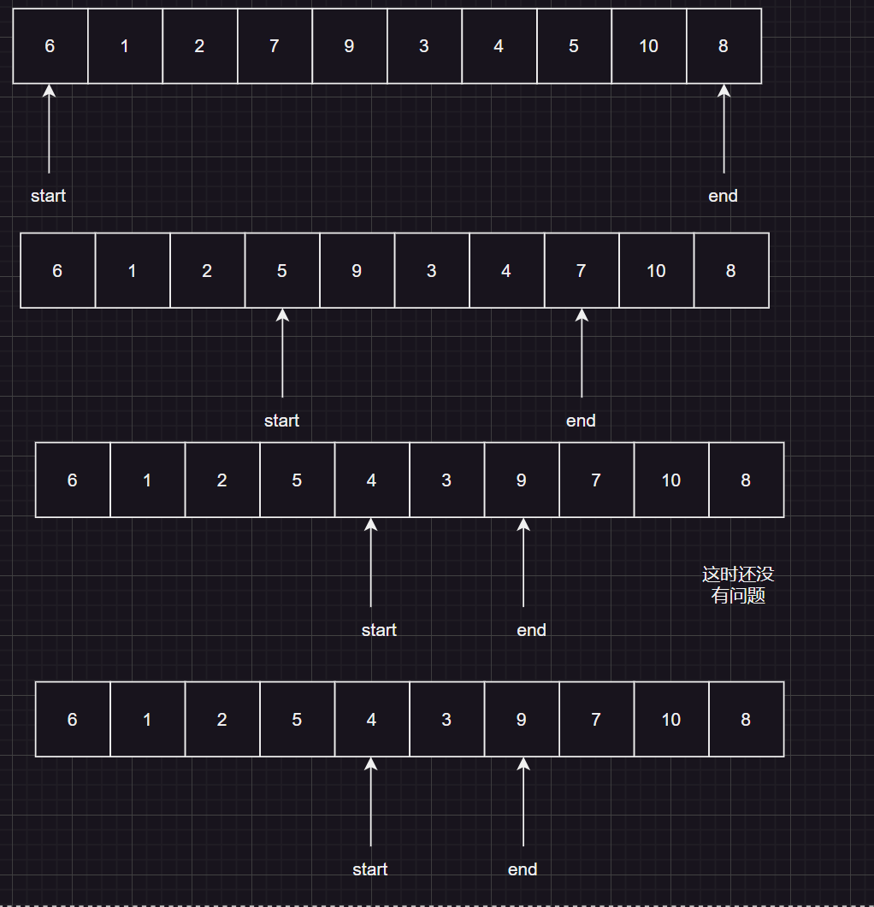
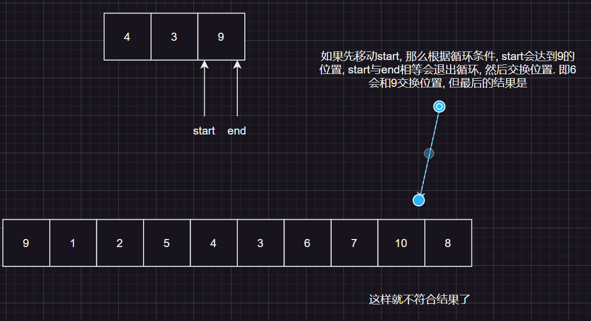

# Java

## 查找

### 二分查找

- 前提: 数组中的数据是有序的, 例如: `1,2,3,4,5,6,7,8,9,10`
- 思路: 双指针思路, 定义两个指针, 一个指向数组的开始位置, 一个指向数组的结束位置, 每次得出中间位置, 然后排除一边, 重复此过程, 直到找到目标值或查找范围缩小为空

```java
public class A03_BinarySearchDemo1 {
    public static void main(String[] args) {
        //前提: 数组中的数据是有序的
        //逻辑, 每次排除掉一般查找范围

        int[] arr = {1, 2, 3, 4, 5, 6, 7, 8, 9, 10};
        int[] arr1 = {1};
        int result = binarySearch(arr, 7);
        int result1 = binarySearch(arr1, 1);
        System.out.println(result);

    }

    public static int binarySearch(int[] arr, int target) {
        //双指针思路: 左指针指向第一个元素, 右指针指向最后一个元素
        int left = 0;
        int right = arr.length - 1;
        /* 如何判断终止条件: 采用极端的方式, 如果数组中只有一个元素, 
        这时left和right指向同一个位置, 这时是否需要继续循环*/ 
        while(left <= right) {// [!code highlight]
            //获取中间位置
            int middle = (left + right) / 2;
            if(arr[middle] < target) {
                left = middle + 1;// [!code highlight]
            } else if(arr[middle] > target) {
                right = middle - 1;// [!code highlight]
            } else {
                return middle;
            }
        }
        return -1;
    }
}
```

:::tip 注意点
1. 判断条件应不应该等于
:::

---

## 排序

### 冒泡排序

### 选择排序

选择排序: 从0索引开始, 拿着每一个索引上的元素跟后面的元素依次比较. 小的放前面, 大的放后面.

```java [chooseSort.java]
public class ChooseSort {
    public static void main(String[] args) {
        /*
        * 选择排序: 从0索引开始, 拿着每一个索引上的元素跟后面的元素依次比较
        * 小的放前面, 大的放后面
        *
        * 与冒泡排序很相似, 每一轮都可以确定数组中最大或最小的位置
        * */

        int[] arr = {1, 5, 3, 2, 4};
        chooseSort(arr);
        for (int i : arr) {
            System.out.println(i);
        }

    }

    public static void chooseSort(int[] arr) {
        //1. 循环遍历每一个元素
        for (int i = 0; i < arr.length; i++) {
            //3. 挨个与它之后的值进行比较, 所以是i + 1
            for (int j = i + 1; j < arr.length; j++) {
                //4. 如果当前值大于后面的值, 则交换位子
                if(arr[i] > arr[j]) {
                    int temp = arr[j];
                    arr[j] = arr[i];
                    arr[i] = temp;
                }
            }

        }
    }
}
```

---

### 插入排序

插入排序: 在最开始将数组分为有序和无序的两部分(将0索引的元素与后面的元素比较, 直到没有比它小的元素), 遍历无序的部分并按照特定的规则插入到有序的数组中

特定的规则: 从右到左, 依次比较, 将当前的元素插入到适当的位置

```java [insertSort.java]
public class InsertSort {
    public static void main(String[] args) {
        /*
         * 插入排序: 在最开始将数组分为有序和无序的两部分, 遍历无序的部分并按照特定的规则插入到有序的数组中
         *
         * 特定的规则: 从右到左, 依次比较, 将当前的元素插入到适当的位置
         * */
        //定义一个数组
        int[] arr = {2, 3, 1};
        insertSort(arr);
        for (int i : arr) {
            System.out.println(i);
        }
    }

    public static void insertSort(int[] arr) {
        int startIndex = -1;
        //1. 将数组分为有序和无序的两部分
        for (int i = 0; i < arr.length; i++) {
            if(arr[i] > arr[i + 1]) {
                startIndex = i + 1;
                break;
            }
        }
        //2. 遍历无序的部分, 按照从右到左, 依次比较, 将当前的元素插入到适当的位置
        for (int i = startIndex; i < arr.length; i++) {
            int j = i;
            //与有序的部分进行比较, 所以需要用到循环
            while (j > 0 && arr[j] < arr[j - 1]) {
                int temp = arr[j];
                arr[j] = arr[j - 1];
                arr[j - 1] = temp;
                //每一次交换位置, 当前元素的位置都要减一
                j--;
            }
        }
    }
}
```

---

### 快速排序

快速排序思路:

1. 将**排序范围内**的第一个数字作为基准数, 再定义两个变量`start`和`end`, 分别指向排序范围内的第一个和最后一个元素位置
2. 先移动右指针`end`, 再移动左指针`start`, 需要确保规则为: **比基准数小的全部在左边; 比基准数大的全部在右边**

```java [QuickSort.java]
public class QuickSort {
    public static void main(String[] args) {
        int[] arr = {6, 1, 2, 7, 9, 3, 3, 4, 5, 10, 8};
        quickSort(arr, 0, arr.length - 1);
        for (int i : arr) {
            System.out.print(i + " ");
        }
    }

    public static void quickSort(int[] arr, int i, int j) {
        int start = i;
        int end = j;
        /*
        * 条件为true的情况右有[1, 2], [1]
        * [1, 2]这个范围继续让右半边递归下去的化, 那么此时的start = 2; end = 0(因为[1,2]这一轮排序使得end在0的位置) ==> start > end的情况
        * [1] 此时start和end指向同一个位置, 那么可以肯定此时它们指向同一个元素, 且这个排序范围也只有一个元素, 那么就不需要排序直接跳过. ==> start == end的情况
        * */
        if(start >= end) return;
        int baseNumber = arr[i];
        //此层循环每一次都会交换一对元素, 也可能是自己与自己交换
        //循环结束时, start和end会指向同一个位置, 此时可以认为该范围已经排序完毕, 将基准数放置到start或者end的位置(此时 start等于end)
        while (start != end) {
            //1. 首先移动右指针位置, 然后再移动左指针
            while(true) {
                if(start >= end || arr[end] < baseNumber) {
                    break;
                }
                end--;
            }

            while(true) {
                if(start >= end || arr[start] > baseNumber) {
                    break;
                }
                start++;
            }

            //交换位置
            int temp = arr[start];
            arr[start] = arr[end];
            arr[end] = temp;
        }

        int temp = arr[i];
        //或者arr[i] = arr[end] 因为此时start = end
        arr[i] = arr[start];
        arr[start] = temp;
        //让当前排序范围的左半边继续排序
        quickSort(arr, i, start - 1);
        //让当前排序范围的右半边继续排序
        quickSort(arr, start + 1, j);
    }
}

```

:::details
1. 为什么一定要先移动右指针, 再移动左指针?


先移动左指针, 会导致指向的位置越来越大(相对于基准数), 最终会破坏排序规则; 而先移动右指针, 指向位置会越来越小.
:::

11