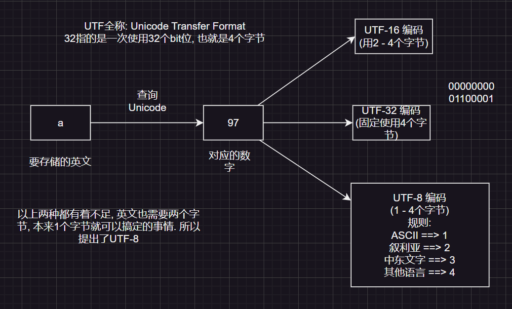
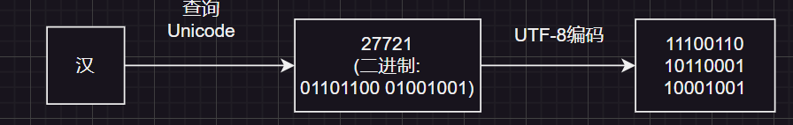

## 相对路径和绝对路径

1. 相对路径：从当前目录开始，依次向上查找，直到找到文件。
    - 路径1: `abc.txt`
    - 路径2: `abc\\a.txt`
2. 绝对路径：从根目录开始，依次向下查找，直到找到文件。
    - 路径1: `D:\\abc.txt`
    - 路径2: `D:\\abc\\a.txt`

## 系统的下层路径

- 在windows系统下下层路径为`\`
- linux系统下下层路径为`/`

- window的换行符是`\r\n`, 继承了[MS-DOS](https://baike.baidu.com/item/ms-dos/1120792) 的换行符标准
- linux的换行符是`\n`, 为了简化文本处理，只使用`\n`来表示换行

---

## Unicode字符集

- Unicode(万国码)字符集是所有现代计算机都支持的字符集

计算机存储规则:



:::tip
`UTF-8`指的是一套编码规则

UTF-8编码方式(二进制)

```
0xxxxxxx (ASCII码) ==> 字母
110xxxxx 10xxxxxx (2字节) ==> 叙利亚文字
1110xxxx 10xxxxxx 10xxxxxx (3字节) ==> 中东文字
11110xxx 10xxxxxx 10xxxxxx 10xxxxxx (4字节) ==> 其他语言
```

无论存储的是汉字还是字母, 都要按照规则进行编码. 通过对应的格式进行解码判断是字母还是汉字.



因为汉字在Unicode中占3个字节, 所以采用第三套编码规则, `1110`开头, 补齐剩下的4位(把汉字的二进制位拿过来), 结果为`11100110`;
然后, 以`10`开头, 补全剩下的`6`位, 结果为`10110001`; 再以`10`开头补全`6`位, 结果为`10001001`;
:::

---

## 为什么会乱码?

1. 读取数据时未读完整个汉字(在Unicode中汉字占3个字节, 如果只读取了其中的一个字节, 并将结果打印就会出现乱码的情况)
2. 编码和解码的方式不统一(例如: 使用`UTF-8`编码, 但是在解码的时候没有使用`UTF-8`解码)

如何解决?

1. 不要使用字节流读取文本文件
2. 编码解码使用同一套规则(例如: `UTF-8`)

在Java中, 可以通过一些方法查看编码和解码之后的结果.

|                    方法                    | 作用                                                     |
| :----------------------------------------: | :------------------------------------------------------- |
|            `byte[] getBytes()`             | 使用平台默认编码规则编码，将结果存储在新的`byte`数组中。 |
|   `byte[] getBytes(String charsetName)`    | 使用指定的编码规则编码，将结果存储在新的`byte`数组中。   |
| `String(byte[] bytes, String charsetName)` | 使用指定的编码规则解码，将结果存储在一个新的字符串中。   |
|           `String(byte[] bytes)`           | 使用平台默认编码规则解码，将结果存储在一个新的字符串中。 |


```java
import java.io.UnsupportedEncodingException;
import java.util.Arrays;

public class Demo6 {
    public static void main(String[] args) throws UnsupportedEncodingException {
        String str = "ai你哟";
        byte[] bytes1 = str.getBytes();
        //[97, 105, -28, -67, -96, -27, -109, -97]
        //在Unicode字符集, UTF-8编码规则中, 字母占一个字节; 中文占3个字节. 字母解码后是正数, 中文解码后是负数
        // a ==> 97; i ==> 105
        // 你 ==> -28, -67, -96
        //哟 ==> -28, -67, -96
        System.out.println(Arrays.toString(bytes1));
        //[97, 105, -60, -29, -45, -76]
        byte[] bytes2 = str.getBytes("GBK");
        System.out.println(Arrays.toString(bytes2));

        String str1 = new String(bytes1);
        System.out.println(str1);// ai你哟
        String str2 = new String(bytes1, "GBK");
        //编码和解码的规则不同, 会导致结果不合预期
        System.out.println(str2);// ai浣犲摕
    }
}
```