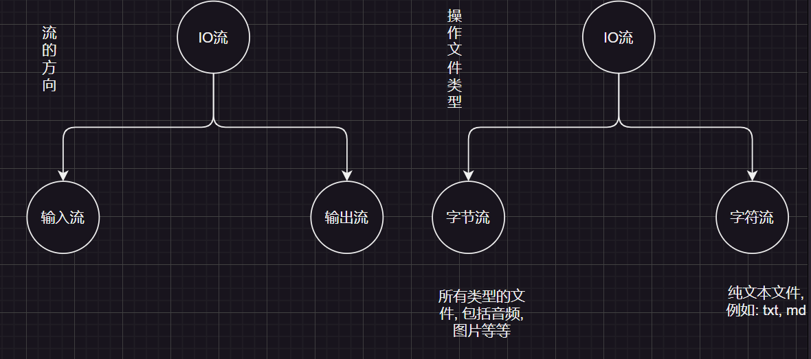
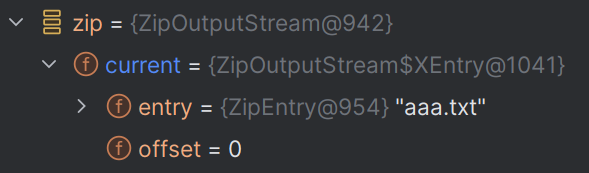

- 存储和读取数据
- 读和写都是按照程序为参照物

## 流的分类

- 操作数据单位：字节流、字符流
- 数据的流向：输入流、输出流
  - 输出流: 程序 ==> 文件
  - 输入流: 文件 ==> 程序
- 流: 像水一样传输数据



:::details 什么是文本文件
用`windows`记事本打开，可以看的懂的文件, 例如: `txt`, `md`
:::

## 流的结构

|        |         输入流          |          输出流          |
| :----: | :---------------------: | :----------------------: |
| 字节流 | 字节输入流`InputStream` | 字节输出流`OutputStream` |
| 字符流 |   字符输入流`Reader`    |    字符输出流`Writer`    |

以上的流都是抽象类, 所有使用它们的实现类: 

- 字节流: `FileInputStream`, `FileOutputStream`
- 字符流: `FileReader`, `FileWriter`

---

## 文件流


### FileOutputStream

- 字节输出流: 将数据写入文件
- 特点: 一次写入一个字节

#### 构造方法

| 方法                                            | 描述                                                  |
| :---------------------------------------------- | :---------------------------------------------------- |
| `FileOutputStream(String name)`                 | 创建一条文件输出流.                                   |
| `FileOutputStream(File file)`                   | 创建一条文件输出流.                                   |
| `FileOutputStream(String name, boolean append)` | 创建一条文件输出流. 如果第二个参数为true, 则追加数据. |
| `FileOutputStream(File file, boolean append)`   | 创建一条文件输出流. 如果第二个参数为true, 则追加数据  |
 

```java
import java.io.FileOutputStream;
import java.io.IOException;

public class Demo1 {
    public static void main(String[] args) throws IOException {
        FileOutputStream fos = new FileOutputStream("day23-code\\aaa.txt");
        //写入数据
        fos.write(97);// a
        fos.write(98);// b
        fos.write(99);// c
        fos.write(100);// d
        //关闭流通道
        fos.close();
        //a.txt: abcd
    }
}
```

:::details 字节输出流的细节
1. 创建字节流对象
   1. 参数可以是字符串路径, 也可以是`File`对象
   2. 如果文件不存在, 会自动创建, 但需要保证父级路径存在, 例: `day23-code\\aaa.txt`中`aaa.txt`可以不存在, 但`day23-code`一定存在.
   3. 如果文件存在, 会清空文件内容, 若想要追加数据, 则设置`append`参数为`true`
2. 写数据
   1. `write`方法的参数是整数, 而实际上写入到本地文件的是`ASCII`码对应的字符.
3. 释放资源
   1. 如果不释放资源, 那么读写文件时, 会造成文件被锁定, 不能被其他程序访问或者删除.
:::

#### 常用方法

| 方法名                                      | 作用                                                   |
| :------------------------------------------ | ------------------------------------------------------ |
| `void write(int ch)`                        | 写一个字符到文件中                                     |
| `void write(char[] cbuf)`                   | 写一个字符数组到文件中                                 |
| `void write(char[] cbuf, int off, int len)` | 写一个字符数组的一部分到文件中，从off开始，len个字符   |
| `void close()`                              | 关闭流，释放资源，关闭后，流不能再使用，否则会抛出异常 |


```java
import java.io.FileOutputStream;
import java.io.IOException;

public class Demo1 {
    public static void main(String[] args) throws IOException {
        FileOutputStream fos = new FileOutputStream("day23-code\\aaa.txt");
        String str = "abcddsaasdasds";
        //将字符串转换为字节数组
        byte[] bytes = str.getBytes();
        fos.write(bytes, 1, 3);
        fos.close();
    }
}
```

#### 如何写入换行?

- window的换行符是`\r\n`, 继承了[MS-DOS](https://baike.baidu.com/item/ms-dos/1120792) 的换行符标准, `\r`只是放在当前行的开头, `\n`才是将光标移动到下一行
- linux的换行符是`\n`, 为了简化文本处理，只使用`\n`来表示换行
- MAcOS的换行符是`\r`

```java
public class Demo1 {
    public static void main(String[] args) throws IOException {
        FileOutputStream fos = new FileOutputStream("day23-code\\aaa.txt");
        String str = "abcddsaasdasds";
        byte[] bytes = str.getBytes();
        fos.write(bytes, 1, 3);

        fos.write('\r');
        fos.write('\n');
        fos.write('a');
        fos.close();
    }
}
```

#### 追加数据

将`append`选项设置为`true`

```java
FileOutputStream fos = new FileOutputStream("day23-code\\aaa.txt", true);
```

---

### FileInputStream

- 字节输入流, 用来读取文件
- 一次读一个字节

#### 常用方法

| 方法签名                               | 描述                                                                                                                                  |
| -------------------------------------- | ------------------------------------------------------------------------------------------------------------------------------------- |
| `int read()`                           | 从输入流中读取一个字节的数据，返回0到255之间的整数，如果到达文件末尾则返回-1。                                                        |
| `int read(byte[] b)`                   | 从输入流中读取最多 `b.length` 个字节的数据，并存储在字节数组 `b` 中，返回实际读取的字节数，如果到达文件末尾则返回-1。                 |
| `int read(byte[] b, int off, int len)` | 从输入流中读取最多 `len` 个字节的数据，并存储在字节数组 `b` 的 `off` 位置开始的位置，返回实际读取的字节数，如果到达文件末尾则返回-1。 |
| `void close()`                         | 关闭此输入流并释放与之关联的所有系统资源。                                                                                            |
| `long skip(long n)`                    | 跳过并丢弃此输入流中的 `n` 个字节。                                                                                                   |
| `int available()`                      | 返回此输入流中的剩余字节数                                                                                                            |
| `void mark(int readlimit)`             | 在此输入流上放置一个标记。                                                                                                            |
| `void reset()`                         | 将此输入流重新定位到最后一次调用 `mark` 方法时的位置。                                                                                |
| `boolean markSupported()`              | 测试此输入流是否支持 `mark` 和 `reset` 方法。                                                                                         |

#### 循环读取

如果文件的数据很多, 那么一次读一个然后输出, 会很慢, 所以我们可以用循环来读取文件, 每次读取一行, 然后输出一行.

根据read方法的特性, 只要读取的不是`-1`就可以一直读

```java
import java.io.FileInputStream;
import java.io.IOException;

public class Demo3 {
    public static void main(String[] args) throws IOException {
        FileInputStream fis = new FileInputStream("day23-code\\aaa.txt");
        int i;
        //read方法每读一次数据, 就移动一次指针
        while ((i = fis.read()) != -1) {
            //又一次使用fis.read()则又会移动一次指针, 导致结果出错
            System.out.println(fis.read());// [!code --]
            System.out.println((char) i);
        }
    }
}
```

#### 文件拷贝

- 思路: 将输入流的数据写入到输出流中, 实现文件拷贝
- 即: 输入流 ==> 程序 ==> 输出流

```java
import java.io.FileInputStream;
import java.io.FileOutputStream;
import java.io.IOException;

public class Demo4 {
    public static void main(String[] args) throws IOException {
        FileInputStream fis = new FileInputStream("day23-code\\aaa.txt");
        FileOutputStream fos = new FileOutputStream("day23-code\\bbb.txt");
        int i;
        while ((i = fis.read()) != -1) {
            fos.write(i);
            System.out.println(i);
        }
        //释放资源规则: 先开的最后释放  
        fis.close();
        fos.close();
    }
}
```

但上述方法一次读取一个, 如果文件太大, 例如36.9MB ==> 38769986字节, 一次读取一个字节, 就需要循环38769986次.

优化: 一次读取多个数据

```java
import java.io.FileInputStream;
import java.io.FileOutputStream;
import java.io.IOException;

public class Demo5 {
    public static void main(String[] args) throws IOException {
        FileInputStream fis = new FileInputStream("D:\\Java\\Java笔记\\day27-IO(异常&File&综合案例）\\笔记\\IO(异常&File&综合案例）.md");
        FileOutputStream fos = new FileOutputStream("day23-code\\note.md");
        //因为笔记占用空间不大, 所以一次性只存储1kb
        final int capacity = 1024;
        byte[] bytes = new byte[capacity];
        int len;

        while ((len = fis.read(bytes)) != -1) {
            //put data into fos
            fos.write(bytes, 0, len);
        }
        //close stream
        fos.close();
        fis.close();
    }
}
```

---

### FileReader

- 字符流的底层就是字节流
- `字符流 = 字节流 + 字符集`
- 特点: 一次读一个字节, 遇到中文时, 一次读多个字节
- 使用场景: 对纯文本文件进行操作
- 内有缓冲区, 一个长度为`8192`类型为`byte[]`的数组(FileInputStream和FileOutputStream内部没有缓冲区)

#### 构造方法

| 构造方法                      | 作用                                                                   |
| ----------------------------- | ---------------------------------------------------------------------- |
| `FileReader(File file)`       | 创建一个读取文件的FileReader对象, 参数是File对象, 用来指定被读取的文件 |
| `FileReader(String fileName)` | 创建一个读取文件的FileReader对象, 参数是文件路径, 用来指定被读取的文件 |

#### 常用方法

| 方法名                                | 作用                       |
| ------------------------------------- | -------------------------- |
| `public int read()`                   | 读取一个字符               |
| `public int read(char[] cbuf)`        | 读取字符数组               |
| `read(char[] cbuf, int off, int len)` | 从此输入流中将字符读入数组 |
| `close()`                             | 关闭流通道                 |


:::code-group
```java [一次读取一个字符]
import java.io.FileReader;
import java.io.IOException;

public class Demo7 {
    public static void main(String[] args) throws IOException {
//       `public void close()` ：关闭此流并释放与此流相关联的任何系统资源。
//        `public int read()`： 从输入流读取一个字符。
        FileReader fr = new FileReader("day23-code\\bbb.txt");
        int i;
        while((i = fr.read()) != -1) {
            System.out.print((char) i);
        }
        System.out.println();
        fr.close();
        //最终输出结果: wangjianian汪加年
    }
}
```

```java [一次读取多个字符]
public class FileReaderDemo9 {
    /**
     * 主函数，用于读取文件内容并打印到控制台
     * 该函数演示了如何使用FileReader类读取文件内容
     *
     * @param args 命令行参数，未使用
     * @throws IOException 如果文件读取过程中发生错误
     */
    public static void main(String[] args) throws IOException {
        // public int read(char[] cbuf)： 从输入流中读取一些字符，并将它们存储到字符数组 cbuf中 。
        // 创建FileReader对象，指定要读取的文件路径
        FileReader fr = new FileReader("day23-code\\bbb.txt");

        char[] chars = new char[2];
        int len;
        // 循环读取文件内容，直到文件结束
        while ((len = fr.read(chars)) != -1) {
            // 打印读取到的字符, "一次读取一个字符"
            System.out.println(new String(chars, 0, len));
        }
        // 文件读取完成后，关闭FileReader对象
        fr.close();
    }
}
```

```txt [bbb.txt]
wangjianian汪加年
```
:::

---

### FileWriter

- 字符输出流, 一次写一个字符
- 内有缓冲区, 一个长度为`8192`类型为`byte[]`的数组

构造方法参数与作用基本与[FileOutputStream](#fileoutputstream)一致

---

#### 常用方法

| 方法名                                             | 作用                     |
| -------------------------------------------------- | ------------------------ |
| `public void write(int c)`                         | 写入一个字符             |
| `public void write(char[] cbuf)`                   | 写入一个字符数组         |
| `public void write(String str)`                    | 写入一个字符串           |
| `public void write(String str, int off, int len)`  | 写入一个字符串的一部分   |
| `public void write(char[] cbuf, int off, int len)` | 写入一个字符数组的一部分 |

---

## 缓冲流

- 缓冲流是基于基本流的包装, 实际上读和写入数据的还是基本流
- 为什么性能更好?
  - 因为缓冲区是在内存中的, 而不是磁盘, 所以读写速度更快

### 字节缓冲流

| 构造方法                                 | 作用                                 |
| ---------------------------------------- | ------------------------------------ |
| `BufferedInputStream(InputStream in)`    | 对`InputStream`进行包装, 成为缓冲流  |
| `BufferedOutputStream(OutputStream out)` | 对`OutputStream`进行包装, 成为缓冲流 |

```java
public class BufferedInputStreamDemo1 {
    public static void main(String[] args) throws IOException {
        BufferedInputStream bis = new BufferedInputStream(new FileInputStream("day23-code\\aaa.txt"));
        BufferedOutputStream bos = new BufferedOutputStream(new FileOutputStream("day23-code\\bbb.txt"));

        int i;
        while ((i = bis.read()) != -1) {
            bos.write(i);
        }
        //只需要关闭高级流即可, 此方法内部会帮我们关闭基础流的通道
        bis.close();
        bos.close();
    }
}
```

---

### 字符缓冲流

| 方法                                 | 说明                           |
| ------------------------------------ | ------------------------------ |
| `public bufferredReader(Reader in)`  | 将基本流包装成高级流, 提升性能 |
| `public bufferredWriter(Writer out)` | 将基本流包装成高级流, 提升性能 |

- 字符基本流本身就带有缓冲区, 所以字符缓冲流在效率上并没有什么提升, 但却有着两个好用的方法

| 字符缓冲输入流             | 作用                                                               |
| -------------------------- | ------------------------------------------------------------------ |
| `public String readLine()` | 从输入流读取一行，不读取换行符，并返回该行的内容, 没有数据返回null |

| 字符缓冲输出流          | 作用                                           |
| ----------------------- | ---------------------------------------------- |
| `public void newLine()` | 写换行符，换行符由系统属性定义，默认为"\r\n"。 |

```java
import java.io.BufferedReader;
import java.io.FileReader;
import java.io.IOException;

public class BufferedReaderDemo2 {
    public static void main(String[] args) throws IOException {
        BufferedReader br = new BufferedReader(new FileReader("day23-code\\bbb.txt"));
        String str = br.readLine();
        String str2 = br.readLine();
        System.out.println(str);
        System.out.println(str2);

        br.close();
    }
}
```

:::tip
缓冲流底层有着缓冲区, 如果自己不主动关流, 那么缓冲区的数据就不会被写入到文件当中.
:::

---

## 转换流

- 转换流是字符流和字节流的桥梁, 可以将字节流转换为字符流, 又可以将字符流转换为字节流
- 作用: 字节流想要使用字符流的方法, 例如: 读取一行数据

| 构造方法                                      | 作用                         |
| --------------------------------------------- | ---------------------------- |
| `public InputStreamReader(InputStream in)`    | 将字节输入流转换为字符输入流 |
| `public OutputStreamWriter(OutputStream out)` | 将字节输出流转换为字符输出流 |

按照指定的编码方式读取数据

:::code-group
```java [ConvertStreamDemo1.java]
//此方式在JDK11以后被舍弃
import java.io.FileInputStream;
import java.io.IOException;
import java.io.InputStreamReader;

public class ConvertStreamDemo1 {
    public static void main(String[] args) throws IOException {
        //使用GBk的方式读取数据
        InputStreamReader isr = new InputStreamReader(
                new FileInputStream("day23-code\\222.txt"),
                "GBK");
        int i;

        while ((i = isr.read()) != -1) {
            System.out.print((char) i);
        }
        //最终结果:
//        wangjianian
//                汪加年
        isr.close();
    }
}
```

```java [ConvertStreamDemo2.java]
//更好的解决方法
import java.io.FileReader;
import java.io.IOException;
import java.nio.charset.Charset;

public class ConvertStreamDemo2 {
    public static void main(String[] args) throws IOException {
        FileReader fr = new FileReader("day23-code\\222.txt", Charset.forName("GBK"));
        int i;

        while ((i = fr.read()) != -1) {
            System.out.print((char) i);
        }
        fr.close();
    }
}
```
:::


```java
import java.io.FileWriter;
import java.io.IOException;
import java.nio.charset.Charset;

public class OutputWriterDemo3 {
    public static void main(String[] args) throws IOException {
        //被舍弃的方式
//        OutputStreamWriter osw = new OutputStreamWriter(
//                new FileOutputStream("day23-code\\aaa.txt"),
//                "GBK");
//        osw.write("你好");
//        osw.close();
        //当前较好的方式
        FileWriter fw = new FileWriter("day23-code\\aaa.txt", Charset.forName("GBK"));
        fw.write("你好");
        fw.close();
    }
}
```

:::tip 总结
转换流就是指定编码规则读取或写入数据, 实际上是字节流的一个包装.
:::

---

## 序列化流以及反序列化流

### 序列化流

简单来说, 序列化流就是把对象写入到文件中, 反序列化流就是把文件中的数据还原为对象.

- 使用场景: 游戏玩一半存档

| 构造方法                               | 作用                                    |
| -------------------------------------- | --------------------------------------- |
| `ObjectOutputStream(OutputStream out)` | 对`OutputStream`进行包装, 成为序列化流  |
| `ObjectInputStream(InputStream in)`    | 对`InputStream`进行包装, 成为反序列化流 |


```java
import java.io.FileOutputStream;
import java.io.IOException;
import java.io.ObjectOutputStream;

public class ObjectInputStreamDemo1 {
    public static void main(String[] args) throws IOException {
        ObjectOutputStream oos = new ObjectOutputStream(new FileOutputStream("day23-code\\ccc.txt"));
        //写入一个Javabean对象
        oos.writeObject(new Student("zhangsan", 18));
        oos.close();
    }
}
```

:::danger
此时会报错`java.io.NotSerializableException`, 因为一个对象想要被序列化, 首先此对象需要实现`Serializable`接口

`Serializable`接口是像`Cloneable`一样的**标记型接口**, 不需要实现任何方法, 主要作用是标记一个类, 表明这个类可以被序列化, 否则会抛出异常

最终呈现的数据:
```
�� sr ObjectStreamIO.Studentb� ,��
 I ageL namet Ljava/lang/String;xp   t zhangsan
```

若想要看见其结果, 则通过反序列化
:::

```java
import java.io.Serializable;
//实现Serializable接口
public class Student implements Serializable {
    /* ... */
}
```

---

### 反序列化流

- 使用场景: 从文件中读取数据, 还原为对象

| 构造方法                            | 作用                                    |
| ----------------------------------- | --------------------------------------- |
| `ObjectInputStream(InputStream in)` | 对`InputStream`进行包装, 成为反序列化流 |


| 常用方法 | 作用                                                     |
| -------- | -------------------------------------------------------- |
| `readObject()` | 从文件中读取数据, 还原为对象, 返回一个Object对象, 如果数据读到底了不会返回`Null`, 而是抛出`EOFException` |

```java
import java.io.*;

public class ObjectInputStreamDemo2 {
    public static void main(String[] args) throws IOException, ClassNotFoundException {
        ObjectInputStream ois = new ObjectInputStream(new FileInputStream("day23-code\\ccc.txt"));
        //读取到的对象, 需要自己强转类型转换
        Student stu = (Student) ois.readObject();
        System.out.println(stu);// Student{name = zhangsan, age = 18}
        ois.close();
    }
}
```

---

#### 使用细节

如果我突然对`Student`类进行修改, 例如下列:

```java
public class Student implements Serializable {
    private String name;
    private int age;
    //额外添加了一个属性
    private String address;
    /* getter setter */
}
```

:::danger
那么再次运行`ObjectInputStreamDemo2`的代码就会报错: `java.io.InvalidClassException: ObjectStreamIO.Student; local class incompatible: stream classdesc serialVersionUID = 7110656237564135966, local class serialVersionUID = -7684728198590112784`

当一个类实现了`Serializable`接口后, 会根据一个类所有的内容生成一个`serialVersionUID`序列号, 假设序列号是1, 那么创建一个对象时, 此对象就包含了序列号, 写进文件中也包含了序列号. 反序列化时, **会和文件中的序列号进行比较**, 若不一致, 则报错. 例如上述, `Student`类修改了, 新的`serialVersionUID`和文件中的不一致, 因此报错.

解决方法: 固定版本号, 手动在实现了`Serializable`的类中添加一个`serialVersionUID`即可
:::

解决方法

```java
import java.io.Serializable;

public class Student implements Serializable {
    // 名字一定要是serialVersionUID
    private static final long serialVersionUID = -7684728198590112784L;
    /* ... */
}
```

:::tip
每次实现`serialVersionUID`都要手写这个变量名很麻烦, 那么可以IDEA帮助我们生成. 打开Settings -> 搜索 Serializable -> 找到下列选项并勾上


:::

#### transient

`transient`关键字用于修饰成员变量, 表示此成员变量**不参与序列化过程**, 即不参与对象的保存, 读取等操作.

:::code-group
```java [Student.java]
import java.io.Serializable;

public class Student implements Serializable {
    // 名字一定要是serialVersionUID
    private static final long serialVersionUID = 1L;
    private String name;
    private int age;
    // transient表示不参与序列化
    private transient String address;
    /* ... */
}
```

```java [ObjectInputStreamDemo2.java]
//写入对象
import java.io.*;

public class ObjectInputStreamDemo2 {
    public static void main(String[] args) throws IOException, ClassNotFoundException {
        ObjectInputStream ois = new ObjectInputStream(new FileInputStream("day23-code\\ccc.txt"));
        Student stu = (Student) ois.readObject();
        System.out.println(stu);
        ois.close();
    }
}
```

```java [ObjectOutputStreamDemo1.java]
//读对象
import java.io.FileOutputStream;
import java.io.IOException;
import java.io.ObjectOutputStream;

public class ObjectOutputStreamDemo1 {
    public static void main(String[] args) throws IOException {
        ObjectOutputStream oos = new ObjectOutputStream(new FileOutputStream("day23-code\\ccc.txt"));

        oos.writeObject(new Student("zhangsan", 18, "湖北"));
        oos.close();
    }
}
```
:::

### 序列化和反序列化总结

1. 使用序列化对象写到文件时, 需要让对象实现`Serializable`接口, 否则会报错`NotSerializableException`异常
2. 序列化写到文件中的数据, 一旦被修改就无法读出
3. 序列化对象后, 修改了类的结构, 会出现问题吗?
   -  再次反序列化会报错`InvalidClassException`
   -  解决方案: 给类添加一个`serialVersionUID`(序列号, 版本号)
4. 如果一个对象中的成员变量不想被序列化, 可以使用`transient`关键字修饰

---

### 练习

需求: 将多个对象序列化到文件中, 但是个数不确定, 如何操作

```java
import java.io.FileOutputStream;
import java.io.IOException;
import java.io.ObjectOutputStream;

public class PracticeDemo3 {
    public static void main(String[] args) throws IOException {
        /* 需求: 将多个对象序列化到文件中, 但是个数不确定, 如何操作 */
        Student s1 = new Student("jack", 23, "北京");
        Student s2 = new Student("tom", 24, "上海");
        Student s3 = new Student("lucy", 25, "广州");
        Student s4 = new Student("mary", 26, "深圳");
        Student s5 = new Student("lucy", 27, "西安");

        ObjectOutputStream oos = new ObjectOutputStream(new FileOutputStream("day23-code\\ccc.txt"));
        oos.writeObject(s1);
        oos.writeObject(s2);
        oos.writeObject(s3);
        oos.writeObject(s4);
        oos.writeObject(s5);

        oos.close();
    }
}
```

```java
import java.io.FileInputStream;
import java.io.IOException;
import java.io.ObjectInputStream;

public class PracticeDemo4 {
    public static void main(String[] args) throws IOException, ClassNotFoundException {
        ObjectInputStream ois = new ObjectInputStream(new FileInputStream("day23-code\\ccc.txt"));
        for (int i = 0; i < 10; i++) {
            Student student = (Student)ois.readObject();
            System.out.println(student);
        }
        ois.close();
    }
}
```

:::danger
目前已知序列化的对象肯定没有十个, 而读到文件末尾时, 没有数据了, `readObject`会抛出异常. 

最佳做法是, 将所以`Student`放在集合中, 把集合序列化到文件中, 这样的话无论对象有多少, 反序列化就只需要1次.
:::

更改后:

```java
public class PracticeDemo3 {
    public static void main(String[] args) throws IOException {
        /* 需求: 将多个对象序列化到文件中, 但是个数不确定, 如何操作 */
        ArrayList<Student> list = new ArrayList<>();
        Student s1 = new Student("jack", 23, "北京");
        Student s2 = new Student("tom", 24, "上海");
        Student s3 = new Student("lucy", 25, "广州");
        Student s4 = new Student("mary", 26, "深圳");
        Student s5 = new Student("lucy", 27, "西安");

        Collections.addAll(list, s1, s2, s3, s4, s5);

        ObjectOutputStream oos = new ObjectOutputStream(new FileOutputStream("day23-code\\ccc.txt"));
        oos.writeObject(list);
        oos.close();
    }
}
```

```java
public class PracticeDemo4 {
    public static void main(String[] args) throws IOException, ClassNotFoundException {
        ObjectInputStream ois = new ObjectInputStream(new FileInputStream("day23-code\\ccc.txt"));
        ArrayList<Student> list = (ArrayList) ois.readObject();

        for (Student student : list) {
            System.out.println(student);
        }
        ois.close();
    }
}
```

---

## 打印流

- 分类: `PrintStream`字节打印流, `PrintWriter`字符打印流
- 特点1: 只可以写, 没有读
- 特点2: 可以原样写出
  - 即打印97, 文件中:97

1. 标准的输入输出流
    - `System.in`: 标准的输入流，默认从键盘输入
    - `System.out`: 标准的输出流，默认从控制台输出

`System.out`的类型就是`PrintStream`; `System.in`的类型就是`InputStream`, 最顶层的抽象类


### 字符打印流

| 构造方法 | 作用 |
| --- | --- |
| `public PrintStream(OutputStream/File/String)` |  关联输出流 |
| `public PrintStream(OutputStream out, boolean autoFlush)` |  关联输出流, 并设置自动刷新 |

> 字符打印流底层没有缓冲区, 自定刷新开不开都无所谓

| 方法 | 作用 |
| --- | --- |
| `public void println(Xxx xxx)` |  打印任何数据 |
| `public void write(int b)` | 规则与之前一样 |
| `public void print(Xxx xxx)` |  打印任何数据, 不换行 |
| `public void printf(String format, Object... args)` |  带有占位符, 不换行 |

```java
import java.io.FileNotFoundException;
import java.io.PrintStream;

public class PrintStreamDemo1 {
    public static void main(String[] args) throws FileNotFoundException {
        PrintStream ps = new PrintStream("day23-code\\bbb.txt");
        ps.println(111);
        ps.close();
        //最终写入的数据有: 111
    }
}
```

---

### 字节打印流

- 构造方法与成员方法与字符打印流基本一致
- 底层有缓冲区, 所以需要设置自动刷新


```java
import java.io.FileNotFoundException;
import java.io.PrintWriter;

public class PrintWriterDemo2 {
    public static void main(String[] args) throws FileNotFoundException {
        PrintWriter pw = new PrintWriter("day23-code\\bbb.txt");
        pw.println(111);
        pw.close();
    }
}
```

---

## 解压缩流和压缩流

### 解压缩流

解压本质: 把每一个`ZipEntry`按照层级拷贝到本地文件中, 即: 压缩包里的每一个文件都是一个`ZipEntry`对象

```java
//解压缩
public class ZipInputStreamDemo1 {
    public static void main(String[] args) throws IOException {
        File src = new File("day23-code\\java.zip");
        File dest = new File("day23-code");
        unZip(src, dest);
    }

    private static void unZip(File src, File dest) throws IOException {
        //1. 创建解压缩流
        ZipInputStream zis = new ZipInputStream(new FileInputStream(src));
        //2. 获取每一个ZipEntry对象
        ZipEntry entry;
        while ((entry = zis.getNextEntry()) != null) {
            if (entry.isDirectory()) {
                //文件夹
                //1. 创建File对象, 创建文件夹
                File f = new File(dest, entry.toString());
                f.mkdirs();

            } else {
                //文件
                //创建输入输出流
                FileOutputStream fos = new FileOutputStream(new File(dest, entry.toString()));
                int b;
                while ((b = zis.read()) != -1) {// [!code highlight]
                    fos.write(b);
                }
                fos.close();
                zis.closeEntry();
            }
        }
        zis.close();
    }
}
```

:::tip
为什么是`zis`读取数据而不需要单独创建输入流呢?

1. 压缩包有着单独的处理方式, 如果简单地通过输入流去读取压缩包的数据, 会报错路径不存在问题
2. `zis`内部有一个`entry`属性, 每次调用`getNextEntry()`时会把压缩包里的文件名赋值给`entry`属性, `entry`属性就是用来读取数据的, 所以不用单独创建输入流


:::

---

### 压缩流

```java
import java.io.*;
import java.util.zip.ZipEntry;
import java.util.zip.ZipOutputStream;

public class ZipOutputStreamDemo2 {
    public static void main(String[] args) throws IOException {
        /* 将aaa.txt打包 */
        File src = new File("day23-code\\aaa.txt");
        File dest = new File("day23-code");
        toZip(src, dest, "aaa");
    }

    private static void toZip(File src, File dest, String name) throws IOException {
        ZipOutputStream zip = new ZipOutputStream(new FileOutputStream(new File(dest, name + ".zip")));
        //将aaa.txt打包为ZipEntry对象, 此构造方法不要把整个路径放进去, 而是把文件名放进去
        ZipEntry entry = new ZipEntry(src.getName());
        zip.putNextEntry(entry);
        //存放之后, 此时文件的内容为空, 读和写入数据
        FileInputStream fis = new FileInputStream(src);
        int i;
        while((i = fis.read()) != -1) {
            zip.write(i);
        }
        zip.closeEntry();

        zip.close();
        fis.close();
    }
}
```

:::tip
底层: 每次调用`putNextEntry()`都会创建一个`ZipEntry`对象, 然后把文件名赋值给`entry`属性, `entry`属性就是用来写入数据的, 所以不用单独创建输出流

:::