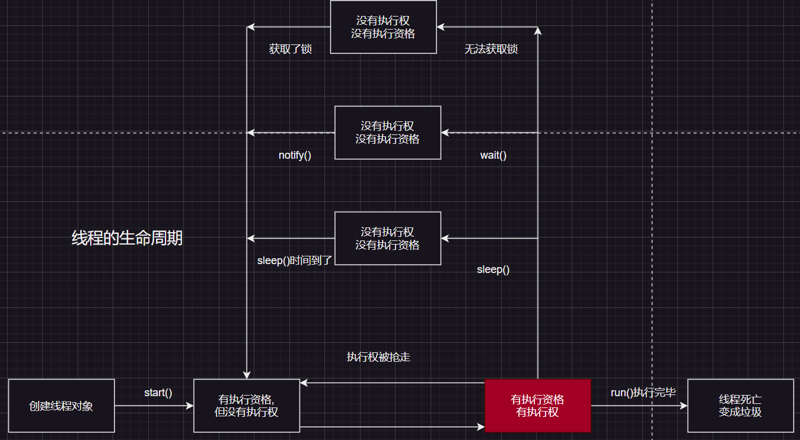
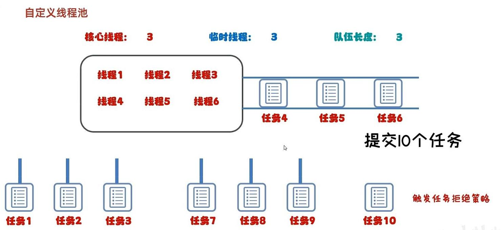

## 程序、进程、线程的理解

1. 程序(program)
概念: 使用某种语言编写的代码

2. 进程(process)
概念：程序的一次执行过程，或是正在运行的一个程序。

说明：进程作为资源分配的单位，系统在运行时会为每个进程分配不同的内存区域。

3. 线程(thread)
概念：进程可进一步细化为线程，是一个程序内部的的一条执行路径。

说明：线程作为调度和执行的单位，每个线程拥有独立的运行栈和程序计数器(pc)，线程切换开销小。

## 并行与并发

- 并发: 一个CPU(采用时间片)同时执行多个任务。比如：秒杀、多个人做同一件事
- 并行: 多个CPU同时执行多个任务。比如：多个人同时做不同的事。

## 创建多线程的方式

### 1. 继承Thread类

1. 创建一个继承于`Thread`类的子类
2. 重写`Thread`类的`run()`, 把你想要此线程执行的逻辑写在此方法中
3. 创建`Thread`类的子类的对象
4. 通过此对象调用`start()`

| 构造方法                             | 说明                   |
| ------------------------------------ | ---------------------- |
| Thread(Runnable target)              | 分配一个新的Thread对象 |
| Thread(Runnable target, String name) | 分配一个新的Thread对象 |

:::code-group
```java [MyThread.java]
//1. 创建一个继承于`Thread`类的子类
public class MyThread extends Thread {
    // 2. 重写`Thread`类的`run()`, 把你想要此线程执行的逻辑写在此方法中
    @Override
    public void run() {
        for (int i = 0; i < 100; i++) {
            System.out.println("我是大帅逼");
        }
    }
}
```

```java [MyThread.java]
public class CreateThreadDemo1 {
    public static void main(String[] args) {
        // 3. 创建`Thread`类的子类的对象
        MyThread mt = new MyThread();
        // 4. 通过此对象调用`start()`
        mt.start();
    }
}
```
:::


:::tip
这样就会启动当前线程, 并且调用当前线程的`run()`

注: `run()`方法不要自己手动调用, 如果再启动一个线程，就必须重新创建一个`Thread`子类的对象，调用此对象的`start()`
:::

---

### 2. 实现Runnable接口

1. 创建一个实现了`Runnable`接口的类
2. 实现类去实现`Runnable`中的抽象方法：`run()`
3. 创建实现类的对象
4. 将此对象作为参数传递到`Thread`类的构造器中，创建Thread类的对象
5. 通过`Thread`类的对象调用`start()`

| 方法名                       | 说明                               |
| ---------------------------- | ---------------------------------- |
| `void  setName(String name)` | 将此线程的名称更改为等于参数name   |
| `String  getName()`          | 返回此线程的名称                   |
| `Thread  currentThread()`    | 返回对当前正在执行的线程对象的引用 |

:::code-group
```java [CreateThreadDemo2.java]
public class CreateThreadDemo2 {
    public static void main(String[] args) {
        MyRunnable mr = new MyRunnable();
        Thread t1 = new Thread(mr);
        Thread t2 = new Thread(mr);
        //设置线程的名字
        t1.setName("线程一");
        t2.setName("线程二");

        t1.start();
        t2.start();
    }
}
```

```java [MyRunnable.java]
public class MyRunnable implements Runnable {
    @Override
    public void run() {
        for (int i = 0; i < 100; i++) {
            //获取当前的线程
            System.out.println(Thread.currentThread().getName() + "www");
        }
    }
}
```
:::

:::tip
开发中优先选择：实现Runnable接口的方式, 因为Java中只允许单继承, 而接口可以多实现.
:::

---

### 3. 实现Callable接口和Future接口

特点: 可以获取到线程(run方法)执行后的返回结果

1. 创建一个实现了`Callable`接口的类
2. 重写call方法，将此线程需要执行的逻辑写在此方法中.
3. 创建`Callable`实现类的对象
4. 使用FutureTask类包装Callable对象，该FutureTask对象封装了线程需要执行的逻辑。
5. 创建Thread类的对象，构造器中需要传递FutureTask对象
6. 最终的结果在FutureTask对象中

| 方法名                             | 说明                                               |
| ---------------------------------- | -------------------------------------------------- |
| `V call()`                         | 计算结果，如果无法计算结果，则抛出一个异常         |
| `FutureTask(Callable<V> callable)` | 创建一个 FutureTask，一旦运行就执行给定的 Callable |
| `V get()`                          | 如有必要，等待计算完成，然后获取其结果             |

:::code-group
```java [CreateCallableDemo3.java]
import java.util.concurrent.ExecutionException;
import java.util.concurrent.FutureTask;

public class CreateCallableDemo3 {
    public static void main(String[] args) throws ExecutionException, InterruptedException {
        MyCallable mc = new MyCallable();

        FutureTask<Integer> ft = new FutureTask<>(mc);

        Thread t = new Thread(ft);

        t.start();
        Integer result = ft.get();
        System.out.println(result);//4950

    }
}
```

```java [MyCallable.java]
import java.util.concurrent.Callable;
//泛型指的是call()的放回结果
public class MyCallable implements Callable<Integer> {

    @Override
    public Integer call() throws Exception {
        //求1-100的和
        int sum = 0;
        for (int i = 1; i < 100; i++) {
            sum += i;
        }
        return sum;
    }
}
```
:::

:::tip
如果需要多个结果, 则创建多个`FutureTask`对象
:::

---

### 3. 创建多线程的总结

三种实现方式的对比

+ 实现Runnable、Callable接口
  + 好处: 扩展性强，实现该接口的同时还可以继承其他的类
  + 缺点: 编程相对复杂，不能直接使用Thread类中的方法
+ 继承Thread类
  + 好处: 编程比较简单，可以直接使用Thread类中的方法
  + 缺点: 可以扩展性较差，不能再继承其他的类

---

## 线程的优先级

| 方法名                         | 说明               |
| ------------------------------ | ------------------ |
| `setPriority(int newPriority)` | 设置此线程的优先级 |
| `final int getPriority()`      | 返回此线程的优先级 |

1. 优先级
    - `MAX_PRIORITY`: 10
    - `MIN_PRIORITY`: 1
    - `NORM_PRIORITY`: 5 => 默认优先级
2. 如何获取和设置当前线程的优先级
    - `getProiority()`: 获取线程的优先级
    - `setProiority(int p)`: 设置线程的优先级

```java
public class CreateThreadDemo4 {
    public static void main(String[] args) {
        MyThread mt1 = new MyThread("线程一");
        MyThread mt2 = new MyThread("线程二");
        mt1.setName("线程一");
        mt2.setName("线程二");
        mt1.setPriority(1);
        mt1.setPriority(10);
        mt1.start();
        mt2.start();
    }
}
```

:::tip
高优先级的线程要抢占低优先级线程`CPU`的执行权。但是只是从概率上讲，高优先级的线程高概率的情况下被执行。并不意味着只当高优先级的线程执行完以后，低优先级的线程才执行。
:::

---

## 守护线程

守护线程也称为备胎线程，当主线程执行完毕以后，守护线程也会**陆续结束**.

| 方法名                      | 说明           |
| --------------------------- | -------------- |
| `setDaemon(boolean daemon)` | 设置为守护线程 |

```java
public class DaemonThreadDemo5 {
    public static void main(String[] args) {
        Thread t1 = new MyThread();
        Thread t2 = new MyThread();
        t1.setName("女神");
        t2.setName("备胎");
        //给t2设置为守护线程
        t2.setDaemon(true);

        t1.start();
        t2.start();
    }
}
```

:::tip 使用场景
例如传输文件, 如果关闭了当前App, 那么传输文件线程就应该结束.
:::

---

## 多线程常用方法汇总

| 方法名                           | 说明                                                                   |
| -------------------------------- | ---------------------------------------------------------------------- |
| `void  setName(String name)`     | 将此线程的名称更改为等于参数name                                       |
| `String  getName()`              | 返回此线程的名称                                                       |
| `Thread  currentThread()`        | 返回对当前正在执行的线程对象的引用                                     |
| `static void sleep(long millis)` | 执行此方法的线程停留（暂停执行）指定的毫秒数                           |
| `setPriority(int newPriority)`   | 设置此线程的优先级                                                     |
| `final int getPriority()`        | 返回此线程的优先级                                                     |
| `setDaemon(boolean daemon)`      | 设置为守护线程                                                         |
| `static yield()`                 | 礼让线程, 此方法执行会让出`CPU`的执行权                                |
| `join()`                         | 插队线程, 插入到当前线程之前, 等到插队线程执行完毕后才开始执行当前线程 |

---

## 线程的同步机制

1.背景
例子：创建个窗口买票，总票数为 100 张，使用实现Runnable接口的方式

1. 问题：卖票过程中，出现了重票、错票 => 出现了线程的安全问题
2. 问题出现的原因：当某个线程操作车票的过程中，尚未操作完成时，其他线程参与进来，也操作车票。
3. 如何解决：当一个线程a在操作ticket的时候，其他线程不能参与进来。直到线程a操作完ticket时，其他线程才可以开始操作ticket。这种情况即使线程a出现了阻碍，也不能被改变。

### 多线程带来的不安全问题

:::code-group
```java [SynThreadDemo1.java]
public class SynThreadDemo1 {
    public static void main(String[] args) {
        Mythread m1 = new Mythread();
        Mythread m2 = new Mythread();
        Mythread m3 = new Mythread();
        m1.setName("窗口一");
        m2.setName("窗口二");
        m3.setName("窗口三");

        m1.start();
        m2.start();
        m3.start();
    }
}
```

```java [Mythread.java]
public class Mythread extends Thread {
    private static int ticket = 1;

    @Override
    public void run() {
        while (true) {
            if(ticket > 100) {
                break;
            }
            try {
                //父类的run方法没有抛出异常, 那么重写的方法也不行, 所以只能try...catch
                sleep(100);
            } catch (InterruptedException e) {
                e.printStackTrace();
            }
            System.out.println(Thread.currentThread().getName() + "卖了第" + ticket + "张票");
            ticket++;
        }
    }
}
```
:::

:::warning
在执行中可能出现的问题有:

1. 三个窗口卖了同一张票, 跳过了两张票. 例如: 都是卖了第1张, 后面的第2, 3张跳过了
2. 前面的票还没卖, 后面的已经卖完了. 例如: 第20张还没卖出去, 第23张已经卖出去了

为什么呢?

出现问题的原因是, 运行代码的时候, CPU的执行权随时可能会被抢占, 而不是按照我们指定的顺序执行.
:::

---

### 解决方案: 同步机制

在Java中，我们通过同步机制，来解决线程的安全问题。

#### 1.同步代码块

```java
synchronized(锁) {
    // 共享数据的代码
}
```

1. 锁默认是打开的, 有一个线程进去, 锁会自动关闭
2. 同步代码块里面的代码全部执行完毕, 线程出来, 锁自动打开

```java
//更改之后的代码, 这样就可以解决线程的安全问题
public class Mythread extends Thread {
    private static int ticket = 1;
    //锁对象一定要唯一, 多个线程共享同一个锁对象, 如果不一样, 则每个线程都操作不同的锁, 那么就会出现安全问题
    //通常会使用当前类的字节码文件作为锁对象
    private static Object o = new Object();
    @Override
    public void run() {
        while (true) {
            synchronized (o) {
                // synchronized (Mythread.class) {
                if (ticket > 100) {
                    break;
                }
                try {
                    //父类的run方法没有抛出异常, 那么重写的方法也不行, 所以只能try...catch
                    sleep(100);
                } catch (InterruptedException e) {
                    e.printStackTrace();
                }
                System.out.println(Thread.currentThread().getName() + "卖了第" + ticket + "张票");
                ticket++;
            }

        }
    }
}
```

---

#### 2.同步方法

如果操作共享数据的代码完整的声明在一个方法中，我们不妨将此方法声明同步。

- 格式: `修饰符 synchronized 返回值类型 方法名(参数列表) { }`
- 同步方法是锁住方法里面所有的代码
- 锁对象不可以自己指定
  - 非静态: `this`
  - 静态: `类名.class` -- 字节码文件对象

:::code-group
```java [SynThreadDemo2.java]
public class SynThreadDemo2 {
    public static void main(String[] args) {
        MyRunnable mr = new MyRunnable();
        /*
        1. 三个线程操作的是同一个对象, 所以MyRunnable类中的ticket变量不设置static也是共享的
        */
        Thread t1 = new Thread(mr);
        Thread t2 = new Thread(mr);
        Thread t3 = new Thread(mr);

        t1.setName("窗口一");
        t2.setName("窗口二");
        t3.setName("窗口三");

        t1.start();
        t2.start();
        t3.start();
    }
}
```

```java [MyRunnable.java]
public class MyRunnable implements Runnable {
    int ticket = 1;

    @Override
    public void run() {
        while (true) {
            if(method()) break;
        }
    }

    public synchronized boolean method() {
        if (ticket > 100) {
            return true;
        }
        try {
            //父类的run方法没有抛出异常, 那么重写的方法也不行, 所以只能try...catch
            Thread.sleep(10);
        } catch (InterruptedException e) {
            e.printStackTrace();
        }
        System.out.println(Thread.currentThread().getName() + "卖了第" + ticket + "张票");
        ticket++;
        return false;
    }
}
```
:::

#### 历史的回旋镖StringBuffer

`StringBuffer`与`StringBuilder`的方法基本一模一样, 而它们之间的区别就是StringBuffer的方法都添加了`synchronized`.

`StringBuffer`是线程安全的, 不会代码执行到一半就被其他线程抢走`CPU`执行权; 而`StringBuilder`更适合于使用在单线程中

:::tip
单线程使用`StringBuilder`, 多线程使用`StringBuffer`
:::

---

#### 3.Lock锁

`Lock`是Java5之后才出现的, 它是Java中**线程同步的另外一种实现方式**。

```java
private ReentrantLock lock = new ReentrantLock();
```

`synchronized` 与 `Lock` 的异同?

相同：二者都可以解决线程安全问题

不同：`synchronized`机制在执行完相应的同步代码以后，自动的释放同步监视器

`Lock`需要手动的启动同步 `lock()`,同时结束同步也需要手动的实现`unlock()`

:::code-group
```java
import java.util.concurrent.locks.ReentrantLock;

public class MyRunnable1 implements Runnable {
    int ticket = 1;
    //需确保多个线程使用的是同一个锁对象
    ReentrantLock rl = new ReentrantLock();

    @Override
    public void run() {
        while (true) {
            //上锁
            rl.lock();
            try {
                if (ticket > 100) {
                    break;
                }
                //父类的run方法没有抛出异常, 那么重写的方法也不行, 所以只能try...catch
                Thread.sleep(10);
                System.out.println(Thread.currentThread().getName() + "卖了第" + ticket + "张票");
                ticket++;
            } catch (InterruptedException e) {
                e.printStackTrace();
            } finally {
                //解锁
                rl.unlock();
            }
        }
    }

}
```

```java
public class SynThreadDemo2 {
    public static void main(String[] args) {
        MyRunnable1 mr = new MyRunnable1();
        //三个线程操作的是同一个对象, 所以MyRunnable类中的ticket变量不设置static也是共享的
        Thread t1 = new Thread(mr);
        Thread t2 = new Thread(mr);
        Thread t3 = new Thread(mr);

        t1.setName("窗口一");
        t2.setName("窗口二");
        t3.setName("窗口三");

        t1.start();
        t2.start();
        t3.start();
    }
}
```
:::

---

## 死锁

死锁不是知识点而是一个错误, 基本特征为**锁套锁**. 例如: 一对情侣吃饭, 只有拿到一双筷子的才可以吃饭, 理想情况下一个人拿到了一双筷子; 而不好的情况就是一人拿到一个筷子, 另一人也拿到另一个筷子, 那么此时没有一个人可以吃饭了, 就发生了死锁.

---

## 生产者消费者


### 生产者和消费者模式概述【应用】

- 概述

  生产者消费者模式是一个十分经典的多线程协作的模式，弄懂生产者消费者问题能够让我们对多线程编程的理解更加深刻。

  所谓生产者消费者问题，实际上主要是包含了两类线程：

  ​	一类是生产者线程用于生产数据

  ​	一类是消费者线程用于消费数据

  为了解耦生产者和消费者的关系，通常会采用共享的数据区域，就像是一个仓库

  生产者生产数据之后直接放置在共享数据区中，并不需要关心消费者的行为

  消费者只需要从共享数据区中去获取数据，并不需要关心生产者的行为

- Object类的等待和唤醒方法

| 方法名           | 说明                                                                        |
| ---------------- | --------------------------------------------------------------------------- |
| `void wait()`      |**使当前线程等待，并释放锁**，直到另一个线程调用该对象的 notify()方法或 notifyAll()方法 |
| `void notify()`    | 唤醒正在等待对象监视器的单个线程                                            |
| `void notifyAll()` | 唤醒正在等待对象监视器的所有线程                                            |

代码实现

吃货最多只能吃10碗面条, 每次都会去桌子上查看是否有面条, 有就吃, 没有就通知厨师做面条; 厨师每次做完面条之后都会通知吃货吃面条

其中吃货是消费者, 厨师是生产者, 桌子是共享数据区


:::code-group
```java [Foodie.java]
public class Foodie extends Thread {
    @Override
    public void run() {
        //吃货最多只能吃10碗面条, 每次吃都会查看桌子上是否有面条
        while (true) {
            synchronized (Desk.obj) {
                //吃了10碗后就不吃了
                if (Desk.foodCount > 10) break;
                //查看桌子上是否有面条
                if (Desk.foodFlag == 1) {
                    //有 ==> 吃
                    System.out.println("吃货吃了" + Desk.foodCount + "碗面条");
                    Desk.foodCount++;
                    Desk.foodFlag = 0;
                    //通知厨师可以做面条了
                    Desk.obj.notifyAll();
                } else {
                    //没有 ==> 等待厨师叫自己吃
                    try {
                        //此代码会让当前线程与锁对象obj建立关系
                        //wait()使当前线程等待, 并且释放锁对象
                        Desk.obj.wait();
                    } catch (InterruptedException e) {
                        throw new RuntimeException(e);
                    }
                }
            }

        }
    }
}
```

```java [Cooker.java]
public class Cooker extends Thread {
    @Override
    public void run() {
        //做面条给吃饭吃,
        while (true) {
            synchronized (Desk.obj) {
                //做了10碗后就不做了
                if (Desk.foodCount > 10) break;
                //查看桌上是否有面条
                if (Desk.foodFlag == 0) {
                    //没有就做面条
                    System.out.println("厨师已经做了第" + Desk.foodCount + "碗面条" + ", 叫吃货来吃");
                    Desk.foodFlag = 1;
                    Desk.obj.notifyAll();
                } else {
                    //有 ==> 等待吃货吃完, 提醒自己
                    try {
                        Desk.obj.wait();
                    } catch (InterruptedException e) {
                        throw new RuntimeException(e);
                    }
                }
            }
        }
    }
}
```

```java [Test.java]
public class Test {
    public static void main(String[] args) throws InterruptedException {
        //Cooker和Foodie对应着连个线程, 而Desk就是媒介
        Foodie foodie = new Foodie();
        Cooker cooker = new Cooker();


        foodie.start();
        cooker.start();

    }
}
```
:::

---

### 堵塞队列

使用场景: 在上面的厨师与吃货中, 每次桌子都只能放一碗面条, 如何我想一次性多做几碗面条, 那么就可以使用阻塞队列了.

使用堵塞队列代替桌子成为共享数据区域


- `ArrayBlockingQueue`: 底层是数组, 有界
- `LinkedBlockingQueue`: 底层是链表, 无界(最大为int的最大值)

- `ArrayBlockingQueue`方法
  - `put`存数据
  - `take`取数据

:::tip
`put()`方法和`take()`方法内部都是有锁的, 所以不要把它们同步代码块, 或者同步方法里面.
:::

---

## 线程的状态总结



其中的运行状态在Java中是没有的, 只是为了更好的理解线程的运行状态.

线程状态。 线程可以处于以下状态之一： 

- 新建状态`NEW` -- 尚未启动的线程处于此状态。 
- 就绪状态`RUNNABLE` -- 在Java虚拟机中执行的线程处于此状态。 
- 堵塞状态`BLOCKED` -- 被阻塞等待监视器锁定的线程处于此状态。 
- 等待状态`WAITING` -- 无限期等待另一个线程执行特定操作的线程处于此状态。 
- 计时等待`TIMED_WAITING` -- 正在等待另一个线程执行最多指定等待时间的操作的线程处于此状态。 
- 结束状态`TERMINATED` -- 已退出的线程处于此状态。 

---

## 线程池

线程池是管理线程的, 线程池可以控制线程的数量, 避免线程的数量过多, 而导致资源占用过多, 而线程的数量过少, 而导致线程频繁创建和销毁, 影响性能.

### 线程池主要核心原理

1. 创建一个池子, 池子是空的
2. 提交任务时, 池子会创建新的线程对象, 任务执行完毕, 线程归还给池子, 下回再次提交任务就不会创建新的线程, 直接复用已有的线程.
3. 如果线程池中的线程数量达到最大值, 任务会等待.

| 线程池方法 | 说明 |
| --- | --- |
| `ExecutorService newFixedThreadPool(int nThreads)` | 创建一个有上限的线程池 |
| `ExecutorService newCachedThreadPool()` | 创建一个没有上限的线程池  |

---

#### 创建一个没有上限的线程池


:::code-group
```java [NewThreadPoolDemo1.java]
import java.util.concurrent.ExecutorService;
import java.util.concurrent.Executors;

public class NewThreadPoolDemo1 {
    public static void main(String[] args) {
        //创建没有上限的线程池
        ExecutorService pool1 = Executors.newCachedThreadPool();
        //提交任务
        pool1.submit(new MyRunnable());
        pool1.submit(new MyRunnable());
        pool1.submit(new MyRunnable());
        //关闭线程池, 一般来说不需要关闭, 因为服务器是不会关的
        pool1.shutdown();// [!code --]
    }
}
```

```java [MyRunnable.java]
public class MyRunnable implements Runnable {
    @Override
    public void run() {
        for (int i = 0; i < 100; i++) {
            System.out.println(Thread.currentThread().getName() + "---" + i);
        }
    }
}
```
:::

---

#### 创建一个有上限的线程池

```java
public class NewThreadPoolDemo2 {
    public static void main(String[] args) {
        //创建没有上限的线程池
        ExecutorService pool1 = Executors.newFixedThreadPool(3);
        //提交任务
        pool1.submit(new MyRunnable());
        pool1.submit(new MyRunnable());
        pool1.submit(new MyRunnable());
        pool1.submit(new MyRunnable());
        pool1.submit(new MyRunnable());
    }
}
```

:::tip
无论任务有多少, 都只有3个线程在运行, 剩下的任务会等待.
:::

### 自定义线程池

| 参数 | 说明 |
| --- | --- |
| `ThreadPoolExecutor​(int corePoolSize, int maximumPoolSize, long keepAliveTime, TimeUnit unit, BlockingQueue<Runnable> workQueue, ThreadFactory threadFactory, RejectedExecutionHandler handler)` | 线程池的构造方法 |

理解方式: 某餐厅提供一对一服务, 正式员工有三位, 餐厅最多招6位服务员, 如果正式员工都在忙, 那么就会聘请临时工, 如果排队人数过多, 超出的顾客欢迎它们下次再来.

1. 正式员工 ==> 核心线程数量
2. 餐厅最大员工数 ==> 最大线程数量
3. 临时员工空闲多长时间被辞退(值) ==> 空闲时间(值, 例如5)
4. 临时员工空闲多长时间被辞退(单位) ==> 空闲时间(单位, 例如秒)
5. 排队的客户 ==> 阻塞队列
6. 从哪里找人 ==> 创建线程的方式
7. 排队人数过多, 超出的顾客下次再来 ==> 拒绝策略



:::tip
1. 什么时候使用临时线程? ==> 只有在队列排满时, 才会使用临时线程
2. 默认的拒绝策略就是舍弃不要
:::

```java
import java.util.concurrent.ArrayBlockingQueue;
import java.util.concurrent.Executors;
import java.util.concurrent.ThreadPoolExecutor;
import java.util.concurrent.TimeUnit;

public class NewThreadPoolDemo3 {
    public static void main(String[] args) {
        ThreadPoolExecutor pool = new ThreadPoolExecutor(
                3,// 核心线程数量
                6,// 最大线程数量
                1,// 线程空闲时间(值)
                TimeUnit.MINUTES,// 线程空闲时间(单位)
                new ArrayBlockingQueue<>(3),// 堵塞队列
                Executors.defaultThreadFactory(),// 线程工厂, 方法内部还有创建Thread对象
                new ThreadPoolExecutor.DiscardPolicy()// 拒绝策略, DiscardPolicy是一个静态内部类
        );
    }
}
```