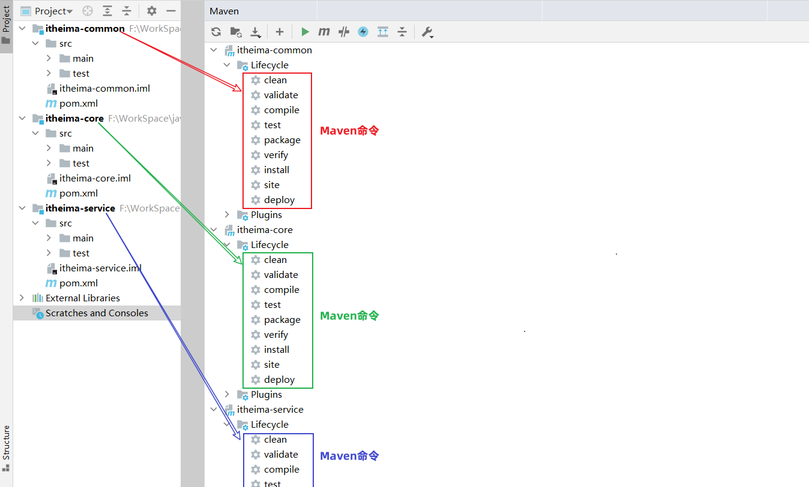
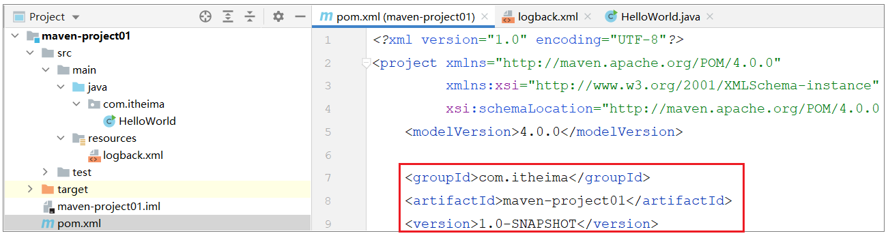
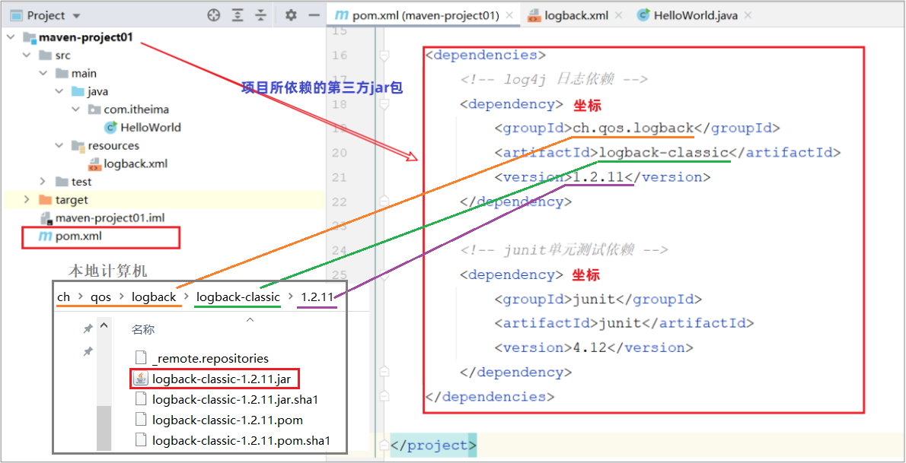

# maven

## 01. Maven课程介绍

### 1.1 课程安排

学习完前端Web开发技术后，我们即将开始学习后端Web开发技术。做为一名Java开发工程师，**后端Web开发技术是我们学习的重点**。

后端Web开发技术的学习，我们会先学习Java项目的构建工具：Maven

### 1.2 初识Maven

#### 1.2.1 什么是Maven

Maven是Apache旗下的一个开源项目，是一款用于管理和构建java项目的工具。

官网：https://maven.apache.org/

> Apache 软件基金会，成立于1999年7月，是目前世界上最大的最受欢迎的开源软件基金会，也是一个专门为支持开源项目而生的非盈利性组织。
>
> 开源项目：https://www.apache.org/index.html#projects-list

#### 1.2.2 Maven的作用

使用Maven能够做什么呢？

1. 依赖管理
2. 统一项目结构
3. 项目构建

**依赖管理**：

- 方便快捷的管理项目依赖的资源(jar包)，避免版本冲突问题

当使用maven进行项目依赖(jar包)管理，则很方便的可以解决这个问题。 我们只需要在maven项目的pom.xml文件中，添加一段如下图所示的配置即可实现。

  

**统一项目结构 : **

- 提供标准、统一的项目结构

在项目开发中，当你使用不同的开发工具 (如：Eclipse、Idea)，创建项目工程时：

 

若我们创建的是一个maven工程，是可以帮我们自动生成统一、标准的项目目录结构：

具体的统一结构如下：

> 目录说明： 
>
> - src/main/java: java源代码目录
> - src/main/resources:  配置文件信息
> - src/test/java: 测试代码
> - src/test/resources: 测试配置文件信息

**项目构建 :** 

- maven提供了标准的、跨平台(Linux、Windows、MacOS) 的自动化项目构建方式

如上图所示我们开发了一套系统，代码需要进行编译、测试、打包、发布，这些操作如果需要反复进行就显得特别麻烦，而Maven提供了一套简单的命令来完成项目构建。

综上所述，可以得到一个结论：**Maven是一款管理和构建java项目的工具**

## 02. Maven概述

### 2.1 Maven介绍

Apache Maven是一个项目管理和构建工具，它基于项目对象模型(Project Object Model , 简称: POM)的概念，通过一小段描述信息来管理项目的构建、报告和文档。

官网：https://maven.apache.org/

Maven的作用： 

1. 方便的依赖管理
2. 统一的项目结构
3. 标准的项目构建流程

### 2.2 Maven模型

* 项目对象模型 (Project Object Model)
* 依赖管理模型(Dependency)
* 构建生命周期/阶段(Build lifecycle & phases)

1. 构建生命周期/阶段(Build lifecycle & phases)

以上图中紫色框起来的部分，就是用来完成标准化构建流程 。当我们需要编译，Maven提供了一个编译插件供我们使用；当我们需要打包，Maven就提供了一个打包插件供我们使用等。 

2. 项目对象模型 (Project Object Model)

以上图中紫色框起来的部分属于项目对象模型，就是将我们自己的项目抽象成一个对象模型，有自己专属的坐标，如下图所示是一个Maven项目：

> 坐标，就是资源(jar包)的唯一标识，通过坐标可以定位到所需资源(jar包)位置
>
> 

3. 依赖管理模型(Dependency)

以上图中紫色框起来的部分属于依赖管理模型，是使用坐标来描述当前项目依赖哪些第三方jar包

之前我们项目中需要jar包时，直接就把jar包复制到项目下的lib目录，而现在书写在pom.xml文件中的坐标又是怎么能找到所要的jar包文件的呢？

> 答案：Maven仓库

### 2.3 Maven仓库

仓库：用于存储资源，管理各种jar包

> 仓库的本质就是一个目录(文件夹)，这个目录被用来存储开发中所有依赖(就是jar包)和插件

Maven仓库分为：

- 本地仓库：自己计算机上的一个目录(用来存储jar包)
- 中央仓库：由Maven团队维护的全球唯一的。仓库地址：https://repo1.maven.org/maven2/
- 远程仓库(私服)：一般由公司团队搭建的私有仓库

当项目中使用坐标引入对应依赖jar包后，首先会查找本地仓库中是否有对应的jar包

* 如果有，则在项目直接引用

* 如果没有，则去中央仓库中下载对应的jar包到本地仓库

如果还可以搭建远程仓库(私服)，将来jar包的查找顺序则变为： 本地仓库 --> 远程仓库--> 中央仓库