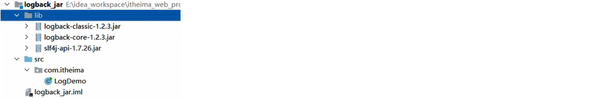
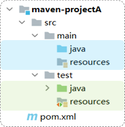

# maven

#### 3.2.2 POM配置详解

POM (Project Object Model) ：指的是项目对象模型，用来描述当前的maven项目。

- 使用pom.xml文件来实现

pom.xml文件：

```xml
<?xml version="1.0" encoding="UTF-8"?>
<project xmlns="http://maven.apache.org/POM/4.0.0"
         xmlns:xsi="http://www.w3.org/2001/XMLSchema-instance"
         xsi:schemaLocation="http://maven.apache.org/POM/4.0.0 http://maven.apache.org/xsd/maven-4.0.0.xsd">
    <!-- POM模型版本 -->
    <modelVersion>4.0.0</modelVersion>

    <!-- 当前项目坐标 -->
    <groupId>com.itheima</groupId>
    <artifactId>maven_project1</artifactId>
    <version>1.0-SNAPSHOT</version>
    
    <!-- 打包方式 -->
    <packaging>jar</packaging>
 
</project>
```

pom文件详解：

- `<project>` ：pom文件的根标签，表示当前maven项目
- `<modelVersion>` ：声明项目描述遵循哪一个POM模型版本
  - 虽然模型本身的版本很少改变，但它仍然是必不可少的。目前POM模型版本是4.0.0
- 坐标 ：`<groupId>`、`<artifactId>`、`<version>`
  - 定位项目在本地仓库中的位置，由以上三个标签组成一个坐标
- `<packaging>` ：maven项目的打包方式，通常设置为jar或war（默认值：jar）


#### 3.2.3 Maven坐标详解

什么是坐标？

* Maven中的坐标是==资源的唯一标识== , 通过该坐标可以唯一定位资源位置
* 使用坐标来定义项目或引入项目中需要的依赖

Maven坐标主要组成

* groupId：定义当前Maven项目隶属组织名称（通常是域名反写，例如：com.itheima）
* artifactId：定义当前Maven项目名称（通常是模块名称，例如 order-service、goods-service）
* version：定义当前项目版本号

如下图就是使用坐标表示一个项目：

 

> **注意：**
>
> * 上面所说的资源可以是插件、依赖、当前项目。
> * 我们的项目如果被其他的项目依赖时，也是需要坐标来引入的。


## 04. 依赖管理

### 4.1 依赖配置

依赖：指当前项目运行所需要的jar包。一个项目中可以引入多个依赖：

例如：在当前工程中，我们需要用到logback来记录日志，此时就可以在maven工程的pom.xml文件中，引入logback的依赖。具体步骤如下：

1. 在pom.xml中编写`<dependencies>`标签

2. 在`<dependencies>`标签中使用`<dependency`>引入坐标

3. 定义坐标的 groupId、artifactId、version

```xml
<dependencies>
    <!-- 第1个依赖 : logback -->
    <dependency>
        <groupId>ch.qos.logback</groupId>
        <artifactId>logback-classic</artifactId>
        <version>1.2.11</version>
    </dependency>
    <!-- 第2个依赖 : junit -->
    <dependency>
        <groupId>junit</groupId>
        <artifactId>junit</artifactId>
        <version>4.12</version>
    </dependency>
</dependencies>
```

4. 点击刷新按钮，引入最新加入的坐标
   - 刷新依赖：保证每一次引入新的依赖，或者修改现有的依赖配置，都可以加入最新的坐标

  

> 注意事项：
>
> 1. 如果引入的依赖，在本地仓库中不存在，将会连接远程仓库 / 中央仓库，然后下载依赖（这个过程会比较耗时，耐心等待）
> 2. 如果不知道依赖的坐标信息，可以到mvn的中央仓库（https://mvnrepository.com/）中搜索


**添加依赖的几种方式：**

1. 利用中央仓库搜索的依赖坐标

   


2. 利用IDEA工具搜索依赖

   


3. 熟练上手maven后，快速导入依赖

   

### 4.2 依赖传递

#### 4.2.1 依赖具有传递性

早期我们没有使用maven时，向项目中添加依赖的jar包，需要把所有的jar包都复制到项目工程下。如下图所示，需要logback-classic时，由于logback-classic又依赖了logback-core和slf4j，所以必须把这3个jar包全部复制到项目工程下




我们现在使用了maven，当项目中需要使用logback-classic时，只需要在pom.xml配置文件中，添加logback-classic的依赖坐标即可。


在pom.xml文件中只添加了logback-classic依赖，但由于maven的依赖具有传递性，所以会自动把所依赖的其他jar包也一起导入。

依赖传递可以分为：

1. 直接依赖：在当前项目中通过依赖配置建立的依赖关系

2. 间接依赖：被依赖的资源如果依赖其他资源，当前项目间接依赖其他资源

 

比如以上图中：

- projectA依赖了projectB。对于projectA 来说，projectB 就是直接依赖。
- 而projectB依赖了projectC及其他jar包。 那么此时，在projectA中也会将projectC的依赖传递下来。对于projectA 来说，projectC就是间接依赖。


#### 4.2.2 排除依赖

问题：之前我们讲了依赖具有传递性。那么A依赖B，B依赖C，如果A不想将C依赖进来，是否可以做到？ 

答案：在maven项目中，我们可以通过排除依赖来实现。


什么是排除依赖？

- 排除依赖：指主动断开依赖的资源。（被排除的资源无需指定版本）

```xml
<dependency>
    <groupId>com.itheima</groupId>
    <artifactId>maven-projectB</artifactId>
    <version>1.0-SNAPSHOT</version>
   
    <!--排除依赖, 主动断开依赖的资源-->
    <exclusions>
        <exclusion>
            <groupId>junit</groupId>
            <artifactId>junit</artifactId>
        </exclusion>
    </exclusions>
</dependency>
```

依赖排除示例：

- maven-projectA依赖了maven-projectB，maven-projectB依赖了Junit。基于依赖的传递性，所以maven-projectA也依赖了Junit


- 使用排除依赖后


### 4.3 依赖范围

在项目中导入依赖的jar包后，默认情况下，可以在任何地方使用。


如果希望限制依赖的使用范围，可以通过`<scope>`标签设置其作用范围。

 

作用范围：

1. 主程序范围有效（main文件夹范围内）

2. 测试程序范围有效（test文件夹范围内）

3. 是否参与打包运行（package指令范围内）


如上图所示，给junit依赖通过scope标签指定依赖的作用范围。 那么这个依赖就只能作用在测试环境，其他环境下不能使用。

scope标签的取值范围：

| **scope**值     | **主程序** | **测试程序** | **打包（运行）** | **范例**    |
| --------------- | ---------- | ------------ | ---------------- | ----------- |
| compile（默认） | Y          | Y            | Y                | log4j       |
| test            | -          | Y            | -                | junit       |
| provided        | Y          | Y            | -                | servlet-api |
| runtime         | -          | Y            | Y                | jdbc驱动    |


### 4.4 生命周期

#### 4.4.1 介绍

Maven的生命周期就是为了对所有的构建过程进行抽象和统一。 描述了一次项目构建，经历哪些阶段。

在Maven出现之前，项目构建的生命周期就已经存在，软件开发人员每天都在对项目进行清理，编译，测试及部署。虽然大家都在不停地做构建工作，但公司和公司间、项目和项目间，往往使用不同的方式做类似的工作。

Maven从大量项目和构建工具中学习和反思，然后总结了一套高度完美的，易扩展的项目构建生命周期。这个生命周期包含了项目的清理，初始化，编译，测试，打包，集成测试，验证，部署和站点生成等几乎所有构建步骤。

Maven对项目构建的生命周期划分为3套（相互独立）：


- clean：清理工作。

- default：核心工作。如：编译、测试、打包、安装、部署等。

- site：生成报告、发布站点等。

三套生命周期又包含哪些具体的阶段呢, 我们来看下面这幅图:

 

我们看到这三套生命周期，里面有很多很多的阶段，这么多生命周期阶段，其实我们常用的并不多，主要关注以下几个：

• clean：移除上一次构建生成的文件

• compile：编译项目源代码

• test：使用合适的单元测试框架运行测试(junit)

• package：将编译后的文件打包，如：jar、war等

• install：安装项目到本地仓库


Maven的生命周期是抽象的，这意味着生命周期本身不做任何实际工作。**在Maven的设计中，实际任务（如源代码编译）都交由插件来完成。**


IDEA工具为了方便程序员使用maven生命周期，在右侧的maven工具栏中，已给出快速访问通道


生命周期的顺序是：clean --> validate --> compile --> test --> package --> verify --> install --> site --> deploy 

我们需要关注的就是：clean -->  compile --> test --> package  --> install 

> 说明：在同一套生命周期中，我们在执行后面的生命周期时，前面的生命周期都会执行。

>  思考：当运行package生命周期时，clean、./compile生命周期会不会运行？
>
> ​		clean不会运行，compile会运行。  因为compile与package属于同一套生命周期，而clean与package不属于同一套生命周期。


#### 4.4.2 执行

在日常开发中，当我们要执行指定的生命周期时，有两种执行方式：

1. 在idea工具右侧的maven工具栏中，选择对应的生命周期，双击执行
2. 在DOS命令行中，通过maven命令执行


**方式一：在idea中执行生命周期**

- 选择对应的生命周期，双击执行

 


compile：


test：


package：


install：


clean：


**方式二：在命令行中执行生命周期**

1. 进入到DOS命令行


 


 

## 05. 附录

### 5.1 更新依赖索引

有时候给idea配置完maven仓库信息后，在idea中依然搜索不到仓库中的jar包。这是因为仓库中的jar包索引尚未更新到idea中。这个时候我们就需要更新idea中maven的索引了，具体做法如下：

 打开设置----搜索maven----Repositories----选中本地仓库-----点击Update


### 5.2 清理maven仓库

初始情况下，我们的本地仓库是没有任何jar包的，此时会从私服去下载（如果没有配置，就直接从中央仓库去下载），可能由于网络的原因，jar包下载不完全，这些不完整的jar包都是以lastUpdated结尾。此时，maven不会再重新帮你下载，需要你删除这些以lastUpdated结尾的文件，然后maven才会再次自动下载这些jar包。


如果本地仓库中有很多这样的以lastUpadted结尾的文件，可以定义一个批处理文件，在其中编写如下脚本来删除： 

~~~
set REPOSITORY_PATH=E:\develop\apache-maven-3.6.1\mvn_repo
rem 正在搜索...

del /s /q %REPOSITORY_PATH%\*.lastUpdated

rem 搜索完毕
pause
~~~


操作步骤如下：

1). 定义批处理文件del_lastUpdated.bat  (直接创建一个文本文件，命名为del_lastUpdated，后缀名直接改为bat即可 )

 

2). 在上面的bat文件上**右键---》编辑** 。修改文件：

 

修改完毕后，双击运行即可删除maven仓库中的残留文件。