## 第一章

linux系统的特点:

1. 抢占式多任务
2. 多用户
3. 设备无关性
4. 开放性
5. 可扩展性, 可维护性,与开放源代码
6. 完善的网络功能
7. 可靠的系统安全
8. 良好的移植性

## 第二章

`firstboot`服务的简介, 启动时机, 引导配置的项目:

1. 简介: 负责协助配置`Red Hat Enterprise Linux`的一些重要信息
2. 启动时机: `firstboot`服务仅在安装后第一次开机执行
3. 引导配置的项目有:
   1. Kdump管理
   2. 许可协议和注册
   3. 首次登录配置页面
   4. 登录界面
   5. 帮助界面
   6. 系统界面

## 第三章

需理解

Xwindow的工作原理:

在完成Red Hat Enterprise Linux系统的安装后，用户可以选择进入两种操作环境：一种是字符命令界面，另一种是图形化界面XWindow.

X Window 与Microsoft Windows虽然在操作及外观上有许多相似之处，但二者的工作原理却有着本质的不同，Microsoft Windows 的图形用户界面是与Microsoft 操作系统紧密相关的，**X Window 则不同，它只是运行在内核上的应用程序。**

## 第四章

1. shell终端的切换:
 - `Ctrl + Alt + F1`: 可以从字符界面的虚拟终端, 切换到图形化用户界面
 - `Ctrl + Alt + F2 ~ Ctrl + Alt + F6`: 从图形化用户界面切换到字符界面的虚拟终端
2. shell的命令格式:
   1. `命令名 [选项] [参数]` -- `[]`为可选项; `[选项]`通常以`-`开头`
3. 命令提示符的各项意义:
   1. `#`: 超级用户的命令提示符
   2. `$`: 普通用户的命令提示符
   3. `[]`以内`@`之前为已登录的用户名, 之后为主机名
   4. `~`: 登录用户的主目录

```bash
# 超级用户
[root@localhost ~]# 
# 普通用户
[user@localhost ~]$ 
```

4. 常用命令:

xxx

---

1. `vim`的三种模式:
   1. 命令模式
   2. 插入模式
   3. 末行模式
2. 模式切换图:

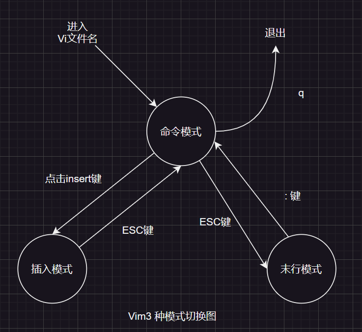

## 第五章

1. 用户账户文件的位置: `/etc/passwd`
2. 字段:
   - 例: `student:x:1001:1001:student:/home/student:/bin/bash`
   - 一行有7个字段, 每一个字段用`:`分隔
   1. 用户名(登录名)
   2. 口令
   3. UID
   4. GID
   5. 用户名全称
   6. 用户登录目录所在位置
   7. 用户所用的Shell的类型

1. 用户影子文件: `/etc/shadow`
2. 字段: 包含9个字段
   1. `name`: 登录名称
   2. `password`: 密码
   3. `lastchange`: 最后一次修改密码的时间
   4. `minage`: 两次修改口令间隔最少的天数
   5. `maxage`: 两次修改口令间隔最多的天数
   6. `warning`: 密码到期警告
   7. `inactive`: 密码失效
   8. `expire`: 用户过期日期
   9. `blank`: 保留字段

1. 添加用户的命令, passwd命令, 删除用户命令
   - `useradd [选项] 用户名`
   - `passwd [选项] 用户名`
   - `userdel [选项] 用户名`

## 第六章

1. 主引导记录(MBR 全称: Master Boot Record)

位置: 整个磁盘的第0号磁柱的第0号磁面的第一个扇区

存储信息有: 初始化程序加载器, 分区表, 验证码

2. GPT

释义: 全局唯一标识分区表(GUID Partition Table)

作用: GPT是一种磁盘分区表格式，用于替代传统的主引导记录（MBR）分区方案。


3. 改变文件访问权限

```bash
# 指定用户对file1文件是可读, 可写, 可执行
[root@localhost ~]# chmod 700 file1

# 指定用户对file1文件是可读, 可写
[root@localhost ~]# chmod 600 file1

# 更改a.txt的权限为所拥有者和同组用户可读, 但不能写和执行, 其他用户都此文件没有任何权限
[root@localhost ~]# chmod 600 a.txt
```

## 第7章

1. LVM

LVM是Red Hat Enterprise Linux 环境下对磁盘分区进行管理的一种机制，LVM是建立在硬盘和分区之上的一个逻辑层，能提高磁盘分区管理的灵活性。

2. LVM的基本术语
   1. 物理存储介质
   2. 物理卷
   3. 卷组
   4. 逻辑卷
   5. 物理块
   6. 逻辑块

## 第8章

1. 进程的概念

程序的一次执行过程，或是正在运行的一个程序

2. 进程的类型
   1. 交互进程
   2. 批处理进程
   3. 守护进程

3. 周期性计划任务

`at`在一定时间内执行一次.

4. `crontab`的使用

- 格式: `crontab [选项]`
- 功能: 维护用户的crontab配置文件
- 选项:
  - `-e`: (edit)编辑用户的crontab配置文件
  - `-l`: (list)显示用户的crontab配置文件
  - `-r`: (erase)删除用户的crontab配置文件

存储内容格式: `minute hour day-of-month month-of-year day-of-week [username] command`

```bash
# root用户设置cron调度, 要求每周一的8:00查看/etc/passwd文件
[root@localhost ~]# crontab -e
# 用户vi打开, 输入以下内容
# "*"表示通配符
00 08 * * 1 root /bin/ls /etc/passwd
```

## 第9章

1. 配置YUM源
   1. YUM工具的配置文件
   2. YUM下载源的定义文件
2. 源代码安装前需要阅读的文件
   1. `README`
   2. `INSTALL`
   3. `Changelog`

## 第10章

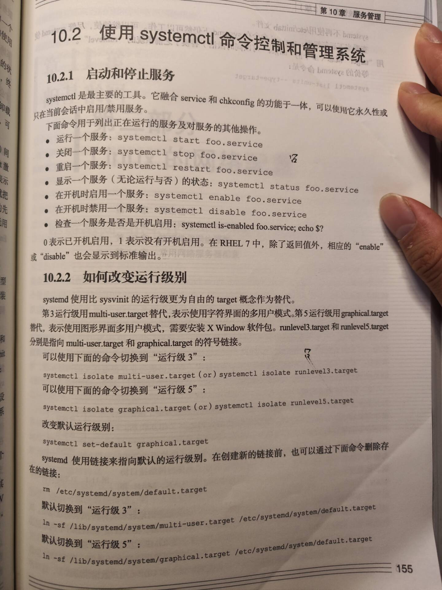

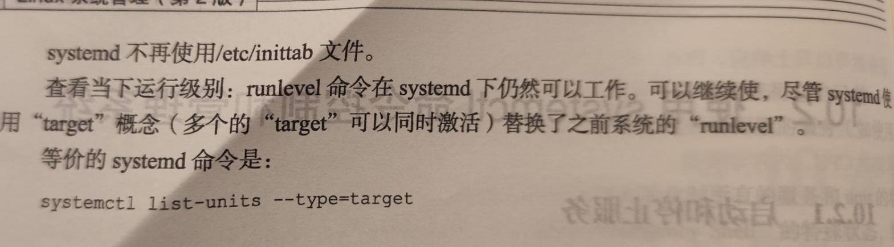

## 第12章

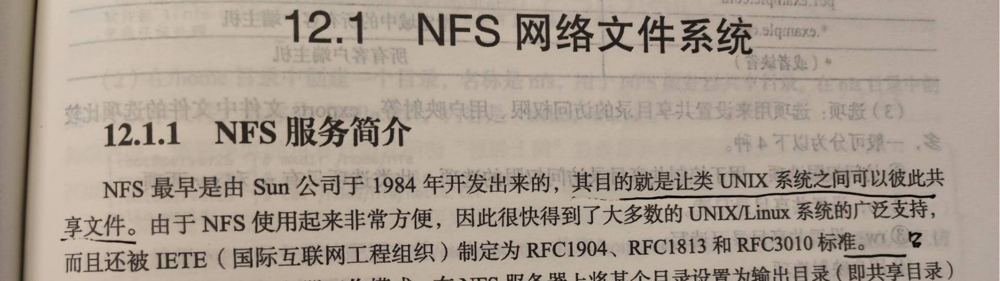

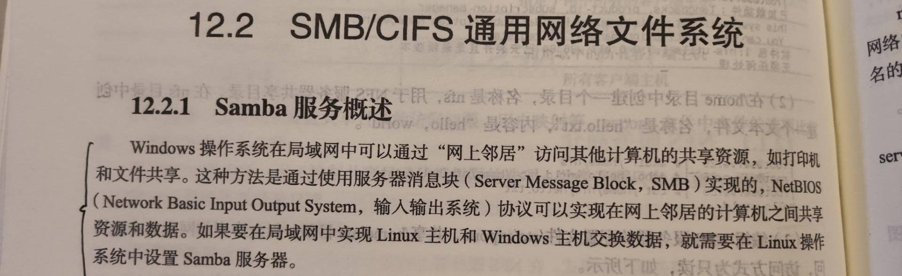

## 第13章

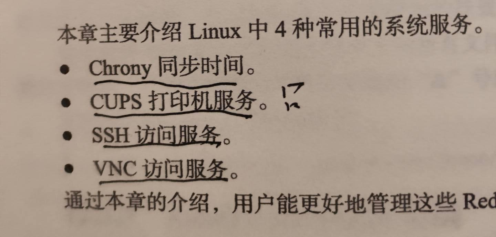

## 第14章

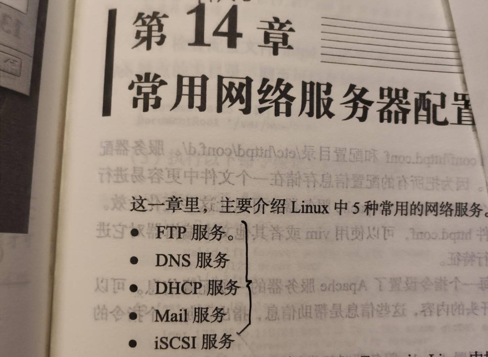

## 第15章

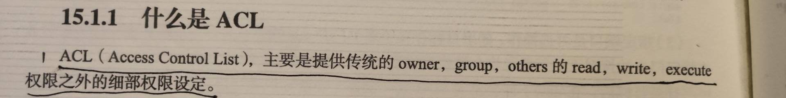

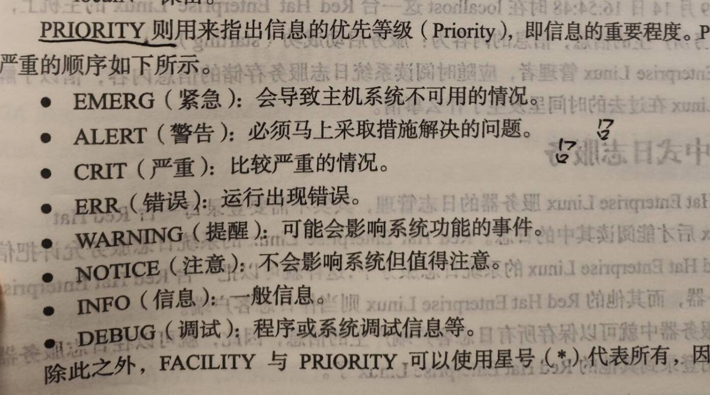

## 第17章

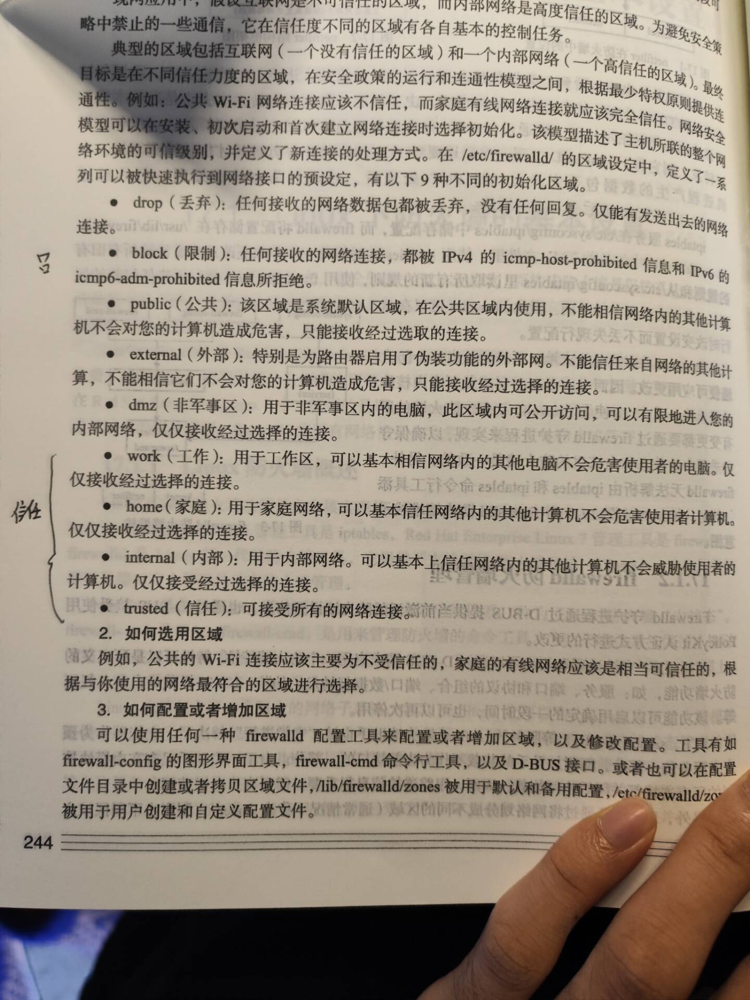

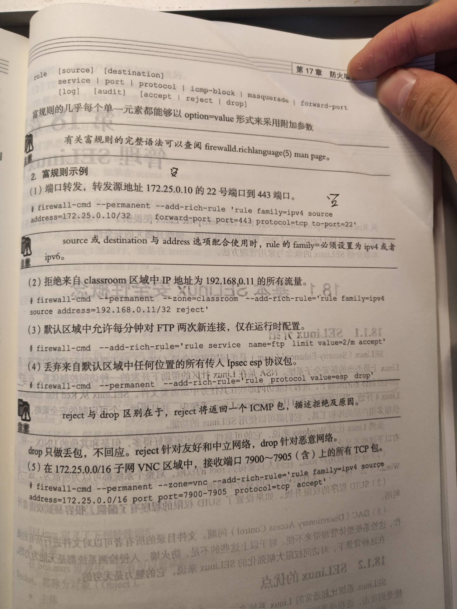

## 第18章

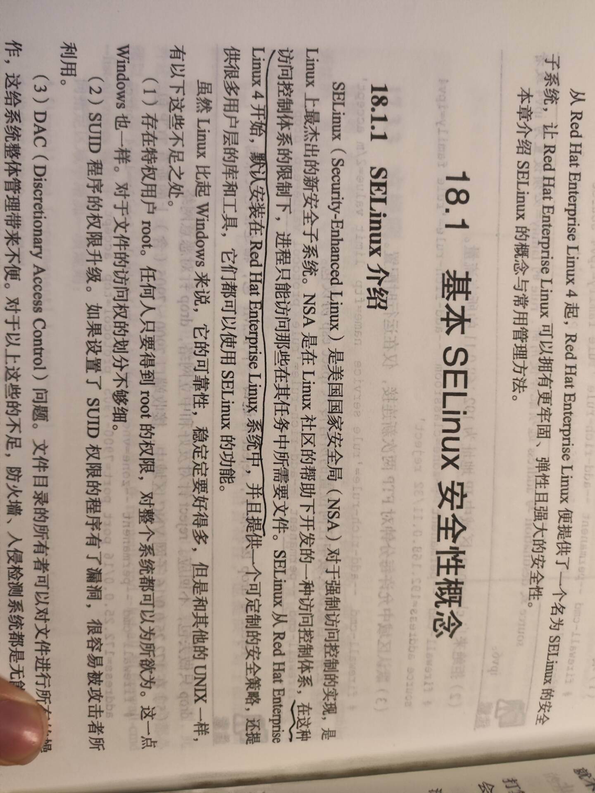

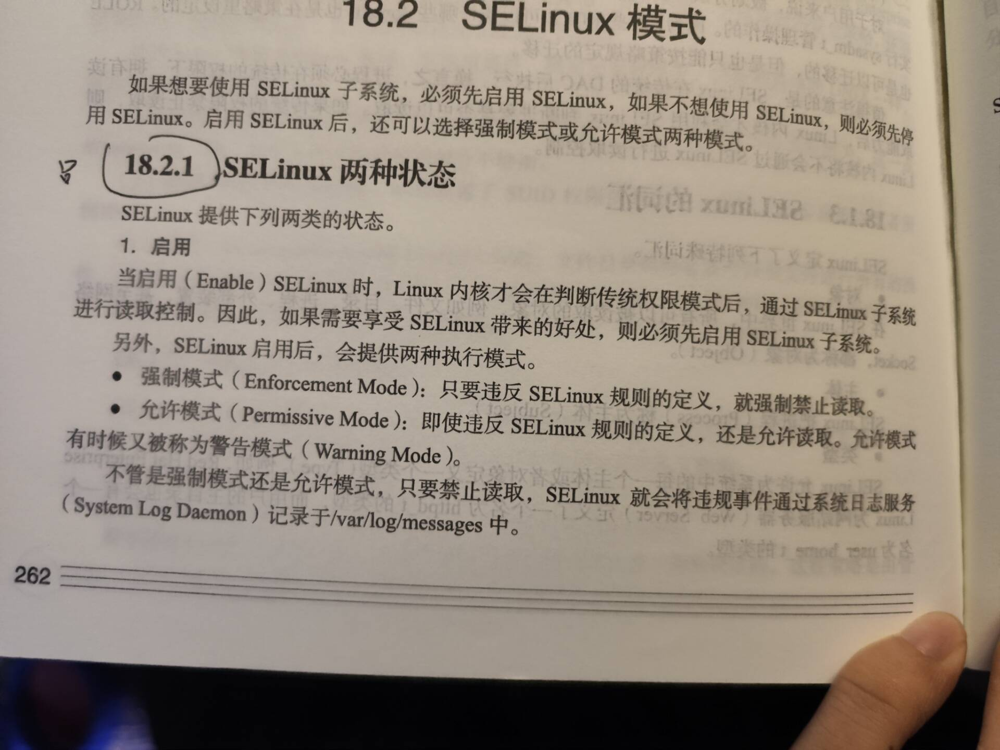

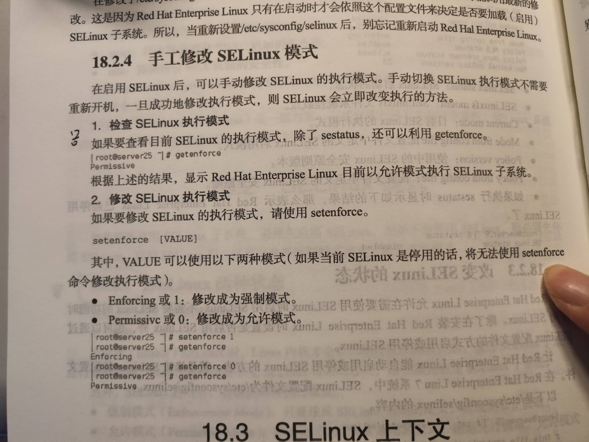

